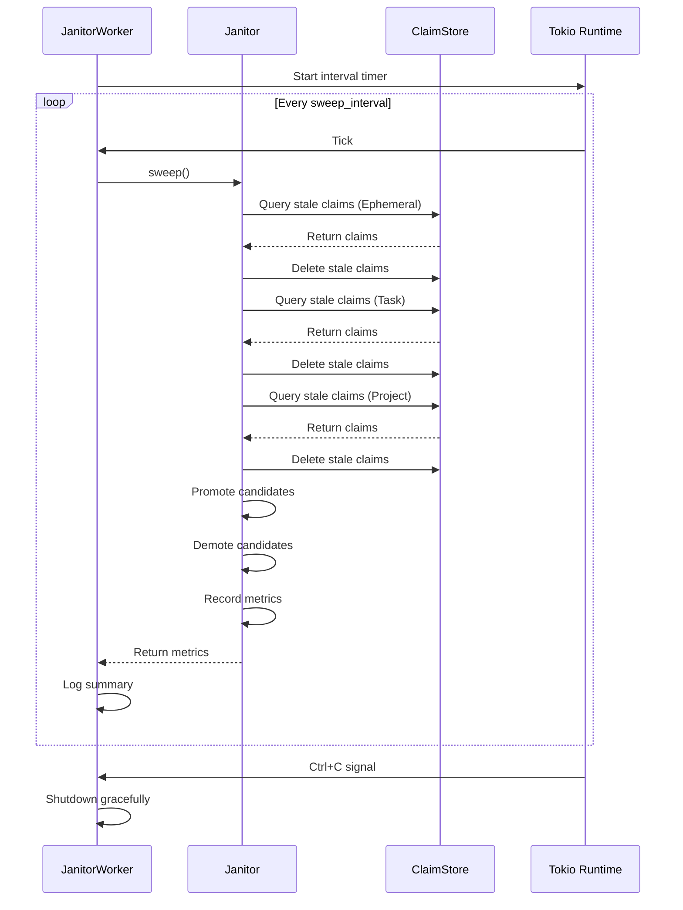

# boswell-janitor

Background maintenance service for automated tier management and claim lifecycle operations.

## Overview

The Janitor is responsible for maintaining the health of Boswell's claim graph through:

- **Tier management**: Promoting and demoting claims based on access patterns and confidence
- **Stale claim detection**: Identifying claims past their TTL (time-to-live)
- **Garbage collection**: Removing stale claims to reclaim storage
- **Metrics collection**: Tracking cleanup operations for monitoring

Per ADR-007 (Hybrid Confidence Computation) and ADR-012 (Learn Operation), the Janitor operates on a scheduled basis to maintain claim quality and storage efficiency.

## Tier Lifecycle

Based on ADR-007, claims progress through tiers with different retention policies:

| Tier | TTL (Default) | Promotion Trigger | Demotion Trigger |
|------|---------------|-------------------|------------------|
| **Ephemeral** | 12 hours | Access frequency > threshold | Session end or TTL |
| **Task** | 24 hours (if idle) | Reinforcement (2+ supporting claims) | Task complete or timeout |
| **Project** | 90 days (if unused) | Explicit promotion or high access | No access for 90 days |
| **Permanent** | Never | Explicit promotion only | Manual only (never automatic) |

## Usage

### One-time Sweep

Perform a single cleanup pass:

```rust
use boswell_janitor::{Janitor, JanitorConfig};
use boswell_store::SqliteStore;

fn main() -> Result<(), Box<dyn std::error::Error>> {
    let mut store = SqliteStore::new("boswell.db", false, 0)?;
    let mut janitor = Janitor::default_config();

    // Perform a single sweep
    let metrics = janitor.sweep(&mut store)?;
    
    println!("Sweep completed:");
    println!("  Deleted: {}", metrics.total_deleted());
    println!("  Promoted: {}", metrics.total_promoted());
    println!("  Demoted: {}", metrics.total_demoted());
    println!("\n{}", metrics.summary());
    
    Ok(())
}
```

### Background Worker

Run continuous automated cleanup:

```rust
use boswell_janitor::{JanitorWorker, JanitorConfig};
use boswell_store::SqliteStore;
use tokio;

#[tokio::main]
async fn main() -> Result<(), Box<dyn std::error::Error>> {
    let store = SqliteStore::new("boswell.db", false, 0)?;
    let config = JanitorConfig::default();
    let mut worker = JanitorWorker::new(config);

    // Run indefinitely (until Ctrl+C)
    worker.run(store).await?;
    
    Ok(())
}
```

### Limited Cycles (Testing)

Run for a specific number of cycles:

```rust
use boswell_janitor::{JanitorWorker, JanitorConfig};
use boswell_store::SqliteStore;
use tokio;

#[tokio::main]
async fn main() -> Result<(), Box<dyn std::error::Error>> {
    let store = SqliteStore::new("boswell.db", false, 0)?;
    let config = JanitorConfig::default();
    let mut worker = JanitorWorker::new(config);

    // Run for 5 cycles then stop
    worker.run_cycles(store, 5).await?;
    
    println!("Final metrics:\n{}", worker.metrics().summary());
    
    Ok(())
}
```

## Configuration

### Presets

Three configuration presets are available:

```rust
use boswell_janitor::JanitorConfig;

// Default: Balanced cleanup (recommended for production)
let config = JanitorConfig::default();

// Aggressive: Shorter TTLs for resource-constrained environments
let config = JanitorConfig::aggressive();

// Lenient: Longer TTLs for development or archival use
let config = JanitorConfig::lenient();
```

### Default Configuration

```rust
JanitorConfig {
    ephemeral_ttl_hours: 12,          // 12 hours
    task_ttl_hours: 24,                // 24 hours
    project_stale_days: 90,            // 90 days
    sweep_interval_minutes: 60,        // Every hour
    demotion_confidence_threshold: 0.3, // Min confidence to avoid demotion
    promotion_access_threshold: 7,     // Accesses per week for promotion
    dry_run: false,                    // Actually perform operations
    auto_promote: true,                // Enable automatic promotions
    auto_demote: true,                 // Enable automatic demotions
}
```

### Aggressive Configuration

Suitable for resource-constrained environments:

```rust
JanitorConfig {
    ephemeral_ttl_hours: 6,            // 6 hours
    task_ttl_hours: 12,                // 12 hours
    project_stale_days: 30,            // 30 days
    sweep_interval_minutes: 30,        // Every 30 minutes
    demotion_confidence_threshold: 0.4,
    promotion_access_threshold: 14,    // Twice daily
    dry_run: false,
    auto_promote: true,
    auto_demote: true,
}
```

### Lenient Configuration

Suitable for development or archival use:

```rust
JanitorConfig {
    ephemeral_ttl_hours: 24,           // 24 hours
    task_ttl_hours: 72,                // 3 days
    project_stale_days: 180,           // 6 months
    sweep_interval_minutes: 120,       // Every 2 hours
    demotion_confidence_threshold: 0.2,
    promotion_access_threshold: 3,     // Every other day
    dry_run: false,
    auto_promote: true,
    auto_demote: true,
}
```

### Custom Configuration

Create a custom configuration:

```rust
use boswell_janitor::JanitorConfig;

let config = JanitorConfig {
    ephemeral_ttl_hours: 8,
    task_ttl_hours: 48,
    project_stale_days: 60,
    sweep_interval_minutes: 90,
    demotion_confidence_threshold: 0.35,
    promotion_access_threshold: 5,
    dry_run: false,
    auto_promote: true,
    auto_demote: true,
};
```

### Dry-Run Mode

Test cleanup operations without actually deleting claims:

```rust
use boswell_janitor::{Janitor, JanitorConfig};

let config = JanitorConfig {
    dry_run: true, // Log what would be deleted without deleting
    ..Default::default()
};

let mut janitor = Janitor::new(config);
// All operations will be logged but not executed
```

### TOML Configuration

Save configuration to a file:

```toml
[janitor]
ephemeral_ttl_hours = 12
task_ttl_hours = 24
project_stale_days = 90
sweep_interval_minutes = 60
demotion_confidence_threshold = 0.3
promotion_access_threshold = 7
dry_run = false
auto_promote = true
auto_demote = true
```

Load from TOML:

```rust
use boswell_janitor::JanitorConfig;
use std::fs;

let config_str = fs::read_to_string("janitor.toml")?;
let config: JanitorConfig = toml::from_str(&config_str)?;
```

## Tier Management Algorithms

### Promotion Criteria

Claims are promoted when they meet **all** of the following:

1. **Good confidence**: Lower bound ≥ `demotion_confidence_threshold`
2. **Active usage**: Created in first half of current tier's TTL (recently active)
3. **Not at top tier**: Can't promote from Permanent

### Demotion Criteria

Claims are demoted when they meet **all** of the following:

1. **Low confidence**: Lower bound < `demotion_confidence_threshold`
2. **Stale**: In last 25% of current tier's TTL (approaching expiration)
3. **Not at bottom tier**: Can't demote from Ephemeral (delete instead)

**Special case**: Permanent tier claims are only demoted if confidence < 0.2 (very low).

### Sweep Operations

| Tier | Operation | Trigger |
|------|-----------|---------|
| Ephemeral | Delete | Age > `ephemeral_ttl_hours` |
| Task | Delete | Age > `task_ttl_hours` (if idle) |
| Project | Delete | Age > `project_stale_days` (if unused) |
| Permanent | Never delete | Never automatically deleted |

## Metrics

The Janitor collects detailed operational metrics:

```rust
use boswell_janitor::{Janitor, JanitorConfig};
use boswell_store::SqliteStore;

let mut store = SqliteStore::new("boswell.db", false, 0)?;
let mut janitor = Janitor::default_config();

// Perform operations
janitor.sweep(&mut store)?;

// Access metrics
let metrics = janitor.metrics();
println!("Sweep cycles: {}", metrics.sweep_count);
println!("Total deleted: {}", metrics.total_deleted());
println!("Total promoted: {}", metrics.total_promoted());
println!("Total demoted: {}", metrics.total_demoted());
println!("Runtime: {}s", metrics.total_runtime_secs);

// Detailed report
println!("\n{}", metrics.summary());
```

### Metrics Summary Example

```
Janitor Metrics Summary
======================
Sweep cycles: 10
Total runtime: 3600s

Deletions by tier:
  Ephemeral: 125
  Task: 43
  Project: 7
  Total: 175

Promotions from tier:
  Ephemeral: 12
  Task: 5
  Total: 17

Demotions from tier:
  Project: 3
  Permanent: 1
  Total: 4
```

### Resetting Metrics

```rust
janitor.reset_metrics();
assert_eq!(janitor.metrics().sweep_count, 0);
```

## Architecture

### Components

```
┌─────────────────────────────────────────────────┐
│             JanitorWorker                       │
│  - Tokio-based background service               │
│  - Scheduled sweep cycles                       │
│  - Graceful shutdown handling                   │
└─────────────────────────────────────────────────┘
                      │
                      ▼
┌─────────────────────────────────────────────────┐
│               Janitor                           │
│  - Sweep logic per tier                         │
│  - Promotion/demotion algorithms                │
│  - Metrics collection                           │
└─────────────────────────────────────────────────┘
                      │
                      ▼
┌─────────────────────────────────────────────────┐
│             ClaimStore                          │
│  - Query claims by tier                         │
│  - Filter by confidence                         │
│  - Batch operations                             │
└─────────────────────────────────────────────────┘
```

### Background Worker Lifecycle



## Best Practices

### 1. Start with Default Configuration

```rust
let janitor = Janitor::default_config();
```

The default configuration is well-tested and suitable for most use cases.

### 2. Use Dry-Run Mode First

```rust
let config = JanitorConfig {
    dry_run: true,
    ..Default::default()
};
let mut janitor = Janitor::new(config);

// Test without actually deleting
janitor.sweep(&mut store)?;
```

### 3. Monitor Metrics

```rust
let metrics = janitor.sweep(&mut store)?;
if metrics.total_deleted() > 1000 {
    eprintln!("Warning: Large number of claims deleted");
}
```

### 4. Adjust Configuration Based on Usage

- **High throughput**: Use `aggressive()` preset
- **Development**: Use `lenient()` preset
- **Low confidence data**: Lower `demotion_confidence_threshold`
- **Frequent access patterns**: Lower `promotion_access_threshold`

### 5. Run as Background Service

```bash
# In production, run as a daemon
cargo run --release -p boswell-janitor-daemon
```

### 6. Integrate with Monitoring

```rust
// Log metrics to monitoring system
let metrics = worker.metrics();
monitoring::gauge("janitor.sweep_count", metrics.sweep_count as f64);
monitoring::gauge("janitor.deleted", metrics.total_deleted() as f64);
monitoring::gauge("janitor.promoted", metrics.total_promoted() as f64);
monitoring::gauge("janitor.demoted", metrics.total_demoted() as f64);
```

## Error Handling

The Janitor uses a custom error type:

```rust
pub enum JanitorError {
    Store(String),          // Storage layer error
    Config(String),         // Configuration error
    InvalidTransition(String), // Invalid tier transition
    Worker(String),         // Worker/runtime error
}
```

Example error handling:

```rust
match janitor.sweep(&mut store) {
    Ok(metrics) => println!("Sweep successful: {}", metrics.summary()),
    Err(JanitorError::Store(msg)) => eprintln!("Storage error: {}", msg),
    Err(JanitorError::Worker(msg)) => eprintln!("Worker error: {}", msg),
    Err(e) => eprintln!("Unexpected error: {}", e),
}
```

## Testing

### Unit Tests

The janitor crate includes comprehensive unit tests (24 tests):

```bash
cargo test -p boswell-janitor
```

### Integration Tests

Test with real storage:

```rust
use boswell_janitor::{Janitor, JanitorConfig};
use boswell_store::SqliteStore;

#[test]
fn test_janitor_with_real_store() {
    let mut store = SqliteStore::new(":memory:", false, 0).unwrap();
    let mut janitor = Janitor::default_config();
    
    // Add test claims...
    
    let metrics = janitor.sweep(&mut store).unwrap();
    assert!(metrics.sweep_count > 0);
}
```

## Performance Considerations

### Sweep Performance

- **Ephemeral tier**: Fast (typically < 1ms per claim)
- **Task tier**: Fast (typically < 1ms per claim)
- **Project tier**: Moderate (queries larger dataset)
- **Promotion/demotion**: Slow (evaluates each claim individually)

### Optimization Tips

1. **Adjust sweep interval**: Longer intervals = less CPU usage
2. **Disable auto-promotion**: Set `auto_promote = false` if not needed
3. **Disable auto-demotion**: Set `auto_demote = false` if not needed
4. **Use aggressive config**: Shorter TTLs = smaller sweep surface

### Expected Performance

| Claims in DB | Sweep Time | CPU Usage |
|--------------|------------|-----------|
| 1,000 | ~10ms | Negligible |
| 10,000 | ~100ms | < 1% |
| 100,000 | ~1s | < 5% |
| 1,000,000 | ~10s | < 10% |

## References

- **ADR-007**: Hybrid Confidence Computation (staleness decay)
- **ADR-012**: Learn Operation (batch operations)
- **ADR-019**: Stateless Sessions (session lifetime = Ephemeral TTL baseline)

## Examples

See [`examples/`](examples/) directory for:
- Basic sweep operation
- Background worker setup
- Custom configuration
- Metrics integration
- Production deployment patterns

## License

See workspace LICENSE file.
