# Boswell — System Architecture

## Architectural Approach

Boswell follows Clean Architecture (also known as Hexagonal Architecture or Ports and Adapters) principles. In the Rust ecosystem, this manifests through traits and modules rather than interfaces and dependency injection containers, but the principles are identical:

- **Domain core has zero external dependencies.** The claim model, confidence computation, tier rules, namespace validation, and relationship semantics depend on nothing outside the domain. They do not know about SQLite, gRPC, or any specific LLM provider.
- **Use cases orchestrate domain logic.** Assert, Query, Challenge, Extract, Reflect, and other operations are implemented as use cases that compose domain primitives.
- **Adapters implement traits defined by the domain.** The SQLite storage adapter, gRPC transport adapter, and LLM provider adapters all implement traits (ports) that the domain defines. They are interchangeable without touching domain code.
- **Dependencies point inward.** Infrastructure depends on the domain. The domain never depends on infrastructure.

This architecture is particularly well-suited to a multi-developer project. Contributors can work on an LLM provider adapter without understanding Claim Store internals, or add a new Janitor policy without touching the gRPC layer. The boundaries act as guardrails for contributors who do not have full context of the system.

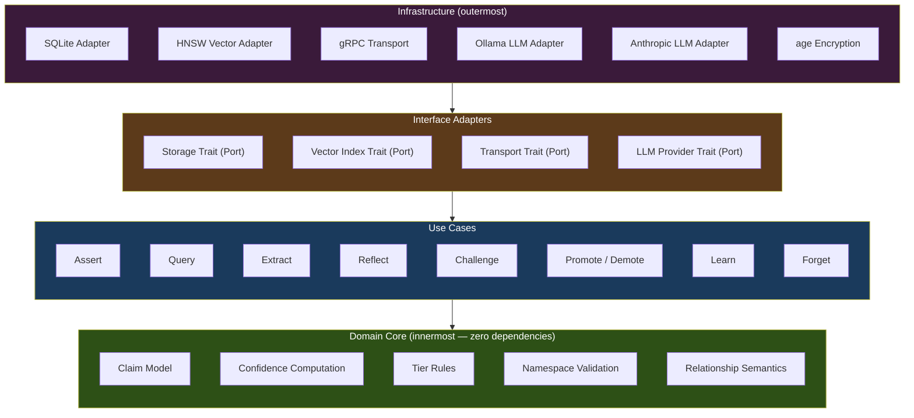

**Dependencies point inward.** Infrastructure depends on adapters, adapters depend on use cases, use cases depend on the domain. The domain never depends on anything outside itself.

## System Overview

Boswell consists of client applications (MCP servers, SDKs) that interact with one or more Boswell instances through a well-defined gRPC API. A Router is always present to provide session management and instance registry. This ensures a single, consistent authentication model and avoids duplicating security-critical token management logic across instances.

### Client Interaction Flow

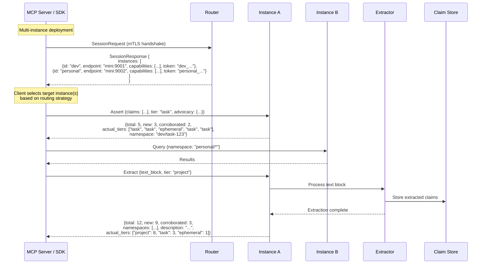

**Key points:**

- **Router is only for session establishment.** After receiving the instance list, clients communicate directly with instances.
- **Client makes all routing decisions.** The SDK determines which instance to target based on namespace, user configuration, or interactive selection.
- **Tier targeting on write.** Clients can specify target tier (ephemeral, task, project) and advocacy scores. The Gatekeeper evaluates tier-crossing requests and the response indicates where claims were actually stored.
- **Clients interact only with the instance API surface.** Background subsystems (Synthesizer, Gatekeeper, Janitor) operate autonomously.
- **Extract operation is client-initiated.** Clients send large text blocks to the Extractor, which generates structured claims and stores them in the Claim Store.

### Instance Architecture

Each Boswell instance handles client operations and runs background maintenance processes. The following sequence diagram shows how different operations flow through the instance:

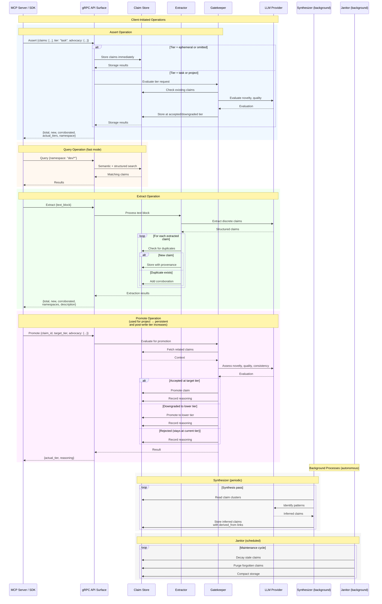

**Key characteristics:**

- **Client operations are synchronous.** Assert, Query, Extract, and Promote block until complete. Clients never interact directly with Extractor, Gatekeeper, or background subsystems.
- **Tier targeting on write.** Claims can target ephemeral (default), task, or project tiers. Ephemeral writes are immediate. Task/project writes trigger Gatekeeper evaluation, which may accept, downgrade, or reject to ephemeral. All writes succeed; the tier is determined by the Gatekeeper.
- **Extract operation is client-initiated but LLM-backed.** Clients send large text blocks; the Extractor uses the LLM to generate structured claims. These claims can also target specific tiers.
- **Gatekeeper evaluates tier-crossing requests.** Triggered when claims target task/project tier on write, or when promotion to persistent is requested. Not on a schedule.
- **Synthesizer and Janitor run autonomously.** No client interaction. They operate on schedules or triggers independent of client operations.
- **All subsystems interact with Claim Store.** It's the single source of truth for all claim data.

Each instance is a self-contained Boswell deployment with its own Claim Store, Extractor, Synthesizer, Gatekeeper, Janitor(s), and LLM Provider configuration. The Router provides session management and instance registry for all deployments, ensuring consistent authentication and token management regardless of the number of instances.

## Subsystem Specifications

### 1. Claim Store

**Responsibility:** Durable storage of all claims, relationships, and provenance. Serves all three read patterns: structured queries (point lookup, filtered search), semantic search (nearest-neighbor over embeddings), and temporal queries (what changed since X).

**Storage Architecture:**

The Claim Store uses a dual-storage design: SQLite as the authoritative source of truth, and an HNSW vector index as a derived projection for semantic search.

#### Write Path

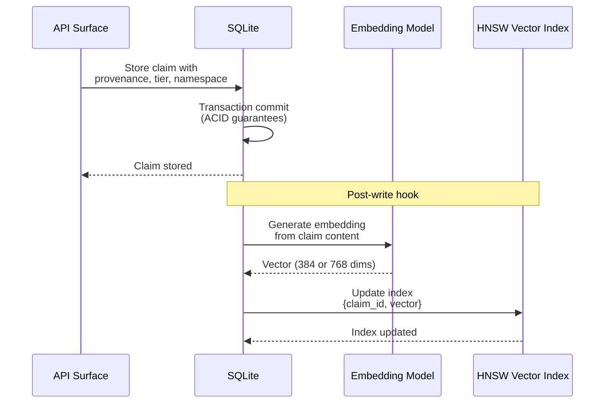

#### Read Path: Fast Mode Query

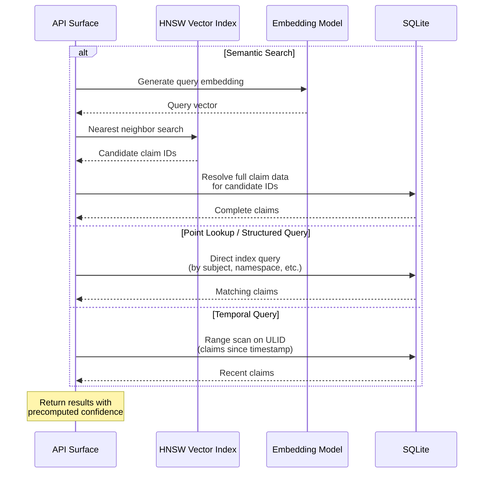

#### Read Path: Deliberate Mode Query

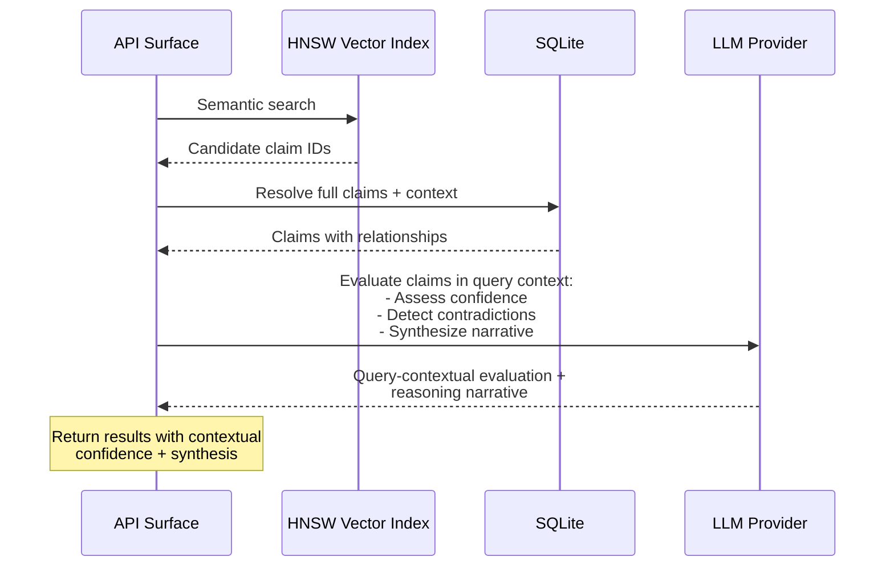

#### Maintenance: Vector Index Rebuild

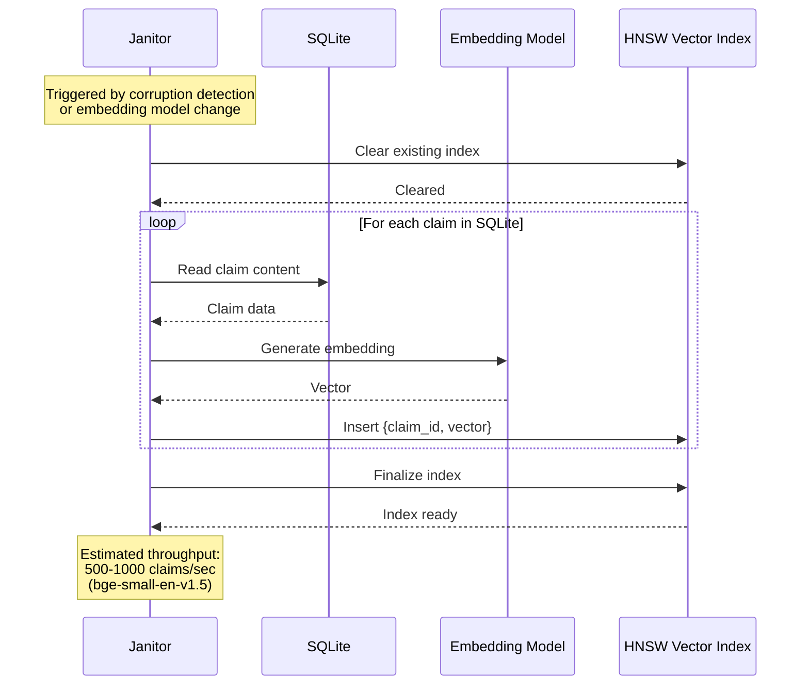

**Key architectural points:**

- **Primary store: SQLite (WAL mode).** Single file, ACID transactions, source of truth for all claim data. WAL (Write-Ahead Logging) mode provides concurrent reads with serialized writes. The expected write concurrency profile (dozens of agents at peak, handful typical) is well within SQLite's capacity in WAL mode.
- **Vector sidecar: HNSW index (memory-mapped).** A purpose-built vector index holding only claim IDs and their embedding vectors. Used exclusively for semantic search. This is a **derived projection** — if corrupted or lost, it is fully rebuildable from the SQLite database by re-reading claim embeddings. It is not a second source of truth.
- **Embeddings generated locally.** Using ONNX models (`bge-small-en-v1.5` at 384 dimensions or `nomic-embed-text` at 768 dimensions). No network calls for this high-frequency operation.
- **Fast mode (default):** Deterministic confidence computation from cached/precomputed values. Point lookups and structured queries served directly from SQLite indexes. Semantic search served from the HNSW sidecar with SQLite resolution of full claim data. Target latency: sub-millisecond for point lookups, low milliseconds for semantic search.
- **Deliberate mode (on demand):** Invokes an LLM to evaluate claim confidence in the context of the specific query, assess contradictions, and produce a reasoning narrative alongside the results. This is more powerful than the fast path because the evaluation is **query-contextual** — the same claim may receive different confidence treatment depending on what the agent is trying to do with it. The deliberate path may also return a synthesis narrative: "here's what we know, here's where the weak spots are, here's what contradicts what."

**Rationale for two-engine design:** A single engine that serves structured queries, semantic search, and event history well does not exist at the embedded/local scale. SQLite excels at structured queries and is adequate for event history (the ULID-based primary key enables efficient range scans for temporal queries). Vector search at scale (millions of claims) requires a purpose-built index with memory-mapped access for performance. The two-engine approach keeps each access pattern optimally served while maintaining a single source of truth.

**Capacity estimates (baseline: M4 Mac Mini, 16 GB RAM, 1 TB storage):**

- A fully indexed claim with its vector embedding is approximately 2.5-5 KB depending on embedding model (1-2 KB structured data + 1.5 KB embedding at 384 float32 dimensions with `bge-small-en-v1.5`, or 3 KB at 768 dimensions with `nomic-embed-text`).
- At 500 GB usable storage: ~100-200 million claims.
- The HNSW vector index is memory-mapped; the OS pages in actively-queried regions. 16 GB of RAM comfortably serves semantic search over millions of claims.
- This represents capacity well beyond what any individual would accumulate in years of heavy use.

### 2. Extractor

**Responsibility:** Accepts large blocks of text and produces structured claims. This is the "read a document and learn from it" pathway.

**Design:**

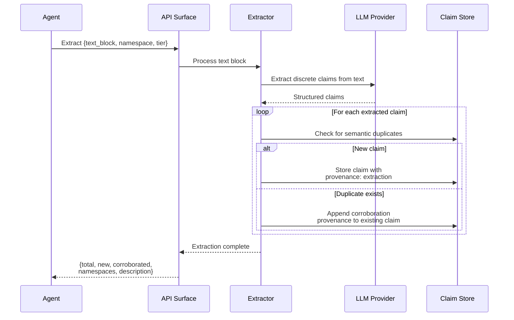

- **Fully LLM-backed.** The input text is sent to the configured LLM provider with instructions to extract discrete claims in the Boswell claim format.
- **Synchronous operation.** The Extract call blocks until all claims are produced. Extraction results (summary with counts, namespaces, and description) are returned when the operation completes. There is no partial or streaming result model.
- **Duplicate handling via corroboration.** If two agents submit the same text block (or different texts that yield semantically identical claims), the resulting duplicate claims are treated as corroboration. A new provenance entry is appended to the existing claim rather than creating a duplicate. This is analogous to "it must be true because everyone is saying it" — not necessarily true, but a signal of collective assessment, weighted appropriately in the confidence model.
- **Tier targeting.** Extracted claims can target a specific tier (ephemeral, task, or project). Default is ephemeral. Tier-crossing requests (task or project) trigger Gatekeeper evaluation. The Gatekeeper may accept the target tier, downgrade to a lower tier, or reject to ephemeral.
- **Provenance records on extracted claims** carry `source_type: extraction` with a hash of the source text for deduplication and traceability.

### 3. Synthesizer

**Responsibility:** Background process that continuously examines the claim graph and discovers emergent ideas — clusters of related claims that together imply a higher-order insight that no individual claim represents.

**Design:**

- **LLM-backed.** The Synthesizer reads claims, identifies patterns, and produces new claims with `source_type: inference` in their provenance and `derived_from` relationships linking back to the constituent claims.
- Runs as a **background process**, not triggered by API calls. Configurable schedule and scope (which namespaces to examine, how frequently).
- **Resolves the hyperedge question.** The claim model uses only pairwise relationships. The compound relationship "Claims A, B, and C together imply Claim D" is represented as Claim D with three `derived_from` edges and three provenance entries. The Synthesizer process handles the complexity; the schema stays simple.
- **Abstraction layers emerge organically.** First-order claims are extracted from sources or asserted by agents. The Synthesizer produces second-order claims from combinations. Over time, it discovers patterns across second-order claims and produces third-order abstractions. Cross-domain pattern recognition — "this software architecture pattern resembles this biological system" — happens naturally through iterative synthesis passes.

**Synthesis Workflow:**

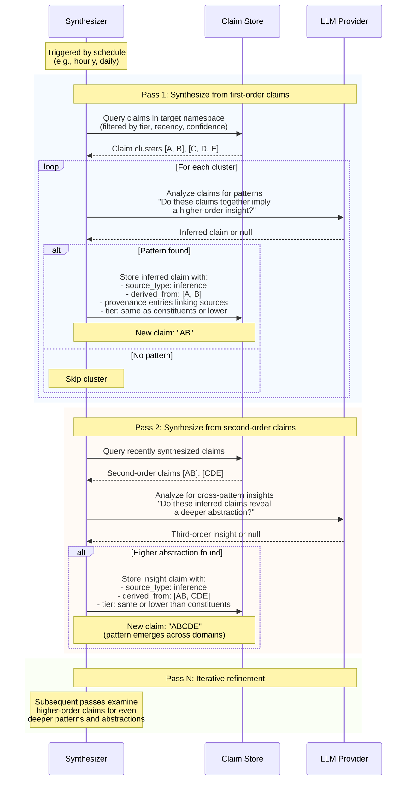

**Key aspects of synthesis:**

- **Synthesized claims enter at the same tier or lower than their constituents.** If all input claims are at task tier, the inferred claim enters at task tier. If inputs are mixed (some task, some ephemeral), the synthesized claim enters at the lower tier (ephemeral). This prevents automatically elevating speculative inferences.
- **Confidence intervals are wider (more uncertain) for synthesized claims.** Uncertainty propagates outward through inference chains, which is epistemically correct.
- **Synthesis is scoped by namespace.** The Synthesizer can target specific namespaces (e.g., "acme/project-x/*") or run across multiple namespaces to find cross-domain patterns.
- **Provenance preserves the full chain.** A third-order claim has `derived_from` links to second-order claims, which in turn link to first-order claims. The entire reasoning chain is traceable.
- **Failed synthesis attempts are not stored.** If the LLM returns "no pattern found," the cluster is skipped. No noise accumulates from failed inference attempts.

### 4. Janitor(s)

**Responsibility:** Maintenance operations including staleness decay, confidence recomputation, garbage collection of forgotten claims, and periodic health checks on claim quality.

**Design:**

- **Primarily deterministic.** Most Janitor operations are rule-based: decaying confidence based on staleness, purging claims past their TTL, compacting storage after deletions.
- **LLM-assisted for contradiction detection.** Semantic contradictions are not always structurally obvious. The Janitor can invoke an LLM to evaluate whether two claims that are structurally unrelated are semantically contradictory.
- **LLM-assisted for periodic confidence re-evaluation.** On a less-frequent schedule, the Janitor can re-evaluate claims using the same LLM-assisted process as the deliberate query path, baking updated assessments into the stored confidence values.
- **Multiple Janitors can run concurrently** on different schedules:
  - A **staleness Janitor** running hourly, decaying confidence on stale claims.
  - A **contradiction Janitor** running less frequently, performing LLM-assisted conflict detection.
  - A **tier migration Janitor** evaluating demotion candidates based on access patterns and confidence degradation.
  - A **garbage collection Janitor** running nightly, purging claims in `forgotten` status and compacting storage.
- Janitors coordinate via advisory locking or claim-level status flags to avoid conflicting operations. SQLite's transaction isolation handles the rest.
- **Archival policy** is configurable per namespace. Users may have different retention preferences for different domains. Claims in `forgotten` status are hard-deleted after a configurable retention period. Claims in `ephemeral` tier that haven't been accessed in a configurable window are purged automatically.

### 5. Gatekeeper

**Responsibility:** Evaluates claims targeting higher tiers to ensure that no edge agent has unilateral authority to decide what knowledge persists at task, project, or persistent tiers.

**Design:**

- **LLM-backed, event-driven.** Triggered when claims target tiers above ephemeral (on write) or when explicit promotion is requested (from project to persistent).
- **Exists at every tier boundary.** The Gatekeeper at ephemeral → task can be more permissive (low stakes, easy cleanup). The Gatekeeper at project → persistent should be the most skeptical (protecting long-term memory from noise).
- **Different Gatekeepers can use different LLM configurations.** The ephemeral → task Gatekeeper might run a fast local model. The project → persistent Gatekeeper might use a frontier model for nuanced evaluation.

**Tier Assignment Rules:**

1. **Default is ephemeral.** Claims without an explicit tier target are stored immediately at ephemeral tier. No Gatekeeper evaluation.
2. **Agents can target task or project tier on write.** Assert and Extract operations accept `target_tier` and `advocacy` parameters. Targeting task or project triggers Gatekeeper evaluation.
3. **Advocacy scores required for higher tiers.** Agent must express `advocacy: {importance: 0.8, confidence: 0.9}` indicating how important they believe the claim is and how confident they are in its accuracy.
4. **Gatekeeper can accept, downgrade, or reject.** 
   - **Accept:** Claim stored at target tier.
   - **Downgrade:** Claim stored at a lower tier (e.g., agent requested project, Gatekeeper puts it at task).
   - **Reject to ephemeral:** Claim stored at ephemeral with reasoning recorded.
5. **No direct writes to persistent.** Agents can target up to project tier. Persistent tier always requires explicit promotion from project tier (most deliberate curation).
6. **Rejection doesn't fail the write.** All claims are stored; the Gatekeeper determines the tier. The response indicates where the claim landed and why.

**Evaluation process:**

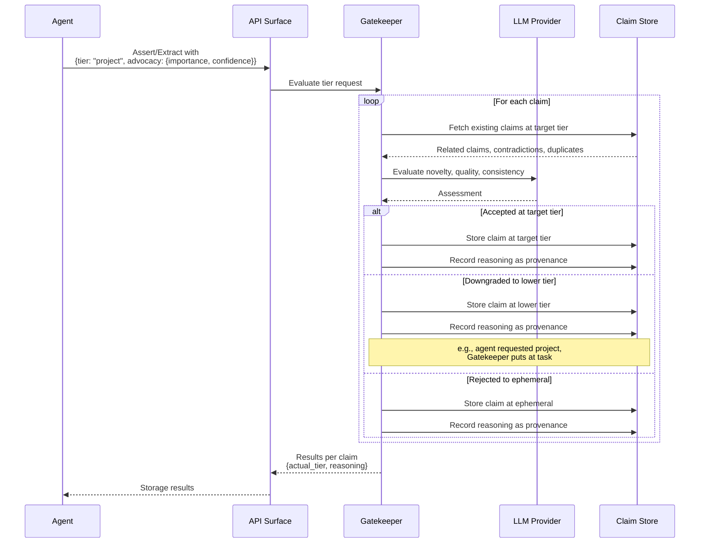

1. Agent submits claims with optional tier target and advocacy scores: `{importance, confidence}` expressing how important the agent believes the claim is and how confident they are in its accuracy.
2. If tier is omitted or set to ephemeral, claim is stored immediately without Gatekeeper evaluation.
3. If tier is task or project, Gatekeeper evaluates each claim against existing claims at the target tier — checking for redundancy, contradiction, and novelty.
4. Gatekeeper considers the agent's advocacy but is **not bound by it**. High advocacy from the agent is a signal, not an instruction.
5. Gatekeeper accepts at target tier, downgrades to a lower tier, or rejects to ephemeral. **The write always succeeds**; the Gatekeeper determines where the claim lands.
6. Gatekeeper's reasoning is recorded as a provenance entry on the claim for future reference.

**All claims are stored, tier determines TTL and scope.** Even "rejected" claims are stored at ephemeral tier with the Gatekeeper's reasoning. If the TTL expires without further advocacy or corroboration, the Janitor sweeps them normally. If new evidence surfaces and another agent independently submits the same knowledge, the Gatekeeper has context from the prior evaluation.

**Defense against confidence bubbles.** If a swarm of agents all hallucinate the same incorrect claim and submit it with high advocacy scores, the Gatekeeper evaluates it against established knowledge and can reject despite high advocacy. The broader context acts as a check on swarm groupthink.

### 6. Router

**Responsibility:** Session management and instance registry. The Router responds to session requests from authorized clients with a list of registered instances, their endpoints, capabilities, and health status.

**Design:**

- **Always present in all deployments.** The Router serves as the single source of session management and token issuance, avoiding duplication of security-critical code in instances. In single-instance deployments, it simply returns a single-element instance list.
- **Not in the hot path for any operations.** After the initial session handshake, the client SDK routes all operations directly to instances. The Router is only contacted for session establishment and registry refresh.
- **Serves only authorized clients.** Session requests are authenticated via mTLS. Only registered clients receive the instance list.

**Trust Model:**

The Router handles session establishment, but instance-level authentication (mTLS on every connection between Router and instance, and between client and instance) ensures that instances independently verify all incoming connections. This is described in detail in the Security Model section.

- **Instance registration is manual and deliberate.** Adding a new instance to the Router requires explicit administrative action and configuration file update. There is no automatic discovery mechanism.
- **Identity is cryptographic.** Each instance has a keypair. The public key (fingerprint) is registered with the Router. Mutual TLS (mTLS) ensures both sides verify identity on every connection.

**Instance Registry:**

Each instance entry contains:

- **instance_id:** Unique identifier for the instance
- **Cryptographic fingerprint:** Identity verification, never changes without explicit administrative action
- **One or more endpoints:** An instance may be reachable at different addresses depending on network context (LAN IP at home, VPN address when remote)
- **Capabilities:** Array of supported operations (e.g., `["assert", "query", "extract", "learn", "reflect", "forget"]`). Some instances may have restricted capability sets.
- **Health status:** Tracked by periodic health checks. States: `healthy`, `degraded`, `unreachable`. Included in session responses so clients can make informed routing decisions.

**Health Tracking:**

The Router periodically health-checks registered instances to maintain current status:
- Successful response within timeout → `healthy`
- Slow response or partial failure → `degraded`
- Connection failure or timeout → `unreachable`

Health status is reported in session responses. Clients are responsible for handling unreachable instances (retry logic, alternate routing, user notification).

**Portable Encrypted Configuration:**

- The Router's configuration file contains the full registry: instance fingerprints, endpoints, and capabilities.
- **Encrypted at rest** using `age` (a modern encryption tool with a mature Rust crate). Passphrase-based encryption — no key files to manage separately.
- **Decrypted in memory at startup.** The Router prompts for the passphrase, decrypts in memory, and never writes plaintext to disk. Re-encrypts before writing any modifications.
- **Portable by design.** The user can store the encrypted config file in iCloud, a USB drive, or any other accessible location. From any machine with the Router binary and the passphrase, the user can spin up a Router that connects to their instance network.
- **Config versioning.** A sequence number in the config allows detecting which copy is most recent when copies exist in multiple locations.
- **Config sync is manual and deliberate.** No automatic synchronization — this prevents propagation of a compromised config.
- Inner format: TOML or JSON (human-readable when decrypted, easy to inspect and hand-edit).

**Token Issuance:**

- When an agent requests access through the Router, the Router issues one session token per registered instance.
- Agents use the instance-specific tokens to communicate directly with instances, removing the Router from the operational path.
- Each instance validates its own tokens against the Router's signing key.

**The Router itself should run on the user's trusted machine** (not a remote server) since it holds the instance registry, keys, and token-issuing authority. Its configuration is file-based and version-controllable for audit trail of trust changes.

## API Surface

All operations are exposed via gRPC. The API supports both direct instance access (agent → instance) and multi-instance access (agent → Router for session, then agent → instances for operations).

The client SDK is responsible for all routing decisions. Based on the instance list received during session establishment, the SDK determines which instance to target for each operation. Routing strategies are implementation-specific and may include: namespace-based routing, user configuration, or interactive selection.

| Operation | Description | Sync/Async | LLM Required |
|---|---|---|---|
| **Assert** | Submit one or more claims with provenance and confidence. Supports optional tier targeting (ephemeral, task, project) with advocacy scores. Tier-crossing requests trigger Gatekeeper evaluation. | Synchronous (may involve Gatekeeper) | Task/project tiers only |
| **Query** | Retrieve claims by structure, semantics, or time. Supports fast (default) and deliberate modes. | Synchronous | Deliberate mode only |
| **Challenge** | Register a contradiction against an existing claim | Synchronous | No |
| **Promote** | Request tier migration for an existing claim. Primarily used for project → persistent promotion. Triggers Gatekeeper evaluation. | Synchronous (involves Gatekeeper) | Yes |
| **Extract** | Submit a text block for claim extraction. Supports optional tier targeting like Assert. | Synchronous (blocking, may involve Gatekeeper) | Yes (extraction + tier evaluation if needed) |
| **Learn** | Bulk-load pre-formatted claims directly into the Claim Store. Supports tier targeting. | Synchronous (may involve Gatekeeper) | Task/project tiers only |
| **Reflect** | Request a synthesized summary of knowledge about a topic | Synchronous | Yes |
| **Forget** | Request eviction of a claim (transitions to `forgotten` status for eventual purging) | Synchronous | No |

**Tier Targeting on Write:**

Operations that write claims (Assert, Extract, Learn) accept optional `target_tier` and `advocacy` parameters:
- **Default behavior:** Claims without a specified tier are stored at ephemeral. No Gatekeeper evaluation, immediate storage.
- **Targeting task or project:** Including `target_tier: "task"` or `target_tier: "project"` with `advocacy: {importance, confidence}` triggers Gatekeeper evaluation. The Gatekeeper may accept the target tier, downgrade to a lower tier, or reject to ephemeral. **The write always succeeds**; the response indicates where the claim was actually stored.
- **Persistent tier:** Cannot be targeted directly. Claims must be promoted from project tier using the Promote operation.

This model balances agent intent (agents know when something is important) with systematic oversight (Gatekeeper prevents noise accumulation at higher tiers).

### Batch Writes and Cross-Domain Routing

Assert (and Learn) accept batches of one or more claims per call. An agent completing a task might produce 20 claims at once; sending them individually would be needlessly chatty.

**In single-instance mode:** The instance accepts the entire batch regardless of domain mix — there's nowhere else for claims to go. Routing hints are ignored.

**In multi-instance mode:** The client SDK groups claims by target instance using its routing strategy, then sends sub-batches directly to each instance in parallel.

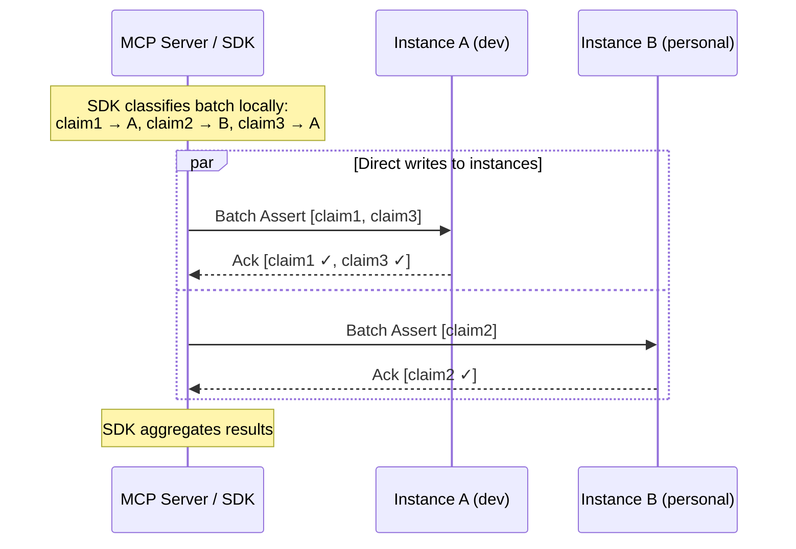

**Partial success model:** Batches are **not atomic** across instances. If claims routed to Instance A succeed but Instance B is unreachable, the client receives partial success with per-instance reporting:

```json
{
  "results": [
    { 
      "instance": "development", 
      "status": "ok",
      "summary": { "total": 2, "new": 2, "corroborated": 0 },
      "namespace": "acme/dev/task-123"
    },
    { 
      "instance": "personal", 
      "status": "failed",
      "reason": "instance_unreachable",
      "claims_not_stored": 1
    }
  ]
}
```

The agent can decide whether to retry failures or let them go. The client is responsible for retrying connections to unreachable instances. Forcing atomicity across instances would require distributed transactions — a complexity cost that provides minimal benefit for this use case.

### Learn Operation Details

The Learn operation enables direct loading of correctly-formatted claim data without the overhead of LLM-based extraction. Use cases include: restoring from a previous session's export, loading a curated knowledge base, importing from another Boswell instance, or bootstrapping domain knowledge.

Parameters include:

- **Target tier:** Which tier to target (ephemeral, task, project). Default is ephemeral. Targeting task or project triggers Gatekeeper evaluation with the trust level serving as advocacy confidence.
- **Trust level:** Initial confidence for loaded claims, also used as advocacy confidence for Gatekeeper evaluation. Can be set high ("these are curated, trust them") or moderate ("load these but let the system validate over time").
- **Conflict policy:** How to handle claims that contradict existing claims — flag immediately, load quietly and let the Janitor sort it out, or reject the conflicting subset.
- **Namespace targeting:** Which namespace the claims land in.

### Query Operation Details

Query supports three retrieval modes:

- **Semantic search:** "Give me everything relevant to topic X." Hits the vector sidecar first for candidate IDs, resolves full claims from SQLite.
- **Point lookup:** "Give me the current state of claim Y" or "Give me all claims where subject = Z." Direct SQLite index queries.
- **Temporal:** "What changed since timestamp X." Range scan on ULID primary key (which embeds creation timestamp).

Additionally, Query supports namespace scoping in three modes:

- **Exact:** `namespace = "acme/website-rebuild/migrate-db"` — only claims at this precise scope.
- **Recursive:** `namespace = "acme/website-rebuild/*"` — prefix match, everything underneath.
- **Depth-limited:** `namespace = "acme/website-rebuild/*/1"` — one level of children only, not grandchildren.

## Technology Stack

| Component | Technology | Rationale |
|---|---|---|
| **Language** | Rust | Compiler-enforced safety (concurrency, memory), ideal for agent-written code where the borrow checker acts as an infallible code reviewer. Zero-cost abstractions, small binaries, no runtime dependency. |
| **Primary Storage** | SQLite (WAL mode) | Single-file, embedded, ACID, handles expected write concurrency, excellent structured query performance at millions of rows. |
| **Vector Index** | HNSW-based (e.g., `usearch`) | Memory-mapped, purpose-built for nearest-neighbor search at scale. Derived projection, rebuildable from SQLite. |
| **API Transport** | gRPC via `tonic` | Efficient binary protocol, streaming support (useful for Reflect and deliberate Query), excellent Rust support, built-in TLS. |
| **Authentication** | Mutual TLS (mTLS) | Cryptographic identity verification at the instance level. Every connection to every instance is authenticated, regardless of deployment mode. No shared secrets. |
| **Config Encryption** | `age` crate | Modern, passphrase-based encryption, pure Rust, no external dependencies. Replaces PGP with simpler, more secure design. |
| **Identifiers** | UUIDv7 | Universally unique, lexicographically sortable by creation time, no coordination required for generation (ideal for agent swarms). RFC 9562 standard. Rust crate: `uuid` with `v7` feature. |
| **Embedding Models** | Local via ONNX (e.g., `fastembed` or equivalent) | High-frequency operation (every Assert, Learn, Query), must be fast and free of network/API dependencies. Ships with `bge-small-en-v1.5` (384 dimensions) and `nomic-embed-text` (768 dimensions). User selects at instance creation. |
| **LLM Integration** | Pluggable provider trait | Each subsystem independently configurable. Supports local models (Ollama, etc.) and API providers (Anthropic, OpenAI, etc.). |

## Embedding Model Management

Embedding model selection is a per-instance configuration decision with the highest switching cost in the system. Once claims are embedded, changing models requires re-embedding every claim.

**Key design decisions:**

- **Default to local models for embeddings.** Embeddings are the highest-frequency LLM-adjacent operation. Network latency and API costs on every write and read are unacceptable.
- **Ship with two models:** `bge-small-en-v1.5` (384 dimensions — faster, smaller, sufficient for topical relevance) and `nomic-embed-text` (768 dimensions — more headroom). User chooses at instance creation. The vector index is for getting into the right neighborhood; the LLM-backed subsystems handle fine-grained reasoning about nuance.
- **Embedding model is recorded in instance configuration** so the system never accidentally mixes embeddings from different models in the same vector index.
- **Re-embedding migration path built in from day one.** A CLI command/Janitor mode that reads every claim from SQLite, recomputes embeddings against a new model, and rebuilds the vector index. Estimated throughput: `bge-small-en-v1.5` processes ~500-1000 claims/second on modern CPU. 1 million claims ≈ 15-30 minutes. 10 million claims ≈ 2.5-5 hours. `nomic-embed-text` at roughly half that throughput.
- **Reindexing is a completely offline operation.** The instance is taken down, the reindex runs, the instance is brought back up. No maintenance mode, no accepting writes during reindex. If agents need memory during the reindex window, the Router's graceful degradation handles it — the instance is simply unavailable.

## Security Model

Security operates at two levels: the **Router** handles all session establishment and token issuance, and each **instance** validates tokens and enforces authorization on operations. This separation ensures consistent authentication logic across all deployments.

### Connection Protocol

All clients connect to the Router for session establishment. Instances never handle session requests directly:

1. Client connects to its configured Boswell endpoint.
2. mTLS handshake — mutual identity verification.
3. Client sends a **session request** (empty beyond identity — no operational context).
4. The endpoint responds with an **instances array** describing available instances with their endpoints, capabilities, health status, and **instance-specific session tokens**.
5. The client SDK uses this instance list to route operations directly to the appropriate instance, including the instance-specific token with each operation. Namespace and tier targeting are properties of individual operations, not the session.

The session is purely an authentication and instance registry retrieval context. The client receives everything it needs to route operations independently.

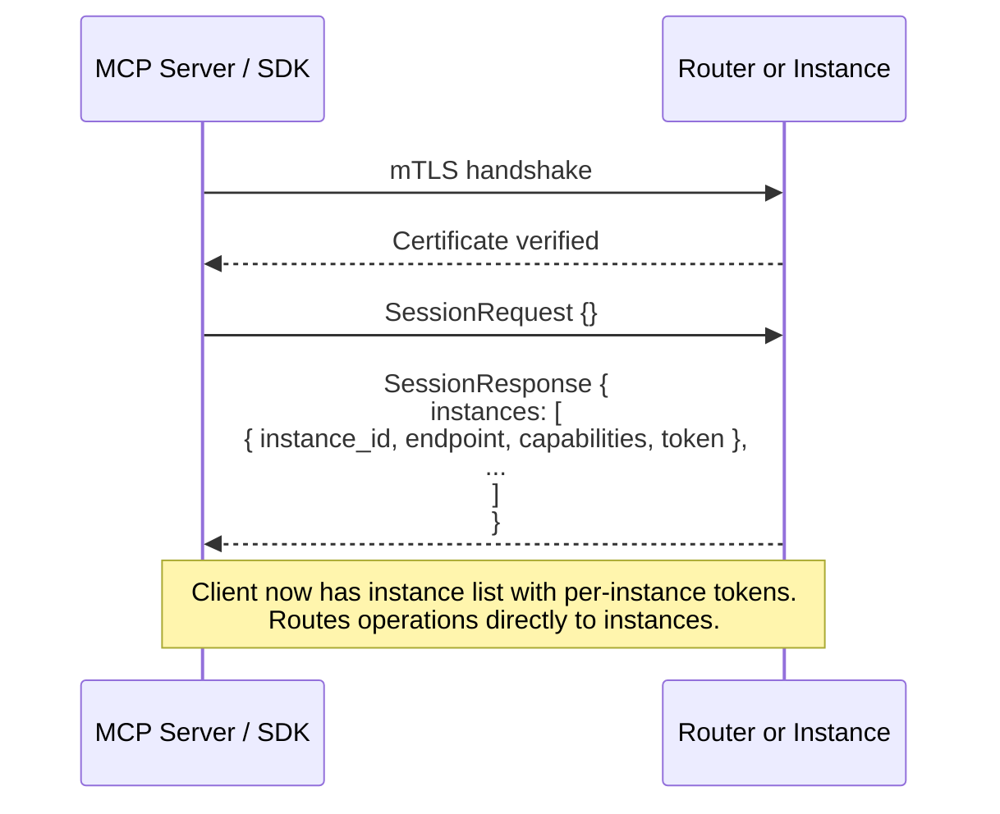

**Session response in multi-instance mode:**

```json
{
  "instances": [
    {
      "instance_id": "development",
      "endpoint": "mini:9001",
      "capabilities": ["assert", "query", "challenge", "promote", "demote", "extract", "learn", "reflect", "forget"],
      "token": "dev_xyz789_abc123"
    },
    {
      "instance_id": "personal",
      "endpoint": "mini:9002",
      "capabilities": ["assert", "query", "challenge", "promote", "demote", "extract", "learn", "reflect", "forget"],
      "token": "personal_def456_ghi789"
    },
    {
      "instance_id": "professional",
      "endpoint": "vps-1:9001",
      "capabilities": ["assert", "query", "learn", "reflect", "forget"],
      "token": "prof_jkl012_mno345"
    }
  ]
}
```

**Session response in single-instance mode:**

```json
{
  "instances": [
    {
      "instance_id": "development",
      "endpoint": "self:9001",
      "capabilities": ["assert", "query", "challenge", "promote", "demote", "extract", "learn", "reflect", "forget"],
      "token": "dev_abc123_xyz789"
    }
  ]
}
```

Same shape — one entry in the array, one token for that instance.

The client interaction is identical regardless of the number of instances:

#### Sequence: Single Instance

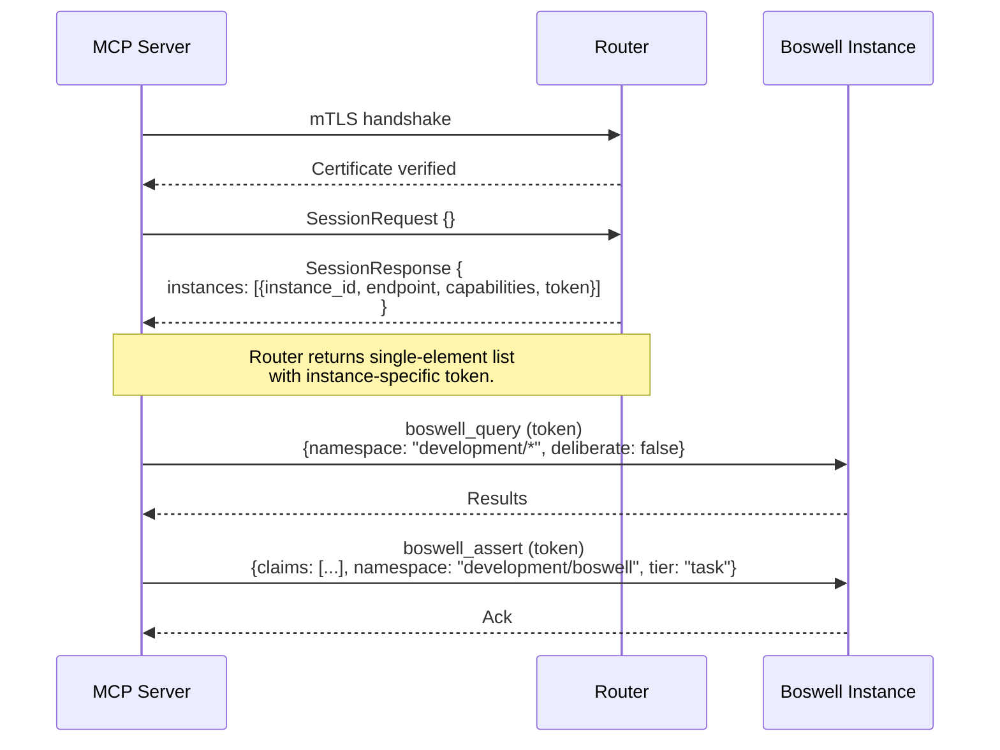

#### Sequence: Multi-Instance

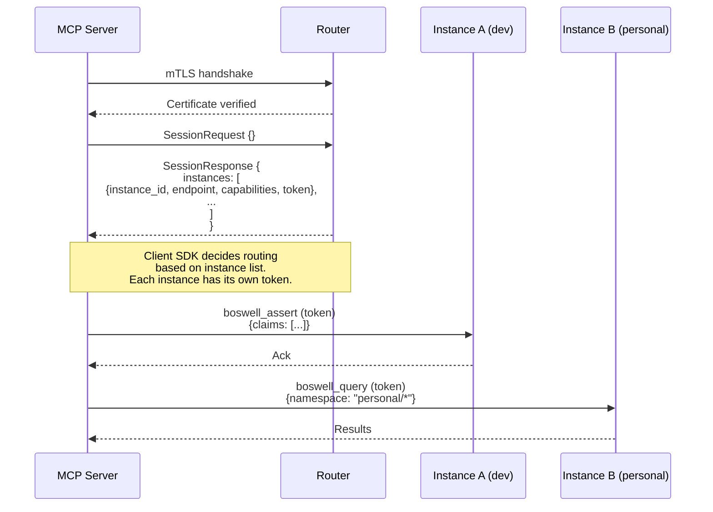

The client SDK makes all routing decisions based on the list of available instances. The SDK can use various strategies: namespace-based routing, user configuration, or interactive prompting when ambiguous.

**Instance availability:** The client is responsible for handling connection failures with retries. If an instance becomes unreachable, the client can attempt reconnection or query the Router for an updated instance list by issuing a new session request.

#### Uniform API Shape

The session request and all subsequent operation calls have **identical structure** regardless of what's on the other end. This means:

- The MCP server has one code path. No `if router then ... else ...` branching.
- Swapping between single-instance and multi-instance deployment is a configuration change (the endpoint URL), not a code change.
- The session is stateless beyond authentication and initial instance list. No routing decisions are baked into the session.

### Instance Authentication

Every instance enforces mTLS (mutual TLS) on every inbound connection. Any client — whether an MCP server, a Router, a direct SDK call, or any other integration — must present a client certificate that the instance recognizes. Connections without a valid registered certificate are rejected at the TLS handshake. There are no unauthenticated access modes.

### Client Registration

Clients are registered with an instance through the same manual trust process used for Router-to-instance registration:

1. The client (e.g., MCP server) generates a keypair.
2. The client's public key fingerprint is manually registered with the instance.
3. The instance only accepts connections from certificates matching registered fingerprints.

This applies to every type of client: MCP servers, Router processes, direct SDK connections, and any future integration. Each gets its own keypair and explicit registration.

### Session Management

The Router is the single source of truth for session management and token issuance in all deployment modes:

- **Single-instance deployments:** The Router issues one session token for the instance and returns a single-element instance list containing the lone instance with its token. The overhead is minimal (one additional process), but the architectural benefit is significant: no duplication of security-critical session management code.
- **Multi-instance deployments:** The Router issues one session token per instance and returns the full instance list with each instance's token. The client SDK routes operations directly to instances using the appropriate instance-specific token.

In both cases, each session token is scoped to its specific instance. This provides granular security: token compromise affects only one instance, and the Router can grant different permissions per instance. Operational context (namespace, tier) is carried on each individual operation, not the session.

### Instance Token Validation

Each instance validates its own session tokens on every operation but does not issue them. The Router's public key is registered with each instance, allowing instances to cryptographically verify their tokens. Each token is instance-specific and signed by the Router.

If a token is compromised, only that specific instance is affected. The Router can revoke individual instance tokens without affecting other instances or requiring certificate changes. This provides granular security and audit capabilities.

### Certificate and Key Management

- Each entity (instance, Router, MCP server, SDK client) has its own keypair.
- Public key fingerprints are registered manually. No automatic trust establishment.
- If a client is compromised: remove its fingerprint from the instance registry. It is immediately unable to connect.
- If an instance is compromised: remove it from the Router registry and revoke any tokens issued for it.
- If the Router is compromised: revoke its certificate at each instance. No instance trusts the Router until re-registered.

The goal is that every trust relationship is explicit, manually established, and independently revocable.

## Client Integration

LLMs do not make network calls directly. When an LLM decides to use a tool, it emits a structured function call (typically JSON) that the host application intercepts, executes, and returns the result as context. Boswell must provide the glue between the LLM's expressed intent and the actual gRPC service.

### Integration Architecture

This shows the complete flow from LLM tool invocation through to Boswell operations:

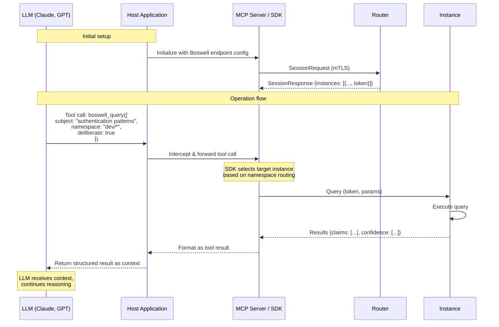

**Key Flow:**

1. **Initialization** - Host application starts MCP server/SDK, which establishes session with Router and receives instance list with tokens
2. **Tool Invocation** - LLM emits structured tool call (JSON), host intercepts it
3. **Routing** - MCP/SDK determines target instance based on namespace or other routing strategy
4. **Execution** - Direct gRPC call to instance using instance-specific token
5. **Response** - Instance returns results, MCP/SDK formats them, host provides to LLM as context

### Components

#### MCP Server (Primary Integration Path)

MCP (Model Context Protocol) is the emerging standard for exposing tools to LLM-powered applications. Claude Desktop, Claude Code, Cursor, and a growing number of agent frameworks support it natively.

The Boswell MCP server:

- Runs locally as a standalone process.
- Holds a registered client certificate for authenticating to the Router (for session establishment) and to instances (for operations) via mTLS.
- On session start, receives the full instance list (endpoints and capabilities) from the Router and routes operations directly to instances.
- Exposes all Boswell operations (Assert, Query, Challenge, Promote/Demote, Extract, Learn, Reflect, Forget) as MCP tools.
- Handles gRPC communication to instances internally.
- Requires zero custom integration code from the user. They add one MCP configuration entry and Boswell tools appear in their LLM client.

This is the highest-leverage integration for adoption. A user installs Boswell, starts the service, adds an MCP config entry, and their Claude or Cursor session immediately has persistent memory.

#### Tool Definitions (JSON Schema)

Portable function schemas describing each Boswell operation — name, parameters, types, and descriptions. These are the LLM-facing documentation that tell the model what tools are available and how to call them. Published as standalone JSON files that any agent framework can load, regardless of whether it supports MCP.

Example (abbreviated):

```json
{
  "name": "boswell_assert",
  "description": "Assert one or more claims into memory with provenance and confidence",
  "parameters": {
    "type": "object",
    "properties": {
      "claims": {
        "type": "array",
        "description": "One or more claims to assert",
        "items": {
          "type": "object",
          "properties": {
            "subject": { "type": "string", "description": "The entity the claim is about" },
            "predicate": { "type": "string", "description": "The relationship or property" },
            "direct_object": { "type": "string", "description": "The value or target" },
            "raw_expression": { "type": "string", "description": "Natural language form of the claim" },
            "namespace": { "type": "string", "description": "Target namespace for the claim" },
            "tier": { "type": "string", "enum": ["ephemeral", "task", "project", "persistent"] }
          },
          "required": ["subject", "predicate", "direct_object", "raw_expression"]
        }
      }
    },
    "required": ["claims"]
  }
}
```

#### Client SDK (Rust)

A Rust library wrapping gRPC calls to the Router or instances. Used internally by the MCP server and available for Rust-based agent frameworks or custom integrations. This is the foundation layer — all other integration paths build on it.

#### Client SDK (Python)

A Python wrapper for the Rust client SDK (via PyO3 or a standalone gRPC client). Given the dominance of Python in the AI agent ecosystem, this expands Boswell's reach significantly. Supports integration with LangChain, CrewAI, AutoGen, and other Python agent frameworks.

#### Client SDK (TypeScript)

A JavaScript/TypeScript wrapper for web-based and Node.js agent frameworks. Supports integration with Vercel AI SDK, LangChain.js, and similar.

### Priority

| Component | Priority | Rationale |
|---|---|---|
| MCP Server | High | Lowest-friction path to adoption. Zero integration code for MCP-capable clients. |
| Tool Definitions (JSON Schema) | High | Required by the MCP server and useful independently for any agent framework. |
| Client SDK (Rust) | High | Foundation for MCP server and all other integrations. |
| Client SDK (Python) | Medium | Expands reach to the large Python agent ecosystem. |
| Client SDK (TypeScript) | Medium | Expands reach to web and Node.js agent frameworks. |

## Deployment Models

### Single Instance (Minimum Viable)

A single Boswell instance on the user's machine with a Router process for session management. The MCP server (or other clients) connects to the Router, receives a session token and single-element instance list, then communicates directly with the instance. The Router's overhead is negligible (< 1MB memory, near-zero CPU when idle), but ensures consistent security architecture. Suitable for individual use with a small number of agents.

### Multi-Instance Local

Multiple Boswell instances on one or more machines on a local network. Router runs on the user's primary machine. Instances and the Router are manually registered with each other. MCP server authenticates to the Router to receive the instance list, then communicates directly with instances. Suitable for domain-isolated memory (development, personal, professional).

### Multi-Instance Distributed

Instances spread across local machines and remote servers (VPS, cloud). Router manages the instance registry. Encrypted portable config enables spinning up a Router from any location. The trust model (mTLS at every connection, manual registration at every trust boundary) ensures security across untrusted networks.

## Quality Assurance Strategy

Rust's compiler is the first and most aggressive quality gate. Code with data races, use-after-free, null pointer dereferences, or concurrency bugs will not compile. This is particularly valuable given that development agents will be writing much of the code.

**CI pipeline gates (all must pass):**

1. `cargo clippy` — lint for idiomatic issues, performance anti-patterns, unnecessary allocations, inefficient iterations.
2. `cargo test` — unit tests, integration tests, doc tests (example code in documentation is executed as tests).
3. `cargo bench` (criterion) — performance benchmarks with regression detection for hot paths. Target latencies defined for key operations.
4. `cargo audit` — dependency vulnerability scanning.

**Testing frameworks:**

- **Built-in `#[test]`** — unit and integration tests, first-class language feature.
- **criterion** — statistically rigorous benchmarking with regression detection. Catches performance degradation from refactoring.
- **proptest** — property-based testing. Defines invariants ("confidence score is always between 0.0 and 1.0", "asserting the same claim twice doesn't create duplicates") and generates thousands of random inputs to find violations.
- **tokio::test** — async test runtime for concurrent operation testing.
- **insta** — snapshot testing for verifying query results and API responses don't change unexpectedly.
- **miri** — interpreter that detects undefined behavior in unsafe code.

**Benchmark-driven development for hot paths:** Key operations have target latencies defined as criterion benchmarks. Agents writing code must produce implementations that meet these targets, and regression is automatically caught.
