# Boswell — System Architecture

## Architectural Approach

Boswell follows Clean Architecture (also known as Hexagonal Architecture or Ports and Adapters) principles. In the Rust ecosystem, this manifests through traits and modules rather than interfaces and dependency injection containers, but the principles are identical:

- **Domain core has zero external dependencies.** The claim model, confidence computation, tier rules, namespace validation, and relationship semantics depend on nothing outside the domain. They do not know about SQLite, gRPC, or any specific LLM provider.
- **Use cases orchestrate domain logic.** Assert, Query, Challenge, Extract, Reflect, and other operations are implemented as use cases that compose domain primitives.
- **Adapters implement traits defined by the domain.** The SQLite storage adapter, gRPC transport adapter, and LLM provider adapters all implement traits (ports) that the domain defines. They are interchangeable without touching domain code.
- **Dependencies point inward.** Infrastructure depends on the domain. The domain never depends on infrastructure.

This architecture is particularly well-suited to an open source project. Contributors can work on an LLM provider adapter without understanding Claim Store internals, or add a new Janitor policy without touching the gRPC layer. The boundaries act as guardrails for contributors who do not have full context of the system.

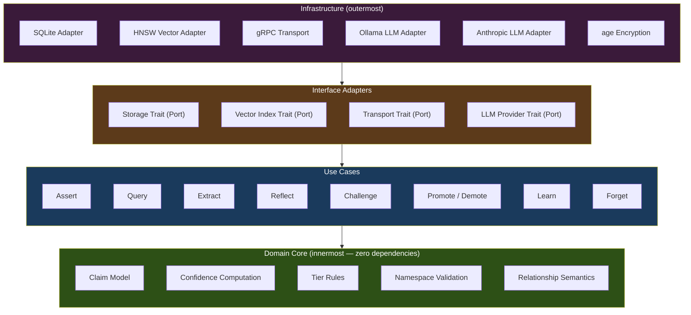

**Dependencies point inward.** Infrastructure depends on adapters, adapters depend on use cases, use cases depend on the domain. The domain never depends on anything outside itself.

## System Overview

Boswell consists of six subsystems coordinated through well-defined interfaces:

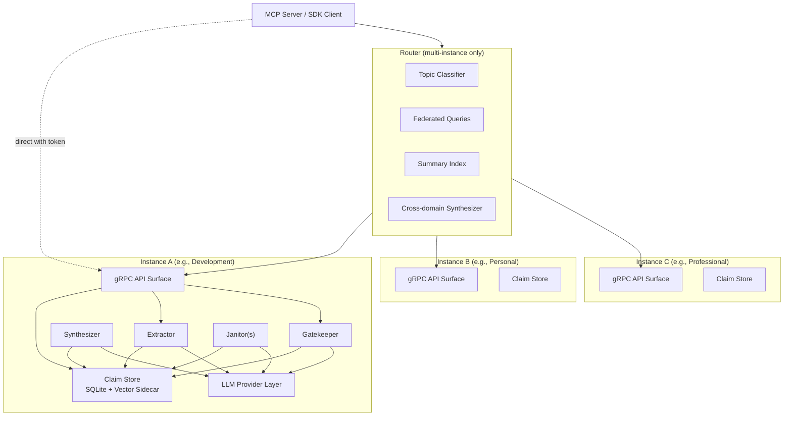

Each instance is a self-contained Boswell deployment with its own Claim Store, Extractor, Synthesizer, Gatekeeper, Janitor(s), and LLM Provider configuration. The Router coordinates across instances but is not required for single-instance deployments.

## Subsystem Specifications

### 1. Claim Store

**Responsibility:** Durable storage of all claims, relationships, and provenance. Serves all three read patterns: structured queries (point lookup, filtered search), semantic search (nearest-neighbor over embeddings), and temporal queries (what changed since X).

**Storage Architecture:**

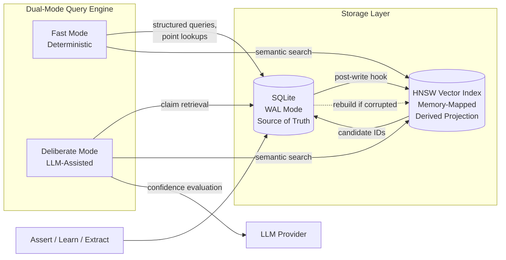

- **Primary store: SQLite (WAL mode).** Single file, ACID transactions, source of truth for all claim data. WAL (Write-Ahead Logging) mode provides concurrent reads with serialized writes. The expected write concurrency profile (dozens of agents at peak, handful typical) is well within SQLite's capacity in WAL mode.
- **Vector sidecar: HNSW index (memory-mapped).** A purpose-built vector index holding only claim IDs and their embedding vectors. Used exclusively for semantic search. This is a **derived projection** — if corrupted or lost, it is fully rebuildable from the SQLite database by re-reading claim embeddings. It is not a second source of truth.

**Rationale for two-engine design:** A single engine that serves structured queries, semantic search, and event history well does not exist at the embedded/local scale. SQLite excels at structured queries and is adequate for event history (the ULID-based primary key enables efficient range scans for temporal queries). Vector search at scale (millions of claims) requires a purpose-built index with memory-mapped access for performance. The two-engine approach keeps each access pattern optimally served while maintaining a single source of truth.

**Capacity estimates (baseline: M4 Mac Mini, 16 GB RAM, 1 TB storage):**

- A fully indexed claim with its vector embedding is approximately 2.5-5 KB depending on embedding model (1-2 KB structured data + 1.5 KB embedding at 384 float32 dimensions with `bge-small-en-v1.5`, or 3 KB at 768 dimensions with `nomic-embed-text`).
- At 500 GB usable storage: ~100-200 million claims.
- The HNSW vector index is memory-mapped; the OS pages in actively-queried regions. 16 GB of RAM comfortably serves semantic search over millions of claims.
- This represents capacity well beyond what any individual would accumulate in years of heavy use.

**Dual-mode query engine:**

- **Fast mode (default):** Deterministic confidence computation from cached/precomputed values. Point lookups and structured queries served directly from SQLite indexes. Semantic search served from the HNSW sidecar with SQLite resolution of full claim data. Target latency: sub-millisecond for point lookups, low milliseconds for semantic search.
- **Deliberate mode (on demand):** Triggered by a parameter on the Query operation. Invokes an LLM to evaluate claim confidence in the context of the specific query, assess contradictions, and produce a reasoning narrative alongside the results. This is more powerful than the fast path because the evaluation is **query-contextual** — the same claim may receive different confidence treatment depending on what the agent is trying to do with it. The deliberate path may also return a synthesis narrative: "here's what we know, here's where the weak spots are, here's what contradicts what."

### 2. Extractor

**Responsibility:** Accepts large blocks of text and produces structured claims. This is the "read a document and learn from it" pathway.

**Design:**

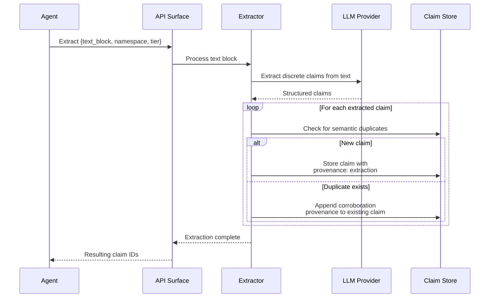

- Fully LLM-backed. The input text is sent to the configured LLM provider with instructions to extract discrete claims in the Boswell claim format.
- **Synchronous operation.** The Extract call blocks until all claims are produced. Resulting claims are not available until the function is complete. There is no partial or streaming result model.
- **Duplicate handling via corroboration.** If two agents submit the same text block (or different texts that yield semantically identical claims), the resulting duplicate claims are treated as corroboration. A new provenance entry is appended to the existing claim rather than creating a duplicate. This is analogous to "it must be true because everyone is saying it" — not necessarily true, but a signal of collective assessment, weighted appropriately in the confidence model.
- Extracted claims enter at the tier and namespace specified by the calling agent, subject to Gatekeeper evaluation for any subsequent promotion.
- Provenance records on extracted claims carry `source_type: extraction` with a hash of the source text for deduplication and traceability.

### 3. Synthesizer

**Responsibility:** Background process that continuously examines the claim graph and discovers emergent ideas — clusters of related claims that together imply a higher-order insight that no individual claim represents.

**Design:**

- LLM-backed. The Synthesizer reads claims, identifies patterns, and produces new claims with `source_type: inference` in their provenance and `derived_from` relationships linking back to the constituent claims.
- Runs as a **background process**, not triggered by API calls. Configurable schedule and scope (which namespaces to examine, how frequently).
- **Resolves the hyperedge question.** The claim model uses only pairwise relationships. The compound relationship "Claims A, B, and C together imply Claim D" is represented as Claim D with three `derived_from` edges and three provenance entries. The Synthesizer process handles the complexity; the schema stays simple.
- **Abstraction layers emerge organically.** First-order claims are extracted from sources or asserted by agents. The Synthesizer produces second-order claims from combinations. Over time, it discovers patterns across second-order claims and produces third-order abstractions. Cross-domain pattern recognition — "this software architecture pattern resembles this biological system" — happens naturally through iterative synthesis passes.

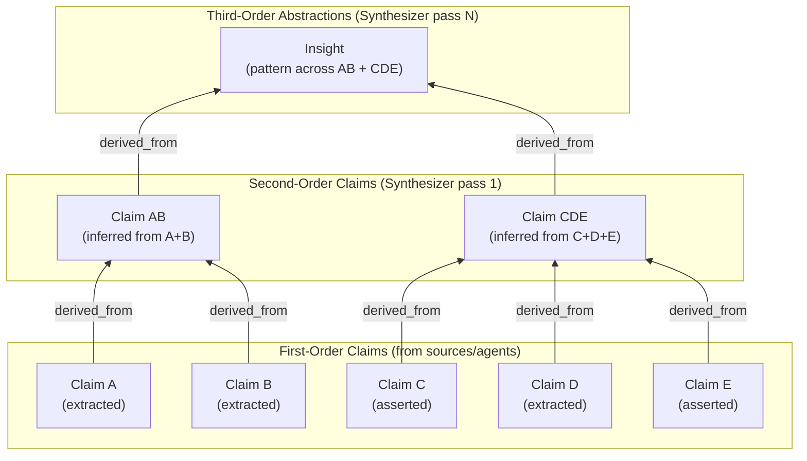

- Synthesized claims' confidence intervals are naturally wider (more uncertain) than their constituents. Uncertainty propagates outward through inference chains, which is epistemically correct.

**Cross-domain Synthesizer (Router-level):**

- In a multi-instance deployment, a separate Synthesizer can run at the Router level, pulling high-confidence persistent-tier claims from each instance and looking for cross-domain connections.
- This Synthesizer does not need access to ephemeral or task-level noise — only the distilled, durable knowledge from each instance.
- Cross-domain insights can be pushed back to relevant instances or stored in a shared insights space at the Router level.

### 4. Janitor(s)

**Responsibility:** Maintenance operations including staleness decay, confidence recomputation, garbage collection of forgotten claims, and periodic health checks on claim quality.

**Design:**

- **Primarily deterministic.** Most Janitor operations are rule-based: decaying confidence based on staleness, purging claims past their TTL, compacting storage after deletions.
- **LLM-assisted for contradiction detection.** Semantic contradictions are not always structurally obvious. The Janitor can invoke an LLM to evaluate whether two claims that are structurally unrelated are semantically contradictory.
- **LLM-assisted for periodic confidence re-evaluation.** On a less-frequent schedule, the Janitor can re-evaluate claims using the same LLM-assisted process as the deliberate query path, baking updated assessments into the stored confidence values.
- **Multiple Janitors can run concurrently** on different schedules:
  - A **staleness Janitor** running hourly, decaying confidence on stale claims.
  - A **contradiction Janitor** running less frequently, performing LLM-assisted conflict detection.
  - A **tier migration Janitor** evaluating demotion candidates based on access patterns and confidence degradation.
  - A **garbage collection Janitor** running nightly, purging claims in `forgotten` status and compacting storage.
- Janitors coordinate via advisory locking or claim-level status flags to avoid conflicting operations. SQLite's transaction isolation handles the rest.
- **Archival policy** is configurable per namespace. Users may have different retention preferences for different domains. Claims in `forgotten` status are hard-deleted after a configurable retention period. Claims in `ephemeral` tier that haven't been accessed in a configurable window are purged automatically.

### 5. Gatekeeper

**Responsibility:** Evaluates claims submitted for tier promotion. Ensures that no edge agent has unilateral authority to decide what knowledge persists long-term.

**Design:**

- **LLM-backed, event-driven.** Triggered when claims are submitted for promotion (e.g., task completion, explicit agent request), not on a schedule.
- **Exists at every tier boundary.** The Gatekeeper at ephemeral → task can be more permissive (low stakes, easy cleanup). The Gatekeeper at project → persistent should be the most skeptical (protecting long-term memory from noise).
- **Different Gatekeepers can use different LLM configurations.** The ephemeral → task Gatekeeper might run a fast local model. The project → persistent Gatekeeper might use a frontier model for nuanced evaluation.

**Evaluation process:**

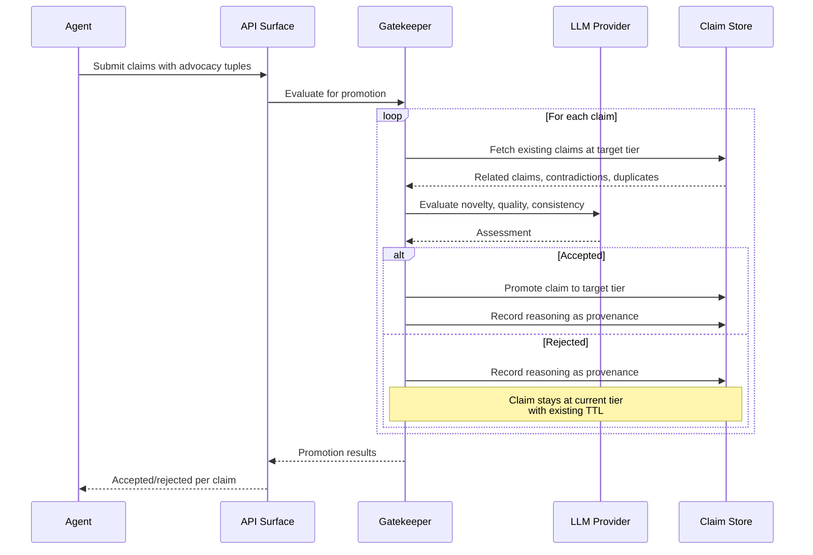

1. Agent submits claims with advocacy scores: a tuple `[perceived_importance, confidence]` expressing how important the agent believes the claim is and how confident the agent is in its accuracy.
2. Gatekeeper evaluates each claim against existing claims at the target tier — checking for redundancy, contradiction, and novelty.
3. Gatekeeper considers the agent's advocacy but is **not bound by it**. High advocacy from the agent is a signal, not an instruction.
4. Gatekeeper accepts, modifies, or rejects each claim for promotion.
5. Gatekeeper's reasoning is recorded as a provenance entry on the claim for future reference.

**Rejected claims are not deleted.** They remain at their current tier with their existing TTL. If the TTL expires without further advocacy or corroboration, the Janitor sweeps them normally. If new evidence surfaces and another agent independently submits the same knowledge, the Gatekeeper has context from the prior evaluation.

**Defense against confidence bubbles.** If a swarm of agents all hallucinate the same incorrect claim and submit it with high advocacy scores, the Gatekeeper evaluates it against established knowledge and can reject despite high advocacy. The broader context acts as a check on swarm groupthink.

### 6. Router

**Responsibility:** Multi-instance topology management, federated queries, authentication, and token issuance.

**Design:**

- **Only necessary for multi-instance features.** Federation, cross-domain synthesis, topology management, and ambiguous routing fallback require the Router. A single-instance deployment does not need a Router. However, see Security Model below — the instance itself enforces authentication regardless of whether a Router is present.
- **Not in the hot path for routine operations.** Clients receive the full instance topology at session start and route operations directly to instances. The Router handles session initiation, ambiguous routing fallback, federated queries, and cross-domain synthesis.
- **Network-accessible from the start.** gRPC API with TLS and authentication, even for single-instance deployments, since the instance may live on a different machine than the agents using it.

**Trust Model:**

Instance-level authentication (mTLS on every connection) is described in the Security Model section above and applies regardless of whether a Router is present. The following describes the additional trust mechanisms specific to the Router's role in multi-instance deployments.

- **Instance registration is manual and deliberate.** Adding a new instance to the Router is an explicit administrative action. No automatic discovery of unknown instances. This is a security-first design — the Router is a high-value target and must not trust unverified instances.
- **Identity is cryptographic.** Each instance has a keypair. The public key (fingerprint) is registered with the Router. Mutual TLS (mTLS) ensures both sides verify identity on every connection.
- **Discovery of registered instances is automatic and resilient.** The Router maintains a registry of known instances with their fingerprints and endpoints. It periodically health-checks all known endpoints and tracks availability. If an instance becomes unreachable (power outage, network issue), the Router continues operating with reduced scope and re-integrates the instance automatically when it becomes available again.
- **Retry backoff on unreachable instances.** Exponential backoff starting at ~30 seconds, ceiling at ~5 minutes, so recovery is detected within a reasonable window without hammering dead endpoints.

**Instance Registry:**

Each instance entry contains:

- Cryptographic fingerprint (identity, never changes without explicit administrative action)
- One or more endpoints (an instance may be reachable at different addresses depending on network context — LAN IP at home, VPN address when remote)
- Trust score: `float (0.0-1.0)`, defaults to 1.0. Mechanism for degrading trust is a future implementation detail, but the field exists from the start. Claims from lower-trust instances have their effective confidence scaled accordingly in federated queries.
- Expertise profile: a set of topic descriptors, keywords, or semantic signatures that describe what the instance stores. Examples: `[programming, software architecture, devops, databases]` for a development instance, `[cooking, family, important dates, health]` for a personal instance. Used by the Topic Classifier (see below) to route incoming claims to the correct instance without requiring agents to understand the instance topology.
- Scope permissions: whether the instance participates in federated queries, cross-domain synthesis, or is direct-access only.
- Health state: `healthy`, `degraded`, `unreachable`, `untrusted` (fingerprint mismatch — alert condition).

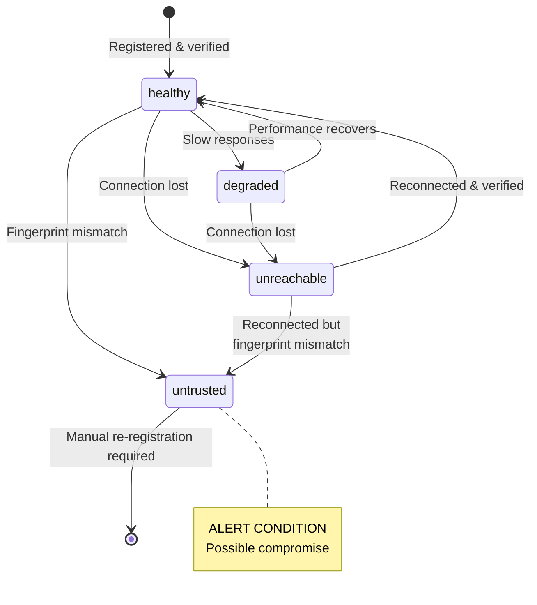

**Topology changes are logged.** "Instance 'professional' became reachable at 14:32:07 via vps-1.example.com:9001" provides audit trail and diagnostic value.

**Federated Queries:**

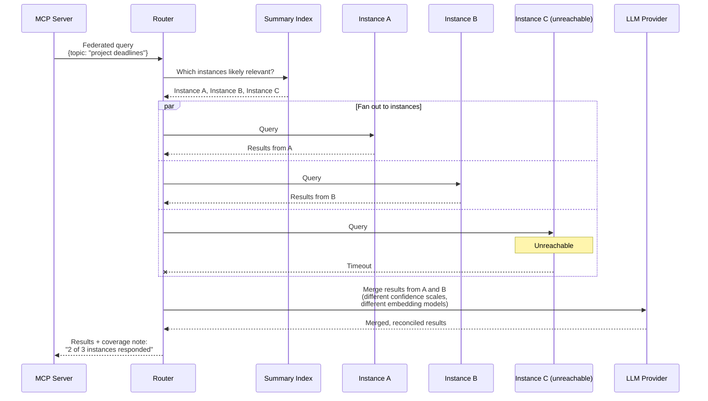

- The Router supports a federated query mode that fans out to multiple instances, collects results, and merges them.
- Merging results from different instances (potentially with different confidence scales and embedding models) requires LLM assistance — this is where the Router's LLM integration earns its keep.
- Results from federated queries include transparency about coverage: "3 of 5 instances currently unreachable, results may be incomplete."

**Summary Index:**

- The Router can maintain a lightweight shared index of topic signatures, namespace registries, and high-confidence persistent claims from each instance.
- Used to route queries efficiently — determining which instances are likely to have relevant knowledge before fanning out, avoiding unnecessary queries to irrelevant instances.
- Stale federation awareness: when a previously-unreachable instance returns, the cross-domain Synthesizer prioritizes scanning it for changes.

**Topic Classifier (Claim Routing):**

In a multi-instance deployment, agents should not need to understand the instance topology to store knowledge. Routing is handled in two tiers:

- **Client-side (simple matches):** The client SDK receives instance expertise profiles in the session response and matches routing hints or namespace prefixes locally. A routing hint of "coding" matching an instance with expertise "programming" is resolved entirely in the SDK — no network call, no LLM.
- **Router fallback (ambiguous cases):** When the SDK cannot confidently match a claim to an instance (no routing hint, no clear namespace match, or the claim spans multiple domains), it sends the operation to the Router. The Router's Topic Classifier analyzes the claim's subject, predicate, and raw expression against registered expertise profiles. Classification can be LLM-assisted (lightweight analysis) or embedding-similarity-based (comparing the claim's embedding against expertise profile signatures).
- **Cross-domain claims** — claims relevant to multiple domains (e.g., "the project deadline conflicts with the family vacation") — require a routing policy. Options include: duplicating the claim into multiple instances, selecting a primary instance and creating a reference in others, or flagging for the user. The routing policy is configurable.
- The Topic Classifier removes the need for agents to understand instance topology. Agents interact with the Router as a single endpoint; the Router handles placement.

**Portable Encrypted Configuration:**

- The Router's configuration file contains the full registry: instance fingerprints, endpoints, trust scores, scope permissions.
- **Encrypted at rest** using `age` (a modern encryption tool with a mature Rust crate). Passphrase-based encryption — no key files to manage separately.
- **Decrypted in memory at startup.** The Router prompts for the passphrase, decrypts in memory, and never writes plaintext to disk. Re-encrypts before writing any modifications.
- **Portable by design.** The user can store the encrypted config file in iCloud, a USB drive, or any other accessible location. From any machine with the Router binary and the passphrase, the user can spin up a Router that connects to their entire memory network (or whatever subset is reachable from that location).
- **Config versioning.** A sequence number in the config allows detecting which copy is most recent when copies exist in multiple locations.
- **Config sync is manual and deliberate.** No automatic synchronization — this prevents propagation of a compromised config.
- Inner format: TOML or JSON (human-readable when decrypted, easy to inspect and hand-edit).

**Token Issuance:**

- When an agent requests access through the Router, the Router issues a short-lived, scoped token valid for specific instances.
- Agents can use the token to communicate directly with the instance, removing the Router from the hot path for individual reads and writes.
- Instances validate tokens against the Router's signing key.
- If the Router is compromised: revoke its CA, no instance trusts anyone until trust is manually re-established.
- If an instance is compromised: remove its registration, it's immediately cut off from everything else.

**The Router itself should run on the user's trusted machine** (not a remote server) since it holds the topology, keys, and token-issuing authority. Its configuration is file-based and version-controllable for audit trail of trust changes.

## API Surface

All operations are exposed via gRPC. The API supports both direct instance access (agent → instance) and routed access (agent → Router → instance).

In routed access mode, operations carry an optional **routing hint** — a transient field indicating which domain the claim or query pertains to (e.g., "development", "cooking"). This hint is used by the Router's Topic Classifier to place claims in the correct instance or direct queries to the right instance. The routing hint is **not persisted** on the claim; it serves only as a routing instruction. If omitted, the Topic Classifier determines placement automatically. Routing hints are per-operation, not per-session — the session is a pure authentication context.

| Operation | Description | Sync/Async | LLM Required |
|---|---|---|---|
| **Assert** | Submit one or more claims with provenance and confidence. Supports batches. | Synchronous | No |
| **Query** | Retrieve claims by structure, semantics, or time. Supports fast (default) and deliberate modes. | Synchronous | Deliberate mode only |
| **Challenge** | Register a contradiction against an existing claim | Synchronous | No |
| **Promote/Demote** | Request tier migration for a claim. Promotion triggers Gatekeeper evaluation. | Synchronous (may involve Gatekeeper) | Promotion only |
| **Extract** | Submit a text block for claim extraction | Synchronous (blocking) | Yes |
| **Learn** | Bulk-load pre-formatted claims directly into the Claim Store ("I know kung fu") | Synchronous | No |
| **Reflect** | Request a synthesized summary of knowledge about a topic | Synchronous | Yes |
| **Forget** | Request eviction of a claim (transitions to `forgotten` status for eventual purging) | Synchronous | No |

### Batch Writes and Cross-Domain Routing

Assert (and Learn) accept batches of one or more claims per call. An agent completing a task might produce 20 claims at once; sending them individually would be needlessly chatty.

**In single-instance mode:** The instance accepts the entire batch regardless of domain mix — there's nowhere else for claims to go. Routing hints are ignored.

**In multi-instance mode:** The client SDK groups claims by target instance using the expertise profiles received at session start, then sends sub-batches directly to each instance in parallel.

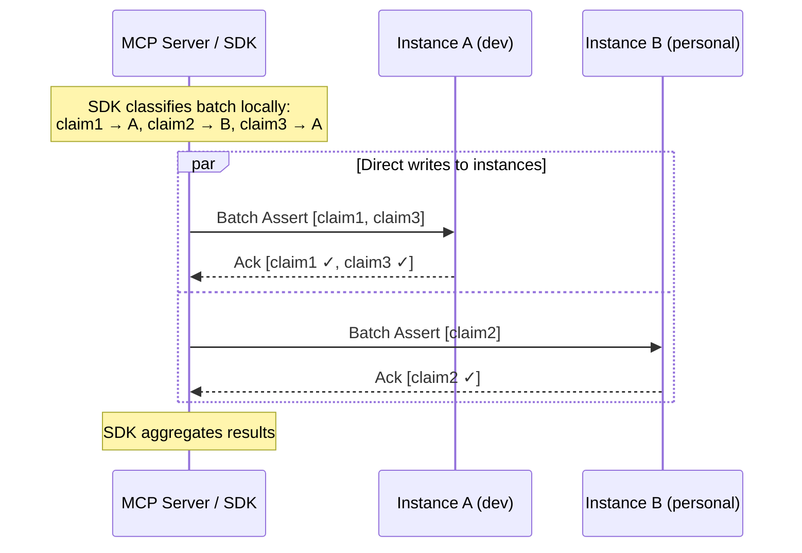

If the SDK cannot confidently route a claim (no routing hint, ambiguous content), it falls back to the Router for classification of those specific claims.

**Partial success model:** Batches are **not atomic** across instances. If claims routed to Instance A succeed but Instance B is unreachable, the client receives partial success with clear per-claim reporting:

```json
{
  "results": [
    { "claim_id": "01ABC...", "status": "ok", "instance": "development" },
    { "claim_id": "01ABD...", "status": "failed", "instance": "personal", "reason": "instance_unreachable" },
    { "claim_id": "01ABE...", "status": "ok", "instance": "development" }
  ]
}
```

The agent can decide whether to retry failures or let them go. The client is responsible for retrying connections to unreachable instances. Forcing atomicity across instances would require distributed transactions — a complexity cost that provides minimal benefit for this use case.

### Learn Operation Details

The Learn operation enables direct loading of correctly-formatted claim data without the overhead of LLM-based extraction. Use cases include: restoring from a previous session's export, loading a curated knowledge base, importing from another Boswell instance, or bootstrapping domain knowledge.

Parameters include:

- **Trust level:** Initial confidence for loaded claims. Can be set high ("these are curated, trust them") or moderate ("load these but let the system validate over time").
- **Conflict policy:** How to handle claims that contradict existing claims — flag immediately, load quietly and let the Janitor sort it out, or reject the conflicting subset.
- **Namespace targeting:** Which scope tier and namespace the claims land in.

### Query Operation Details

Query supports three retrieval modes:

- **Semantic search:** "Give me everything relevant to topic X." Hits the vector sidecar first for candidate IDs, resolves full claims from SQLite.
- **Point lookup:** "Give me the current state of claim Y" or "Give me all claims where subject = Z." Direct SQLite index queries.
- **Temporal:** "What changed since timestamp X." Range scan on ULID primary key (which embeds creation timestamp).

Additionally, Query supports namespace scoping in three modes:

- **Exact:** `namespace = "acme/website-rebuild/migrate-db"` — only claims at this precise scope.
- **Recursive:** `namespace = "acme/website-rebuild/*"` — prefix match, everything underneath.
- **Depth-limited:** `namespace = "acme/website-rebuild/*/1"` — one level of children only, not grandchildren.

## Technology Stack

| Component | Technology | Rationale |
|---|---|---|
| **Language** | Rust | Compiler-enforced safety (concurrency, memory), ideal for agent-written code where the borrow checker acts as an infallible code reviewer. Zero-cost abstractions, small binaries, no runtime dependency. |
| **Primary Storage** | SQLite (WAL mode) | Single-file, embedded, ACID, handles expected write concurrency, excellent structured query performance at millions of rows. |
| **Vector Index** | HNSW-based (e.g., `usearch`) | Memory-mapped, purpose-built for nearest-neighbor search at scale. Derived projection, rebuildable from SQLite. |
| **API Transport** | gRPC via `tonic` | Efficient binary protocol, streaming support (useful for Reflect and deliberate Query), excellent Rust support, built-in TLS. |
| **Authentication** | Mutual TLS (mTLS) | Cryptographic identity verification at the instance level. Every connection to every instance is authenticated, regardless of deployment mode. No shared secrets. |
| **Config Encryption** | `age` crate | Modern, passphrase-based encryption, pure Rust, no external dependencies. Replaces PGP with simpler, more secure design. |
| **Identifiers** | ULID | Universally unique, lexicographically sortable by creation time, no coordination required for generation (ideal for agent swarms), monotonic within same millisecond. Rust crate: `ulid`. |
| **Embedding Models** | Local via ONNX (e.g., `fastembed` or equivalent) | High-frequency operation (every Assert, Learn, Query), must be fast and free of network/API dependencies. Ships with `bge-small-en-v1.5` (384 dimensions) and `nomic-embed-text` (768 dimensions). User selects at instance creation. |
| **LLM Integration** | Pluggable provider trait | Each subsystem independently configurable. Supports local models (Ollama, etc.) and API providers (Anthropic, OpenAI, etc.). |

## Embedding Model Management

Embedding model selection is a per-instance configuration decision with the highest switching cost in the system. Once claims are embedded, changing models requires re-embedding every claim.

**Key design decisions:**

- **Default to local models for embeddings.** Embeddings are the highest-frequency LLM-adjacent operation. Network latency and API costs on every write and read are unacceptable.
- **Ship with two models:** `bge-small-en-v1.5` (384 dimensions — faster, smaller, sufficient for topical relevance) and `nomic-embed-text` (768 dimensions — more headroom). User chooses at instance creation. The vector index is for getting into the right neighborhood; the LLM-backed subsystems handle fine-grained reasoning about nuance.
- **Embedding model is recorded in instance configuration** so the system never accidentally mixes embeddings from different models in the same vector index.
- **Re-embedding migration path built in from day one.** A CLI command/Janitor mode that reads every claim from SQLite, recomputes embeddings against a new model, and rebuilds the vector index. Estimated throughput: `bge-small-en-v1.5` processes ~500-1000 claims/second on modern CPU. 1 million claims ≈ 15-30 minutes. 10 million claims ≈ 2.5-5 hours. `nomic-embed-text` at roughly half that throughput.
- **Reindexing is a completely offline operation.** The instance is taken down, the reindex runs, the instance is brought back up. No maintenance mode, no accepting writes during reindex. If agents need memory during the reindex window, the Router's graceful degradation handles it — the instance is simply unavailable.

## Security Model

Security is enforced at the **instance level**, not the Router level. Every Boswell instance requires authenticated connections regardless of deployment mode. The Router adds topology management and federation on top of this, but a single instance with no Router is still fully secured.

### Connection Protocol

The MCP server (or any client) does not know or care whether it is connecting to a Router or a direct instance. The connection protocol is identical in both cases:

1. Client connects to its configured Boswell endpoint.
2. mTLS handshake — mutual identity verification.
3. Client sends a **session request** (empty beyond identity — no operational context).
4. The endpoint responds with a **session token**, a **mode** indicator, and an **instances array** describing available instances with their endpoints, expertise profiles, and health states.
5. The client SDK uses this topology to route operations directly to the appropriate instance. Namespace, routing hints, and tier targeting are properties of individual operations, not the session.

The session is purely an authentication and topology discovery context. The client receives everything it needs to route operations independently.

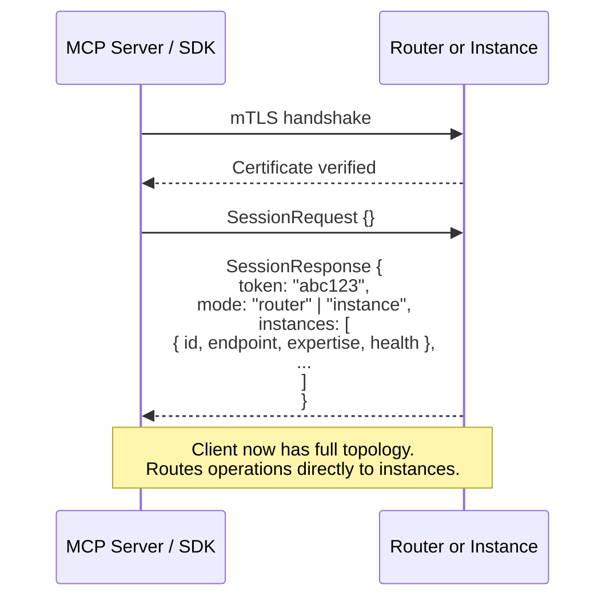

**Session response in multi-instance mode:**

```json
{
  "token": "xyz789",
  "mode": "router",
  "instances": [
    {
      "instance_id": "development",
      "endpoint": "mini:9001",
      "expertise": ["programming", "devops", "databases"],
      "health": "healthy"
    },
    {
      "instance_id": "personal",
      "endpoint": "mini:9002",
      "expertise": ["cooking", "family", "important-dates"],
      "health": "healthy"
    },
    {
      "instance_id": "professional",
      "endpoint": "vps-1:9001",
      "expertise": ["clients", "contracts", "meetings"],
      "health": "unreachable"
    }
  ]
}
```

**Session response in single-instance mode:**

```json
{
  "token": "abc123",
  "mode": "instance",
  "instances": [
    {
      "instance_id": "development",
      "endpoint": "self:9001",
      "expertise": [],
      "health": "healthy"
    }
  ]
}
```

Same shape — one entry in the array, no expertise filtering needed.

The difference between deployment modes is invisible to the client:

#### Sequence: Single Instance (No Router)

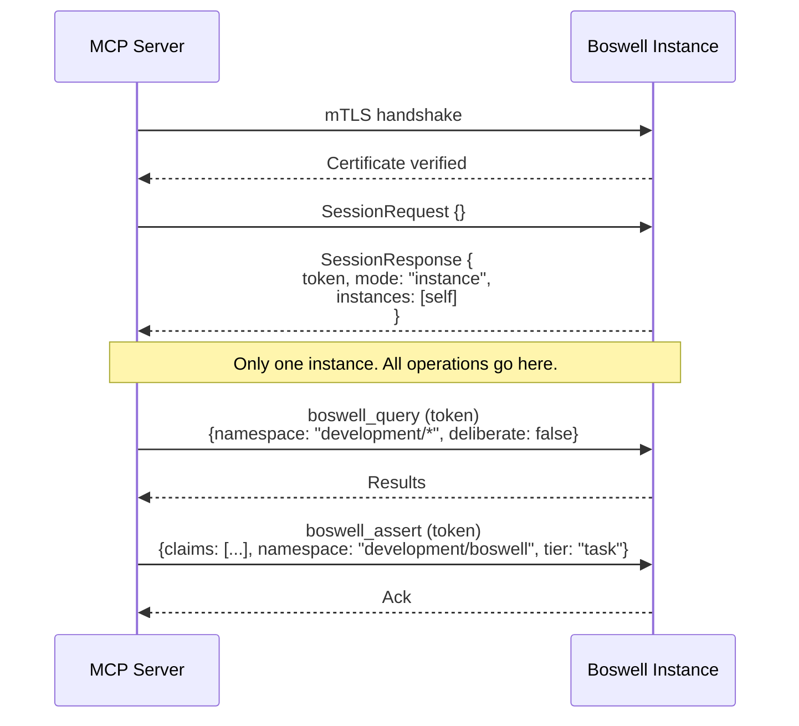

#### Sequence: Multi-Instance via Router

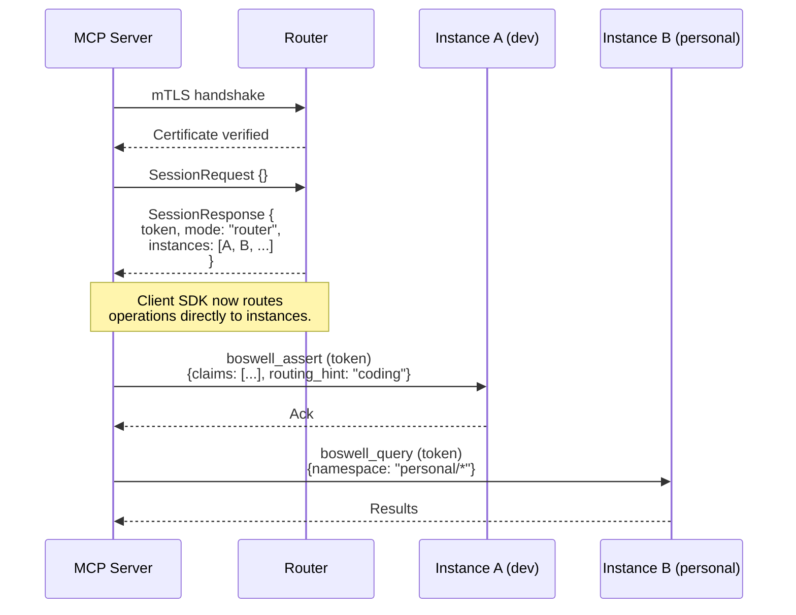

The client SDK matches routing hints and namespace prefixes against the expertise profiles and endpoints received at session start. Simple matches (routing_hint "coding" → instance with expertise "programming") are resolved locally by the SDK with no LLM involvement. For ambiguous claims that don't clearly match any instance, the SDK can fall back to the Router for classification.

**Topology staleness:** The topology received at session start can become stale during a long session — an unreachable instance may recover, or a healthy instance may go down. The client is responsible for handling connection failures with retries. If retries to a known endpoint persistently fail (or succeed for a previously-unreachable instance), the client can re-fetch the topology from the Router by issuing a new session request. There is no push-based topology update mechanism.

#### Uniform API Shape

The session request and all subsequent operation calls have **identical structure** regardless of what's on the other end. This means:

- The MCP server has one code path. No `if router then ... else ...` branching.
- Swapping between single-instance and multi-instance deployment is a configuration change (the endpoint URL), not a code change.
- A single instance accepts routing hints on operations even though it doesn't need them for routing. The slight payload overhead is negligible; the simplification is significant.
- The session is stateless beyond authentication and initial topology. No routing decisions are baked into the session.

### Instance Authentication

Every instance enforces mTLS (mutual TLS) on every inbound connection. Any client — whether an MCP server, a Router, a direct SDK call, or any other integration — must present a client certificate that the instance recognizes. Connections without a valid registered certificate are rejected at the TLS handshake. There are no unauthenticated access modes.

### Client Registration

Clients are registered with an instance through the same manual trust process used for Router-to-instance registration:

1. The client (e.g., MCP server) generates a keypair.
2. The client's public key fingerprint is manually registered with the instance.
3. The instance only accepts connections from certificates matching registered fingerprints.

This applies to every type of client: MCP servers, Router processes, direct SDK connections, and any future integration. Each gets its own keypair and explicit registration.

### Single-Instance Deployment Security

In single-instance mode, the instance speaks the same session protocol as the Router (see sequence diagrams above). The MCP server connects, authenticates, receives a token and endpoint, and proceeds. The instance returns itself as the target endpoint. Operational context (namespace, routing hints) is carried on each individual operation, not the session. No Router is present, but the instance is fully authenticated.

### Multi-Instance Deployment Security

In multi-instance mode, the Router handles the session handshake and returns the full instance topology (see sequence diagrams above). The client SDK then routes operations directly to instances using the session token. The Router's token must be accepted by all registered instances. For ambiguous routing and federated queries, the client falls back to the Router. The session token is scoped to allow direct client-to-instance communication without the Router proxying every call.

### Certificate and Key Management

- Each entity (instance, Router, MCP server, SDK client) has its own keypair.
- Public key fingerprints are registered manually. No automatic trust establishment.
- If a client is compromised: remove its fingerprint from the instance registry. It is immediately unable to connect.
- If an instance is compromised: remove it from the Router registry and revoke any tokens issued for it.
- If the Router is compromised: revoke its certificate at each instance. No instance trusts the Router until re-registered.

The goal is that every trust relationship is explicit, manually established, and independently revocable.

## Client Integration

LLMs do not make network calls directly. When an LLM decides to use a tool, it emits a structured function call (typically JSON) that the host application intercepts, executes, and returns the result as context. Boswell must provide the glue between the LLM's expressed intent and the actual gRPC service.

### Integration Architecture

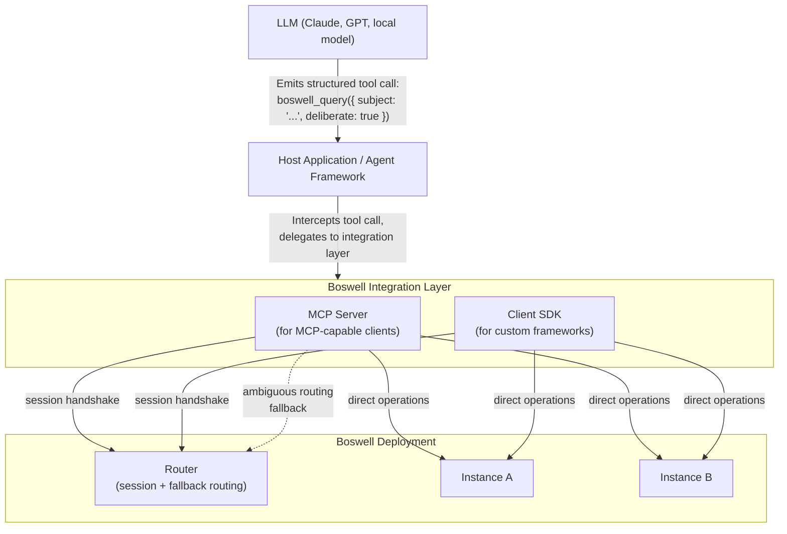

### Components

#### MCP Server (Primary Integration Path)

MCP (Model Context Protocol) is the emerging standard for exposing tools to LLM-powered applications. Claude Desktop, Claude Code, Cursor, and a growing number of agent frameworks support it natively.

The Boswell MCP server:

- Runs locally as a standalone process.
- Holds a registered client certificate for authenticating to the Router or directly to an instance via mTLS.
- On session start, receives the full instance topology (endpoints, expertise profiles, health states) and routes operations directly to instances.
- Exposes all Boswell operations (Assert, Query, Challenge, Promote/Demote, Extract, Learn, Reflect, Forget) as MCP tools.
- Handles gRPC communication to instances internally, with Router fallback for ambiguous routing.
- Requires zero custom integration code from the user. They add one MCP configuration entry and Boswell tools appear in their LLM client.

This is the highest-leverage integration for adoption. A user installs Boswell, starts the service, adds an MCP config entry, and their Claude or Cursor session immediately has persistent memory.

#### Tool Definitions (JSON Schema)

Portable function schemas describing each Boswell operation — name, parameters, types, and descriptions. These are the LLM-facing documentation that tell the model what tools are available and how to call them. Published as standalone JSON files that any agent framework can load, regardless of whether it supports MCP.

Example (abbreviated):

```json
{
  "name": "boswell_assert",
  "description": "Assert one or more claims into memory with provenance and confidence",
  "parameters": {
    "type": "object",
    "properties": {
      "claims": {
        "type": "array",
        "description": "One or more claims to assert",
        "items": {
          "type": "object",
          "properties": {
            "subject": { "type": "string", "description": "The entity the claim is about" },
            "predicate": { "type": "string", "description": "The relationship or property" },
            "direct_object": { "type": "string", "description": "The value or target" },
            "raw_expression": { "type": "string", "description": "Natural language form of the claim" },
            "namespace": { "type": "string", "description": "Target namespace for the claim" },
            "tier": { "type": "string", "enum": ["ephemeral", "task", "project", "persistent"] },
            "routing_hint": { "type": "string", "description": "Optional domain hint for Router placement (transient, not persisted)" }
          },
          "required": ["subject", "predicate", "direct_object", "raw_expression"]
        }
      }
    },
    "required": ["claims"]
  }
}
```

#### Client SDK (Rust)

A Rust library wrapping gRPC calls to the Router or instances. Used internally by the MCP server and available for Rust-based agent frameworks or custom integrations. This is the foundation layer — all other integration paths build on it.

#### Client SDK (Python)

A Python wrapper for the Rust client SDK (via PyO3 or a standalone gRPC client). Given the dominance of Python in the AI agent ecosystem, this expands Boswell's reach significantly. Supports integration with LangChain, CrewAI, AutoGen, and other Python agent frameworks.

#### Client SDK (TypeScript)

A JavaScript/TypeScript wrapper for web-based and Node.js agent frameworks. Supports integration with Vercel AI SDK, LangChain.js, and similar.

### Priority

| Component | Priority | Rationale |
|---|---|---|
| MCP Server | High | Lowest-friction path to adoption. Zero integration code for MCP-capable clients. |
| Tool Definitions (JSON Schema) | High | Required by the MCP server and useful independently for any agent framework. |
| Client SDK (Rust) | High | Foundation for MCP server and all other integrations. |
| Client SDK (Python) | Medium | Expands reach to the large Python agent ecosystem. |
| Client SDK (TypeScript) | Medium | Expands reach to web and Node.js agent frameworks. |

## Deployment Models

### Single Instance (Minimum Viable)

A single Boswell instance on the user's machine. The MCP server (or other clients) connects directly via gRPC with mTLS. No Router needed. The instance enforces authentication independently — client certificates must be registered with the instance. Suitable for individual use with a small number of agents.

### Multi-Instance Local

Multiple Boswell instances on one or more machines on a local network. Router runs on the user's primary machine. Instances and the Router are manually registered with each other. MCP server authenticates to the Router, which authenticates to instances. Suitable for domain-isolated memory (development, personal, professional) with optional federation.

### Multi-Instance Distributed

Instances spread across local machines and remote servers (VPS, cloud). Router manages the topology with resilient health-checking. Encrypted portable config enables spinning up a Router from any location. The trust model (mTLS at every connection, manual registration at every trust boundary) ensures security across untrusted networks.

## Quality Assurance Strategy

Rust's compiler is the first and most aggressive quality gate. Code with data races, use-after-free, null pointer dereferences, or concurrency bugs will not compile. This is particularly valuable given that development agents will be writing much of the code.

**CI pipeline gates (all must pass):**

1. `cargo clippy` — lint for idiomatic issues, performance anti-patterns, unnecessary allocations, inefficient iterations.
2. `cargo test` — unit tests, integration tests, doc tests (example code in documentation is executed as tests).
3. `cargo bench` (criterion) — performance benchmarks with regression detection for hot paths. Target latencies defined for key operations.
4. `cargo audit` — dependency vulnerability scanning.

**Testing frameworks:**

- **Built-in `#[test]`** — unit and integration tests, first-class language feature.
- **criterion** — statistically rigorous benchmarking with regression detection. Catches performance degradation from refactoring.
- **proptest** — property-based testing. Defines invariants ("confidence score is always between 0.0 and 1.0", "asserting the same claim twice doesn't create duplicates") and generates thousands of random inputs to find violations.
- **tokio::test** — async test runtime for concurrent operation testing.
- **insta** — snapshot testing for verifying query results and API responses don't change unexpectedly.
- **miri** — interpreter that detects undefined behavior in unsafe code.

**Benchmark-driven development for hot paths:** Key operations have target latencies defined as criterion benchmarks. Agents writing code must produce implementations that meet these targets, and regression is automatically caught.
