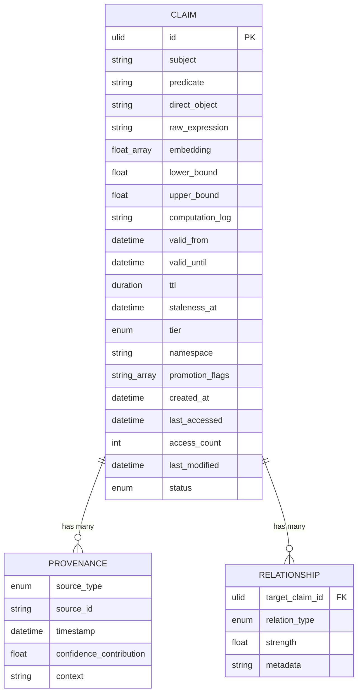
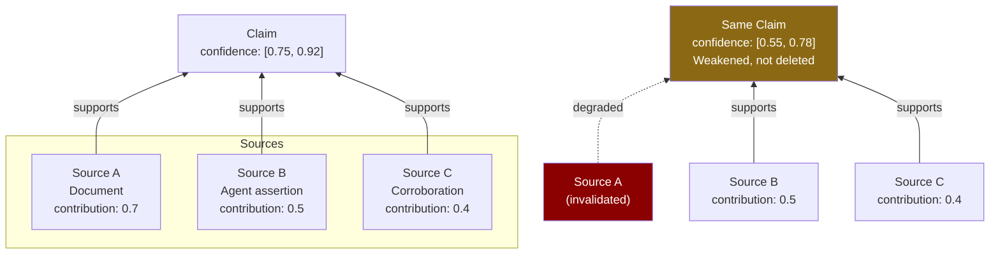
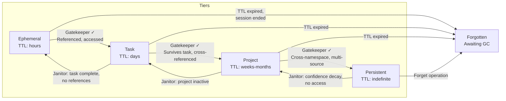
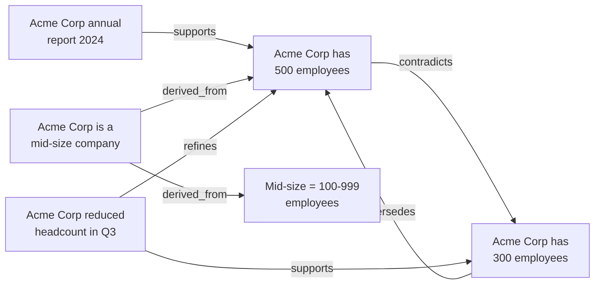
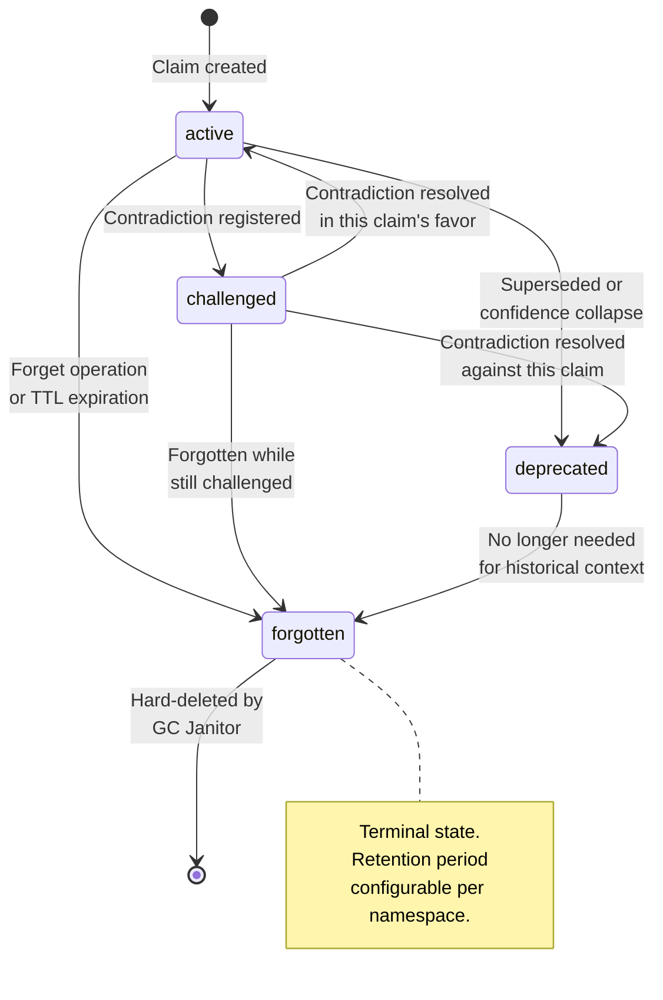
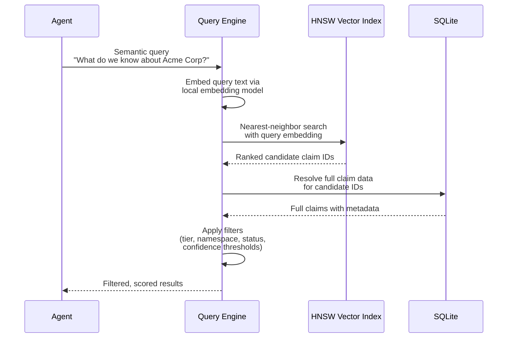

# Boswell — Claim Model

## Overview

The claim is the fundamental unit of knowledge in Boswell. It represents a piece of knowledge that the system believes to be true with some degree of confidence. The term "claim" is deliberate — nothing in Boswell is treated as unconditionally true. Every claim carries metadata about its confidence, source, temporal validity, and relationships to other claims.

## Claim Structure



```
Claim
├── id                  : ULID
├── subject             : string
├── predicate           : string
├── direct_object        : string
├── raw_expression      : string
├── embedding           : float[]
│
├── confidence
│   ├── lower_bound     : float (0.0-1.0)
│   ├── upper_bound     : float (0.0-1.0)
│   └── computation_log : string (optional)
│
├── temporality
│   ├── valid_from      : datetime (optional)
│   ├── valid_until     : datetime (optional)
│   ├── ttl             : duration (optional)
│   └── staleness_at    : datetime
│
├── provenance[]
│   ├── source_type     : enum
│   ├── source_id       : string
│   ├── timestamp       : datetime
│   ├── confidence_contribution : float
│   └── context         : string
│
├── scope
│   ├── tier            : enum
│   ├── namespace       : string
│   └── promotion_flags : string[]
│
├── relationships[]
│   ├── target_claim_id : ULID
│   ├── relation_type   : enum
│   ├── strength        : float (0.0-1.0)
│   └── metadata        : string (optional)
│
└── lifecycle
    ├── created_at      : datetime
    ├── last_accessed    : datetime
    ├── access_count     : int
    ├── last_modified    : datetime
    └── status           : enum
```

## Field Specifications

### Identity

#### `id` — ULID

Every claim is identified by a ULID (Universally Unique Lexicographically Sortable Identifier). ULIDs are 128-bit identifiers encoded as 26-character strings using Crockford's Base32. Example: `01ARZ3NDEKTSV4RRFFQ69G5FAV`.

**Structure:** The first 48 bits are a millisecond-precision timestamp. The remaining 80 bits are random. This gives ULIDs several properties critical to Boswell:

- **Chronologically sortable.** Sorting ULIDs lexicographically sorts them by creation time. This makes the "what changed since timestamp X" query pattern a simple range scan on the primary key — no secondary index required.
- **No coordination required.** Any agent on any machine can generate a ULID independently. There is no central authority or sequence counter. This is essential for agent swarms where multiple agents assert claims concurrently.
- **Monotonic within the same millisecond.** Compliant implementations increment the random portion when multiple ULIDs are generated in the same millisecond on the same machine, preserving deterministic ordering.

### The Semantic Triple

#### `subject` — string

The entity or concept the claim is about. Examples: "Acme Corp", "Washington State", "SQLite WAL mode".

#### `predicate` — string

The relationship or property being asserted. Examples: "requires", "is located in", "supports concurrent reads".

#### `direct_object` — string

The value or target of the assertion. Examples: "registered agent for LLCs", "Pacific Northwest", "true".

**The triple is intentionally redundant with `raw_expression`.** The triple provides structured queryability — "give me all claims where subject = 'Acme Corp'" is a direct index lookup. But triples lose nuance. The raw expression preserves it (see below).

### Natural Language

#### `raw_expression` — string

The natural language form of the claim. Examples:

- "Acme Corp is struggling financially"
- "Acme Corp may face liquidity challenges in the near term"

These two expressions might map to similar triples but carry different connotations. The raw expression preserves nuance that the structured triple cannot capture.

The `raw_expression` serves three purposes:

1. **Display and debugging.** When a human or agent inspects a claim, the raw expression is the readable form.
2. **Embedding source.** The vector embedding is generated from the raw expression, so semantic search captures the nuance of the natural language rather than the compressed triple.
3. **Synthesis input.** When the Synthesizer evaluates clusters of claims, it works with the raw expressions to understand subtle differences.

### Embedding

#### `embedding` — float[]

A vector embedding of `raw_expression` generated by the configured embedding model. The dimensionality depends on the model (384 for `bge-small-en-v1.5`, 768 for `nomic-embed-text`).

**Constraints:**

- All embeddings within a single Boswell instance must be generated by the same model. Mixing embeddings from different models in the same vector index produces meaningless similarity comparisons.
- The active embedding model is recorded in instance configuration. On model change, a full reindex is required (see Architecture document, Embedding Model Management).
- Embeddings are computed at write time (Assert, Learn, Extract output) and stored in both SQLite and the HNSW vector sidecar.

### Confidence

The confidence model uses an **interval** rather than a single score. This captures two dimensions of epistemic state that a single float collapses:

#### `lower_bound` — float (0.0 to 1.0)

The conservative estimate of the claim's truthfulness. "At minimum, we believe this claim is this likely to be true."

#### `upper_bound` — float (0.0 to 1.0)

The optimistic estimate. "At most, we believe this claim is this likely to be true."

Must satisfy: `lower_bound <= upper_bound`.

**How to interpret the interval:**

- **Narrow interval, high values** (e.g., `[0.85, 0.95]`): Well-established claim with strong evidence. The system has a clear picture of its reliability.
- **Narrow interval, low values** (e.g., `[0.15, 0.25]`): Well-established as likely false or unreliable. Strong counter-evidence exists.
- **Wide interval, moderate values** (e.g., `[0.3, 0.8]`): Uncertain. Some evidence supports the claim, some contradicts it, or there simply isn't enough evidence to narrow the range.
- **Wide interval, high upper bound** (e.g., `[0.4, 0.95]`): Could be very right, but we're not sure. Thin evidence that hasn't been contradicted.

**Agents can collapse the interval to a single value when they don't need the nuance:**

- Take the lower bound for conservative decisions ("only act on things we're fairly sure about").
- Take the midpoint for balanced decisions.
- Take the upper bound for exploratory or risk-tolerant decisions.

**Practical implications:**

- The width of the interval communicates uncertainty. "Give me claims with narrow intervals" means "give me things we have a clear picture of."
- "Give me claims with wide intervals" means "give me things we're uncertain about" — useful for the Synthesizer to identify areas needing investigation.
- When the Synthesizer derives new claims from parents, the derived claim's interval is naturally wider than any parent's. Uncertainty propagates outward through inference chains.

#### `computation_log` — string (optional)

Debugging field recording how the current confidence interval was derived. Populated when the Janitor or deliberate query path recomputes confidence. Not populated on every fast-path read.

### Confidence Computation

Confidence intervals are computed via two paths:

**Fast path (deterministic):** A formula that aggregates provenance contributions, applies staleness decay, and factors in corroboration/contradiction from related claims. The specific formula is an implementation detail that will evolve — the interface contract is: the computation is deterministic, fast, and the inputs are the claim's provenance, temporality, and relationships. Results are cached and invalidated when related claims change.

**Deliberate path (LLM-assisted):** Invoked on demand via a parameter on the Query operation, or periodically by the Janitor. An LLM evaluates the claim in context — its provenance, contradictions, the confidence of related claims, and the specific query context — and produces a nuanced assessment. The deliberate path may produce a different confidence interval for the same claim depending on what question is being asked about it, because relevance and reliability are context-dependent.

The fast path is the default. The deliberate path is opted into when an agent wants to pressure-test what the system knows before making a consequential decision.

### Temporality

Temporality tracks two distinct concepts: when the claim is **true** and when the claim is **fresh**.

#### `valid_from` — datetime (optional)

When the claim became true in the real world. Example: A contract effective date. `null` means the valid-from time is unknown or the claim has no specific start date.

#### `valid_until` — datetime (optional)

When the claim stops being true in the real world. Example: "the contract expires December 2026." `null` means the claim has no known expiration — it is indefinitely valid as far as the system knows.

#### `ttl` — duration (optional)

Time-to-live: the claim should be automatically considered for eviction after this duration regardless of its real-world validity. This is a storage management concern, not a truth concern. An ephemeral claim might have a TTL of hours. A task-level claim might have a TTL of days. Claims without a TTL persist until explicitly forgotten or demoted.

**TTL is the primary mechanism for handling unpromoted claims.** When the Gatekeeper rejects a claim for promotion, the claim remains at its current tier with its current TTL. If no one references it or re-advocates for it before the TTL expires, the Janitor sweeps it. This avoids the need for a special "rejected" status.

#### `staleness_at` — datetime

When the claim's information freshness begins to decay. This is distinct from `valid_until`. A claim can be valid (the contract hasn't expired) but stale (we learned about this contract 18 months ago and haven't re-verified that its terms haven't changed).

After `staleness_at`, the confidence interval begins to widen (lower bound decreases) based on a configurable decay function. The rate of decay is configurable per tier:

- Ephemeral claims: rapid decay (half-life of hours).
- Task claims: moderate decay (half-life of days to weeks).
- Project claims: slow decay (half-life of weeks to months).
- Persistent claims: very slow decay (half-life of months to years).

### Provenance

Provenance is an **array**, not a single value. Each entry represents one source of support for the claim. This is where the corroboration model lives.

#### `source_type` — enum

| Value | Description |
|---|---|
| `extraction` | Produced by the Extractor from a text block |
| `agent_assertion` | Directly asserted by an agent |
| `user_input` | Provided by a human user |
| `inference` | Derived by the Synthesizer from other claims |
| `corroboration` | A duplicate assertion that reinforced an existing claim |
| `direct_load` | Loaded via the Learn operation without LLM processing |

#### `source_id` — string

Identifies the specific source. Depending on `source_type`:

- For `extraction`: hash of the source text.
- For `agent_assertion`: the agent's identifier.
- For `user_input`: user identifier.
- For `inference`: IDs of the parent claims from which this claim was derived.
- For `corroboration`: ID of the agent or extraction that corroborated.
- For `direct_load`: identifier of the loaded dataset or source system.

#### `timestamp` — datetime

When this provenance entry was recorded.

#### `confidence_contribution` — float

How much this source moves the needle on the claim's overall confidence. A highly credible primary source might contribute 0.9. A weak secondary source might contribute 0.3. The confidence computation aggregates these contributions.

#### `context` — string

Free-form notes on why or how this provenance supports the claim. May include the Gatekeeper's reasoning when a claim is evaluated for promotion. May include notes from the agent about why it believes this claim is important.

### Provenance and Source Invalidation

Invalidating a source does **not** delete claims derived from it. It **reduces confidence** by degrading the affected provenance entry's contribution. If a claim has three independent corroborating sources and one is invalidated, the claim barely flinches — the other two still support it. A claim with a single source that gets invalidated will see its confidence interval widen significantly, but the claim itself remains in the system for other sources to potentially corroborate.

Provenance is a **support network**, not a dependency tree. Removing one support weakens the structure proportionally; it does not collapse it.



### Scope

#### `tier` — enum

| Value | Description | Typical TTL | Staleness Half-Life |
|---|---|---|---|
| `ephemeral` | Momentary context, session-level | Hours | Hours |
| `task` | Relevant to a specific task | Days | Days to weeks |
| `project` | Relevant across tasks within a project | Weeks to months | Weeks to months |
| `persistent` | Long-term knowledge | None (indefinite) | Months to years |

**Tier migration** is governed by the Gatekeeper (for promotion) and the Janitor (for demotion). See Architecture document for details.



**Promotion triggers (evaluated by Gatekeeper):**

- Ephemeral → Task: Claim is referenced by another claim, or accessed more than N times within a session.
- Task → Project: Claim survives task completion, or is referenced by claims in sibling tasks.
- Project → Persistent: Claim is referenced across namespace boundaries, explicitly flagged by an agent, or accumulates provenance from multiple independent sources.

**Demotion triggers (evaluated by Janitor):**

- Persistent → Project: Confidence interval degrades below threshold through staleness or contradiction, and no agent has accessed it in a configurable period.
- Project → Task: Project completes or goes inactive, claim was never promoted further.
- Task → Ephemeral: Task completes, claim was never referenced by anything else.
- Ephemeral → Forgotten: TTL expires or session ends with no promotion signals.

**Explicit overrides:** An agent can directly request promotion or demotion regardless of automatic rules. Promotion still triggers Gatekeeper evaluation. Demotion is immediate.

#### `namespace` — string

A convention-based hierarchical scope identifier using slash-delimited segments. Examples:

- `development`
- `development/boswell`
- `development/boswell/claim-store`
- `cooking/italian`
- `personal/important-dates`

**Validation rules (enforced deterministically at write time, not by LLM):**

- Maximum depth enforced by counting slash characters. Recommended limit: 4-5 slashes. Configurable per instance.
- Validation is a simple `string.split('/').len()` check. Writes that exceed the maximum depth are rejected.
- Maximum depth may be configurable per tier. Ephemeral claims might allow deeper nesting for granular subtask isolation. Persistent claims might enforce shallower namespaces.

**Query modes:**

- **Exact:** `namespace = "acme/website-rebuild/migrate-db"` — only claims at this scope.
- **Recursive:** `namespace = "acme/website-rebuild/*"` — prefix match (string `starts_with`), returns everything underneath. Fast and indexable.
- **Depth-limited:** `namespace = "acme/website-rebuild/*/1"` — prefix match plus slash-count filter on results. One level of children only.

**Namespace discovery:** A distinct query on the namespace field returns all known namespaces matching a prefix. "What namespaces exist under `development/*`?" This allows agents to orient themselves when entering a project context.

#### `promotion_flags` — string[]

Signals that might trigger tier migration. These are advisory markers that agents can set to influence (but not dictate) the Gatekeeper's and Janitor's evaluation. Examples: `"cross-namespace-reference"`, `"agent-flagged-important"`, `"frequently-accessed"`.

### Relationships

Relationships are **pairwise** between two claims. The system does not support hyperedges (relationships involving three or more claims simultaneously) in the data model. Compound relationships ("Claims A, B, and C together imply Claim D") are represented by the Synthesizer creating Claim D with individual `derived_from` edges to each constituent.



#### `target_claim_id` — ULID

The claim this relationship points to.

#### `relation_type` — enum

| Value | Description |
|---|---|
| `supports` | This claim provides evidence for the target claim |
| `contradicts` | This claim conflicts with the target claim |
| `refines` | This claim adds nuance or detail to the target claim |
| `supersedes` | This claim replaces the target claim (target should be deprecated) |
| `derived_from` | This claim was inferred from the target claim (used by Synthesizer) |
| `related_to` | General association without a specific directional meaning |

#### `strength` — float (0.0 to 1.0)

How strongly this relationship holds. A direct, clear contradiction is strength 1.0. A tangential relationship might be 0.3.

#### `metadata` — string (optional)

Free-form notes about the relationship. May include reasoning about why the relationship exists, set by the Synthesizer or an agent.

### Lifecycle

#### `created_at` — datetime

When the claim was first written to the Claim Store. Redundant with the ULID's embedded timestamp but stored explicitly for query convenience.

#### `last_accessed` — datetime

When the claim was last read by any operation. Updated on Query hits. Used by the Janitor for tier demotion decisions (claims that haven't been accessed in a long time are candidates for demotion).

#### `access_count` — int

Cumulative number of times the claim has been read. Used as a promotion signal (frequently accessed claims may deserve a higher tier).

#### `last_modified` — datetime

When the claim's data was last changed (provenance added, confidence recomputed, relationship added, status changed). Distinct from `last_accessed`.

#### `status` — enum

| Value | Description |
|---|---|
| `active` | Normal operating state. Claim is queryable and participates in all operations. |
| `challenged` | A contradiction has been registered but not resolved. The claim is still queryable but its confidence interval should reflect the challenge. |
| `deprecated` | The claim has been superseded or determined to be unreliable. Still queryable (for historical context) but excluded from default query results. |
| `forgotten` | Marked for eviction. Not returned in any query. The garbage collection Janitor will hard-delete claims in this status after a configurable retention period. |

**Status transitions:**



`forgotten` is a terminal state. Claims in `forgotten` status are eventually hard-deleted by the garbage collection Janitor. The retention period before hard deletion is configurable per namespace, allowing users to set different retention preferences for different domains.

## Advocacy Tuple

When an agent submits claims for tier promotion (typically at task completion), it can attach an **advocacy tuple** to each claim:

```
advocacy: [perceived_importance: float, confidence: float]
```

- `perceived_importance` (0.0-1.0): How important the agent believes this claim is for long-term retention.
- `confidence` (0.0-1.0): How confident the agent is in the claim's accuracy.

Examples:

- `[0.9, 0.4]`: "I think this is really important but I'm not sure it's accurate."
- `[0.4, 0.9]`: "I'm very confident this is true but it's probably only moderately important."
- `[0.9, 0.9]`: "This is important and I'm confident about it."

The Gatekeeper receives and considers the advocacy tuple but is **not bound by it**. High advocacy is a signal, not an instruction. The Gatekeeper evaluates the claim against existing knowledge at the target tier and makes an independent judgment.

## Storage Considerations

### Transient API Fields (Not Persisted)

The following fields exist on API requests but are **not stored** as part of the claim. They serve operational purposes during write processing and are discarded after use.

#### `routing_hint` — string (optional)

A hint carried on individual operations (Assert, Extract, Learn, Query) indicating which domain the claim or query pertains to (e.g., "development", "cooking", "personal"). Used in multi-instance deployments to help the Router's Topic Classifier place claims in the correct instance or direct queries to the right instance without requiring the agent to know the instance topology.

The routing hint is per-operation, not per-session — the session is a pure authentication context with no routing state. This allows agents to freely mix domains across operations within a single session.

The routing hint is transient because the claim's namespace already carries domain context once placed. The hint is a routing instruction, not a property of the knowledge itself.

#### `advocacy` — tuple (optional)

Described above in the Advocacy Tuple section. While the Gatekeeper's reasoning is recorded as provenance, the advocacy tuple itself from the submitting agent is an input to the promotion evaluation, not a persisted field on the claim.

### SQLite Schema Implications

The claim model maps to a relational schema with the following primary tables:

- **claims**: Core claim data (id, subject, predicate, direct_object, raw_expression, confidence bounds, temporality fields, scope fields, lifecycle fields, status).
- **provenance**: One-to-many from claims. Each row is a provenance entry.
- **relationships**: Junction table between claims. Each row is a directional edge.
- **embeddings**: Claim ID to embedding vector mapping. Also maintained in the HNSW sidecar.

Indexes should be created on:

- `claims.id` (primary key, ULID — supports temporal range scans).
- `claims.subject` (structured queries by entity).
- `claims.namespace` (prefix queries for recursive namespace scoping).
- `claims.tier` (filtering by storage tier).
- `claims.status` (excluding deprecated/forgotten from default queries).
- `claims.last_accessed` (Janitor demotion candidate queries).
- `provenance.source_id` (cascade evaluation when a source is invalidated).

### Vector Index

The HNSW sidecar stores only `(claim_id, embedding)` pairs. It contains no claim metadata. All semantic search queries follow the pattern:



1. Query the vector index with an embedding to get candidate IDs ranked by relevance.
2. Resolve full claim data from SQLite using the candidate IDs.
3. Apply any additional filters (tier, namespace, status, confidence thresholds) on the resolved claims.

The vector index is a derived projection. If lost or corrupted, it is rebuilt by scanning all claims in SQLite and re-indexing their embeddings. This is equivalent to the reindex operation used when changing embedding models.
