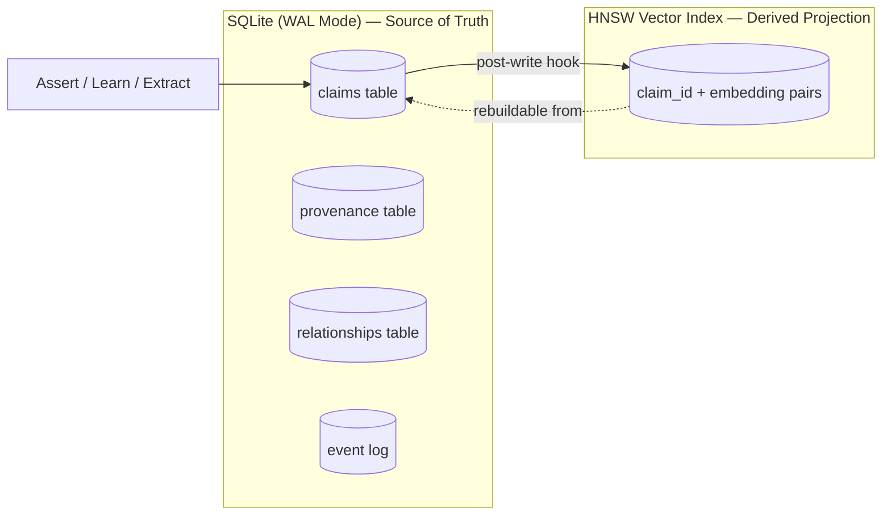
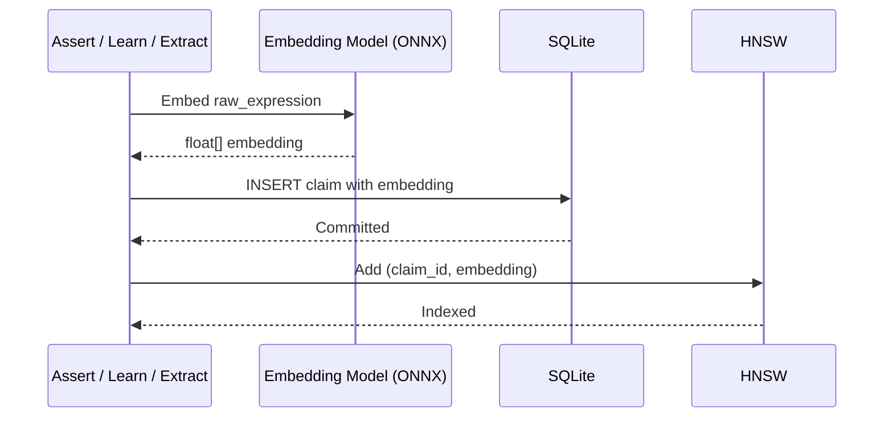

# Boswell — Claim Store

The Claim Store is the core storage engine for all claims, relationships, and provenance. It is the only subsystem that directly manages persistent data. All other subsystems interact with claims through the Claim Store's trait interface.

## Responsibility

- Durable storage of all claims, relationships, and provenance entries.
- Serving three read patterns: structured queries (point lookup, filtered search), semantic search (nearest-neighbor over embeddings), and temporal queries (claims modified since X).
- Embedding computation for incoming claims using the configured local embedding model.
- Duplicate detection via embedding similarity.
- Confidence computation (fast/deterministic path).

## Storage Architecture



### SQLite (Primary Store)

**Configuration:** WAL (Write-Ahead Logging) mode. Single file per instance. ACID transactions.

**Tables:**

- **claims** — Core claim data: id (ULID, primary key), subject, predicate, object, raw_expression, embedding (BLOB), confidence lower_bound, confidence upper_bound, computation_log, valid_from, valid_until, ttl, staleness_at, tier, namespace, promotion_flags, created_at, last_accessed, access_count, last_modified, status.
- **provenance** — One-to-many with claims: claim_id (FK), source_type, source_id, timestamp, confidence_contribution, context.
- **relationships** — Pairwise: source_claim_id, target_claim_id, relation_type, strength, metadata. Indexed both directions for traversal.
- **event_log** — Append-only audit trail: event_id (ULID), event_type (assert, challenge, promote, demote, forget, corroborate, status_change), claim_id, timestamp, actor_id, details (JSON).

**Indexes:**

| Index | Columns | Purpose |
|---|---|---|
| `idx_claims_subject` | subject | Structural lookup by entity |
| `idx_claims_predicate` | predicate | Structural lookup by relationship type |
| `idx_claims_namespace` | namespace | Namespace filtering and prefix matching |
| `idx_claims_tier` | tier | Tier filtering |
| `idx_claims_status` | status | Status filtering (most queries filter on active) |
| `idx_claims_created` | created_at | Temporal queries |
| `idx_claims_modified` | last_modified | Change tracking |
| `idx_claims_staleness` | staleness_at | Janitor staleness scans |
| `idx_provenance_claim` | claim_id | Provenance lookup by claim |
| `idx_provenance_source` | source_id | Provenance lookup by source (for invalidation) |
| `idx_relationships_source` | source_claim_id | Forward traversal |
| `idx_relationships_target` | target_claim_id | Reverse traversal |
| `idx_relationships_type` | relation_type | Relationship type filtering |

**Composite indexes** for common query patterns (subject + namespace, namespace + tier + status) should be added based on profiling.

### HNSW Vector Index (Sidecar)

**Contains only:** `(claim_id, embedding)` pairs. No claim metadata.

**Implementation:** Memory-mapped file. The OS pages in actively-queried regions. On an M4 Mac Mini with 16 GB RAM, this comfortably serves millions of claims.

**Rebuild guarantee:** If corrupted or lost, fully rebuildable by scanning the claims table and re-indexing all embeddings. This is an offline operation (see ADR-014).

**Query pattern:** Input an embedding vector, receive ranked list of claim_ids by similarity score. Full claim data is then resolved from SQLite.

## Embedding Pipeline

Every claim that enters the Claim Store (via Assert, Learn, or Extract) goes through the embedding pipeline:



The embedding model runs locally via ONNX. The model is configured per-instance and recorded in instance metadata. See `12-embedding.md` for model details.

## Duplicate Detection

Before inserting a new claim, the Claim Store checks for semantic duplicates:

1. Embed the incoming claim's `raw_expression`.
2. Query the HNSW index for nearest neighbors above a configurable similarity threshold (default: 0.95).
3. For each candidate, compare structural fields (subject, predicate, object) as a secondary check.
4. If a match is found: append a new provenance entry to the existing claim (corroboration). Do not create a duplicate.
5. If no match: insert the new claim normally.

The similarity threshold is tunable. A higher threshold (0.98) means only near-identical claims are treated as duplicates. A lower threshold (0.90) casts a wider net but risks merging distinct claims.

## Confidence Computation (Fast Path)

The Claim Store computes confidence intervals deterministically on every read. See `13-confidence.md` for the full formula. The key properties:

- **Inputs:** Provenance array, staleness_at, relationships to other claims.
- **Output:** `[lower_bound, upper_bound]` confidence interval.
- **Performance:** Cached per-claim, invalidated when related claims change. Point lookups return cached values. Batch queries recompute only for invalidated claims.
- **No LLM involvement.** The fast path is entirely deterministic.

The deliberate path (LLM-assisted, query-contextual) is invoked by the Query operation when `deliberate: true`. It calls through to the LLM Provider Layer (see `11-llm-provider.md`).

## Concurrency Model

SQLite WAL mode provides:

- **Concurrent reads:** Multiple queries execute simultaneously with no blocking.
- **Serialized writes:** One writer at a time. Writes are fast (typically sub-millisecond for a single claim insert), so serialization is not a bottleneck at the expected concurrency level (dozens of agents at peak).
- **Readers never block writers and writers never block readers.**

The HNSW index is updated synchronously after each SQLite write. This means there is a brief window (microseconds) where a claim exists in SQLite but is not yet searchable via semantic query. This is acceptable — the claim is immediately queryable by structure.

## Trait Interface (Port)

The Claim Store exposes a trait that the domain core defines. All access to storage goes through this trait. Infrastructure adapters (SQLite, HNSW) implement it.

```rust
// Domain-defined trait — no infrastructure dependencies
pub trait ClaimStore {
    fn assert_claim(&self, claim: ClaimInput) -> Result<ClaimResult, StoreError>;
    fn assert_batch(&self, claims: Vec<ClaimInput>) -> Result<Vec<ClaimResult>, StoreError>;

    fn query_structural(&self, filter: StructuralFilter) -> Result<Vec<Claim>, StoreError>;
    fn query_semantic(&self, embedding: Vec<f32>, limit: usize, threshold: f32) -> Result<Vec<(Claim, f32)>, StoreError>;
    fn query_temporal(&self, since: Option<DateTime>, until: Option<DateTime>) -> Result<Vec<Claim>, StoreError>;

    fn get_claim(&self, id: &Ulid) -> Result<Option<Claim>, StoreError>;
    fn update_status(&self, id: &Ulid, status: ClaimStatus) -> Result<(), StoreError>;
    fn update_confidence(&self, id: &Ulid, interval: ConfidenceInterval) -> Result<(), StoreError>;

    fn add_provenance(&self, claim_id: &Ulid, provenance: ProvenanceEntry) -> Result<(), StoreError>;
    fn add_relationship(&self, rel: Relationship) -> Result<(), StoreError>;
    fn get_relationships(&self, claim_id: &Ulid, direction: Direction) -> Result<Vec<Relationship>, StoreError>;

    fn get_namespaces(&self, prefix: &str) -> Result<Vec<String>, StoreError>;

    fn append_event(&self, event: Event) -> Result<(), StoreError>;
}
```

## Configuration

| Setting | Default | Description |
|---|---|---|
| `database_path` | `./boswell.db` | Path to SQLite database file |
| `vector_index_path` | `./boswell.hnsw` | Path to HNSW index file |
| `embedding_model` | `bge-small-en-v1.5` | ONNX model for embedding computation |
| `duplicate_threshold` | `0.95` | Semantic similarity threshold for duplicate detection |
| `max_namespace_depth` | `5` | Maximum number of slashes in namespace |
| `wal_autocheckpoint` | `1000` | SQLite WAL auto-checkpoint interval (pages) |
| `confidence_cache_ttl` | `300` | Seconds before cached confidence values are recomputed |

## Backup and Recovery

- **Backup:** Copy the SQLite database file. The WAL file should be checkpointed first (`PRAGMA wal_checkpoint(TRUNCATE)`). The HNSW index does not need to be backed up — it is rebuildable.
- **Recovery:** Place the SQLite file, start the instance. If the HNSW index is missing, the instance rebuilds it on startup (offline).
- **Export:** A CLI command can export claims in a portable JSON format for migration between instances or for the Learn operation.
