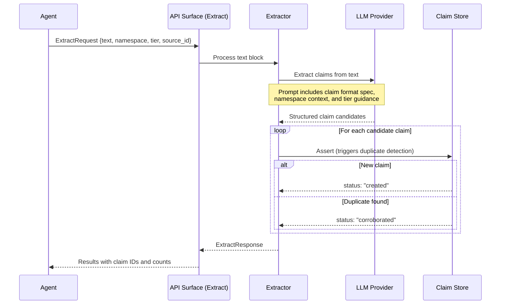

# Boswell — Extractor

The Extractor converts unstructured text into structured claims. It is the primary pathway for ingesting knowledge from documents, transcripts, articles, and other text sources.

## Responsibility

- Accept a block of text and produce a set of structured claims.
- Deduplicate extracted claims against existing knowledge (via the Claim Store's duplicate detection).
- Record provenance linking each extracted claim back to its source.

## Design



### Synchronous Blocking

The Extract operation blocks until all claims are produced. There is no partial result, streaming, or background processing model. The caller waits for the full extraction to complete.

**Rationale:** Extraction results are not useful until complete. An agent that says "learn this document" expects to query the resulting claims immediately after the call returns. Partial results would require the agent to poll or handle an eventually-consistent state that adds complexity without clear benefit.

**Implication:** Extract is the most expensive API operation due to LLM involvement. The text block may be large (pages of content), and the LLM must analyze the entire block to produce claims. Rate limiting is essential (see `03-api-surface.md`).

### LLM Prompt Design

The Extractor sends the text block to the configured LLM provider with a structured prompt that includes:

1. **Claim format specification.** The LLM must produce claims in Boswell's triple-plus-expression format: subject, predicate, object, and raw_expression.
2. **Extraction guidelines:**
   - Extract discrete, atomic claims. One idea per claim.
   - Preserve nuance in the raw_expression. The triple is for queryability; the raw_expression captures what was actually said.
   - Include temporal context when present ("as of Q3 2025", "since 2019").
   - Flag uncertainty in the source material — if the source hedges ("approximately", "reportedly"), reflect that in the claim.
3. **Namespace context.** The target namespace helps the LLM understand the domain and produce appropriately-scoped claims.
4. **Deduplication hint.** "The following claims already exist in this namespace" — a summary of high-confidence claims in the target namespace that helps the LLM avoid re-extracting known information. This is optional and bounded (top N claims by relevance to the source text).

### Provenance Tracking

Every extracted claim carries:

```
provenance: {
  source_type: "extraction",
  source_id: <hash of source text or user-provided identifier>,
  timestamp: <extraction time>,
  confidence_contribution: <LLM's assessed confidence for this claim>,
  context: "Extracted from text block by <model_name>"
}
```

The `source_id` enables traceability: "where did this claim come from?" and deduplication: "we've already processed this document."

### Duplicate Handling (Corroboration)

When two agents submit the same text block (or different texts that yield semantically identical claims), the Claim Store's duplicate detection treats the second extraction as corroboration:

1. The duplicate claim matches an existing claim via embedding similarity.
2. Instead of creating a new claim, a new provenance entry is appended to the existing claim.
3. The existing claim's confidence may increase as a result of the additional provenance.

This is analogous to "it must be true because multiple sources are saying it" — a valid signal, weighted appropriately in the confidence model. The Gatekeeper guards against confidence bubbles where hallucinated claims reinforce each other.

### Error Handling

- If the LLM fails mid-extraction (timeout, provider error), the entire Extract call fails. No partial results are persisted.
- If individual claims fail validation (invalid namespace depth, missing fields), those claims are skipped and reported in the response. Successfully extracted claims are still persisted.
- If the LLM produces output that doesn't conform to the expected claim format, the Extractor attempts to parse what it can and reports failures.

## Trait Interface

```rust
pub trait Extractor {
    fn extract(
        &self,
        text: &str,
        namespace: &str,
        tier: Tier,
        source_id: &str,
        existing_context: Option<Vec<ClaimSummary>>,
    ) -> Result<ExtractionResult, ExtractorError>;
}

pub struct ExtractionResult {
    pub claims_created: Vec<ClaimResult>,
    pub claims_corroborated: Vec<ClaimResult>,
    pub failures: Vec<ExtractionFailure>,
}
```

## Configuration

| Setting | Default | Description |
|---|---|---|
| `llm_provider` | (required) | LLM provider for extraction (see `11-llm-provider.md`) |
| `max_text_length` | `50000` | Maximum input text length (characters). Longer texts are rejected. |
| `context_claims_limit` | `20` | Maximum number of existing claims to include as deduplication context |
| `extraction_timeout` | `120s` | Maximum time for a single extraction call |

## Considerations

**Large documents:** For documents exceeding the LLM's context window, the Extractor should chunk the text and extract from each chunk independently. Chunking strategy (by paragraph, by section, by token count) is configurable. Cross-chunk references may be lost — this is a known limitation. The Synthesizer may later discover connections between claims extracted from different chunks.

**Multi-language support:** Claim extraction quality depends on the LLM's capability in the source language. The Extractor does not translate — it extracts claims in the language of the source text. The embedding model should support the same language for semantic search to work correctly.
