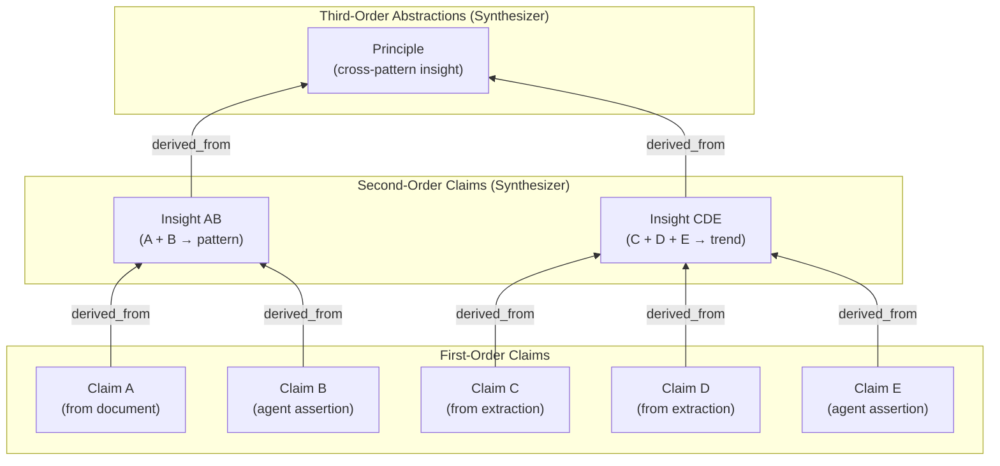
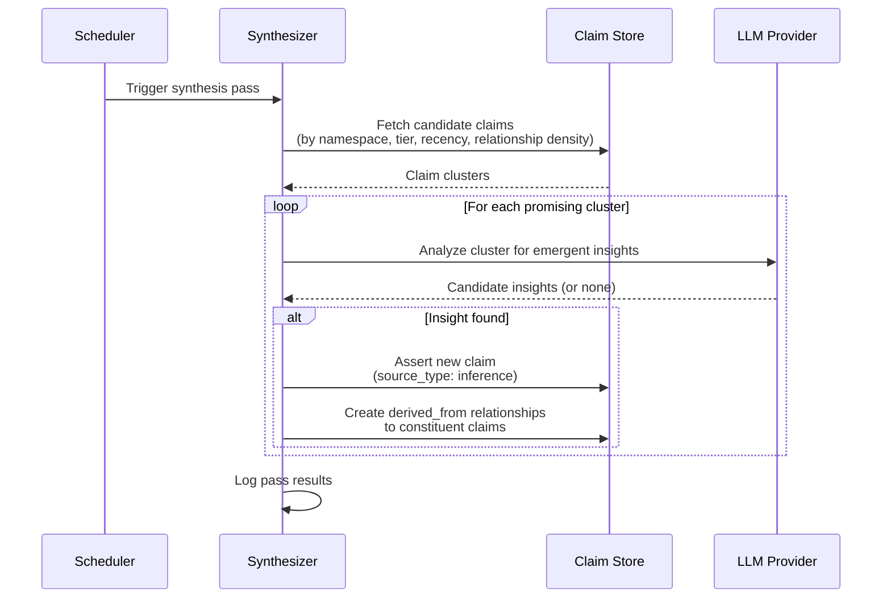
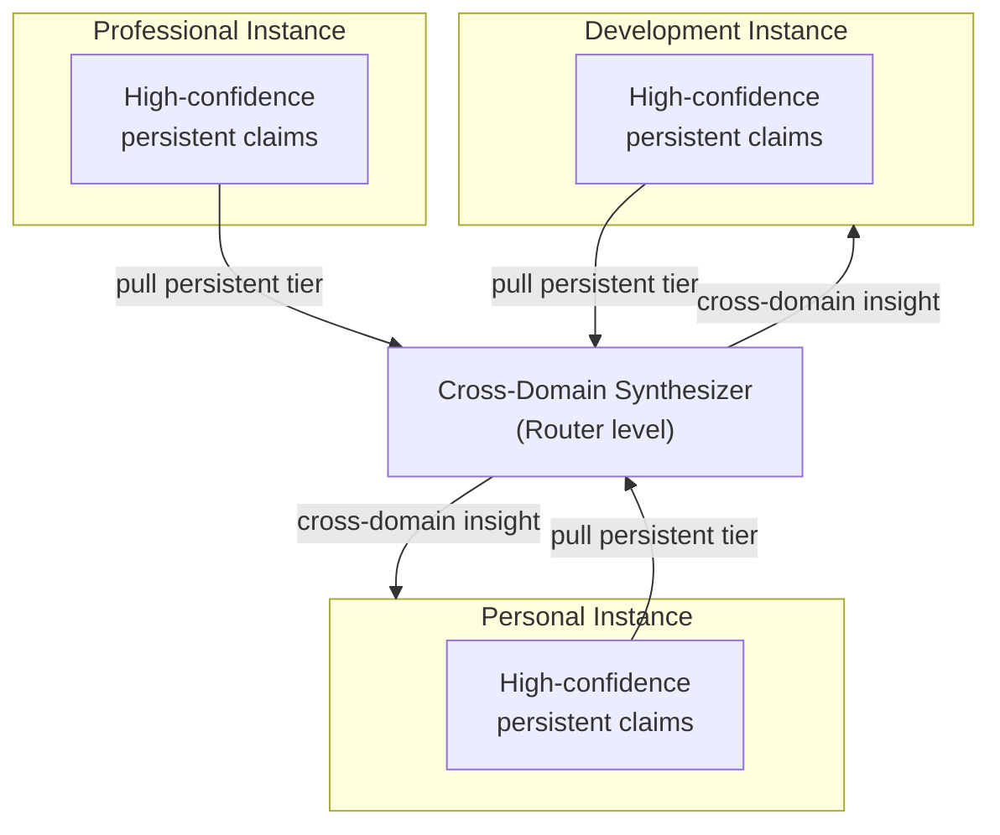

# Boswell — Synthesizer

The Synthesizer is a background process that continuously examines the claim graph and discovers emergent ideas — clusters of related claims that together imply a higher-order insight no individual claim represents.

## Responsibility

- Discover patterns, connections, and higher-order insights across existing claims.
- Produce new claims with `source_type: inference` and `derived_from` relationships linking back to constituent claims.
- Enable organic abstraction layers: first-order → second-order → third-order.
- At the Router level (multi-instance): discover cross-domain connections between instances.

## Design



### Background Process

The Synthesizer runs on a configurable schedule, not triggered by API calls. It is a continuous background process that scans claim clusters and identifies opportunities for synthesis.

**Execution cycle:**



### Candidate Selection

The Synthesizer does not scan every claim on every pass. It prioritizes:

1. **Recently modified claims.** New assertions, challenges, and corroborations may create new synthesis opportunities.
2. **Clusters with high relationship density.** Claims with many `supports`, `related_to`, or `refines` edges are more likely to yield compound insights.
3. **Claims with wide confidence intervals.** Areas of uncertainty may benefit from synthesis that connects disparate evidence.
4. **Namespaces not recently synthesized.** Round-robin across namespaces prevents one active domain from monopolizing synthesis resources.

### Resolving the Hyperedge Question

The claim model uses only pairwise relationships (see ADR-002). The compound relationship "Claims A, B, and C together imply Claim D" is represented as:

- Claim D with `source_type: inference` in its provenance.
- Three `derived_from` relationships: D→A, D→B, D→C.
- Three provenance entries referencing A, B, and C as sources.

The Synthesizer handles the complexity of multi-claim reasoning. The schema stays simple.

### Confidence Propagation

Synthesized claims naturally have wider confidence intervals than their constituents:

- The lower bound of a derived claim cannot exceed the minimum lower bound of its constituents.
- The upper bound is bounded by the LLM's assessed confidence in the inference.
- **Uncertainty propagates outward** through inference chains, which is epistemically correct. A chain of inferences should be less certain than its foundations.

When a constituent claim's confidence changes (challenge, corroboration, staleness decay), the Synthesizer can flag derived claims for re-evaluation on its next pass.

### Cross-Domain Synthesizer (Router Level)

In multi-instance deployments, a separate Synthesizer can run at the Router level:



- Pulls only high-confidence, persistent-tier claims from each instance. No ephemeral or task-level noise.
- Looks for cross-domain connections: "this software architecture pattern resembles this biological system."
- Insights can be pushed back to relevant instances or stored in a shared insights space at the Router level.
- When a previously-unreachable instance becomes available, the cross-domain Synthesizer prioritizes scanning it for changes.

## Trait Interface

```rust
pub trait Synthesizer {
    fn run_pass(&self, scope: SynthesisScope) -> Result<SynthesisReport, SynthesizerError>;
}

pub struct SynthesisScope {
    pub namespaces: Option<Vec<String>>,   // Limit to specific namespaces (None = all)
    pub min_tier: Tier,                     // Minimum tier to consider
    pub since: Option<DateTime>,            // Only claims modified since this time
    pub max_clusters: usize,                // Maximum clusters to evaluate per pass
}

pub struct SynthesisReport {
    pub claims_examined: usize,
    pub clusters_evaluated: usize,
    pub insights_created: usize,
    pub duration: Duration,
}
```

## Configuration

| Setting | Default | Description |
|---|---|---|
| `llm_provider` | (required) | LLM provider for synthesis |
| `schedule` | `every 6 hours` | How often to run synthesis passes |
| `namespaces` | `*` | Which namespaces to examine (glob pattern) |
| `min_tier` | `task` | Minimum tier to consider for synthesis (skip ephemeral noise) |
| `max_clusters_per_pass` | `50` | Limit on clusters evaluated per pass |
| `min_cluster_size` | `3` | Minimum claims in a cluster for synthesis consideration |
| `enabled` | `true` | Can be disabled entirely for instances where synthesis isn't needed |

## Considerations

**Cost control.** Each synthesis pass involves LLM calls. The schedule and max_clusters_per_pass settings control cost. For instances backed by expensive frontier models, less frequent passes with smaller cluster limits may be appropriate.

**Runaway synthesis.** The Synthesizer must not create unbounded chains of meta-insights. A depth limit on derived_from chains (e.g., maximum 5 levels of derivation) prevents this. Beyond that depth, the insight is likely too abstract to be useful.

**Quality over quantity.** The Synthesizer should produce fewer, higher-quality insights rather than many low-confidence speculative claims. The LLM prompt should emphasize that "no insight" is a valid outcome for a cluster.
