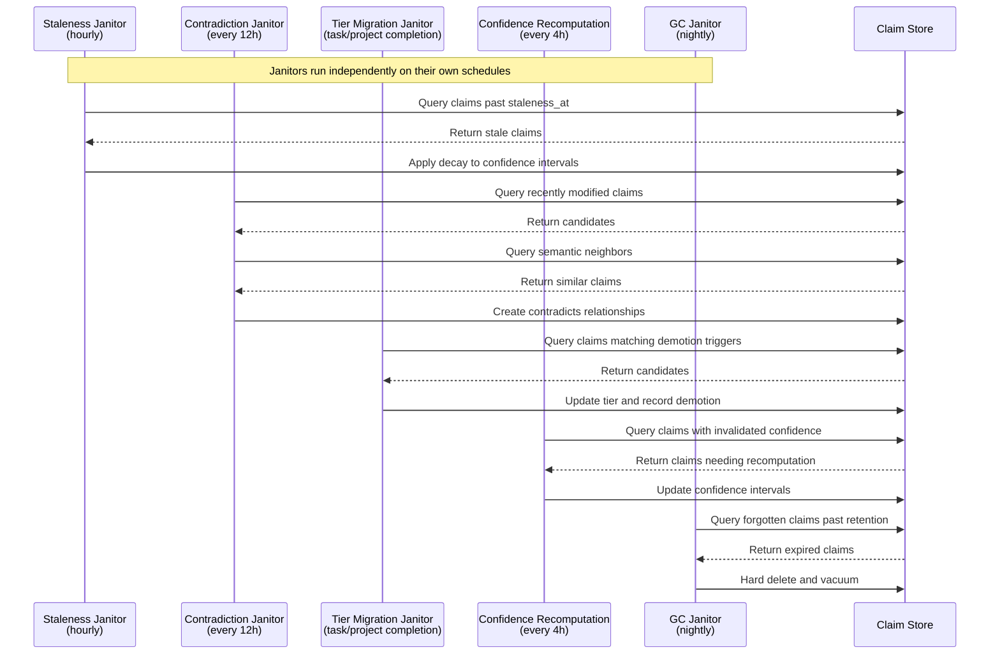

# Boswell — Janitor(s)

Janitors are background maintenance processes that keep the claim graph healthy. Multiple Janitors run on different schedules, each responsible for a specific maintenance concern.

## Responsibility

- Staleness decay: reduce confidence on stale claims.
- Confidence recomputation: periodically refresh cached confidence values.
- Contradiction detection: identify semantic contradictions between claims.
- Tier demotion: evaluate claims for demotion based on access patterns and confidence degradation.
- Garbage collection: hard-delete claims in `forgotten` status after retention period.
- Storage compaction: reclaim space after deletions.

## Janitor Types



### Staleness Janitor

**Schedule:** Hourly (configurable).
**Type:** Fully deterministic. No LLM involvement.

Scans claims where `now() > staleness_at` and applies the half-life decay model to their confidence intervals:

```
staleness_factor = 0.5 ^ (time_since_staleness_at / half_life)
```

Half-life is configurable per tier:

| Tier | Default Half-Life | Rationale |
|---|---|---|
| Ephemeral | 4 hours | Short-lived by design |
| Task | 3 days | Relevant to active work |
| Project | 4 weeks | Relevant to ongoing projects |
| Persistent | 6 months | Long-term knowledge, slow decay |

The Staleness Janitor multiplies both bounds of the confidence interval by the staleness factor. A claim one half-life past its staleness date retains 50% of its original confidence. Two half-lives: 25%. The decay is smooth — no cliffs.

Claims that decay below a configurable floor (default: `lower_bound < 0.05`) are candidates for demotion by the Tier Migration Janitor.

### Contradiction Janitor

**Schedule:** Every 12 hours (configurable).
**Type:** LLM-assisted for semantic contradiction detection.

Structural contradictions (explicit `contradicts` relationships) are already tracked in the relationship graph. The Contradiction Janitor looks for **semantic contradictions** that aren't structurally obvious:

1. Select claims that have been recently modified or created.
2. For each claim, query semantically similar claims in the same namespace.
3. Send candidate pairs to the LLM: "Do these two claims contradict each other?"
4. If the LLM identifies a contradiction, create a `contradicts` relationship and transition the weaker claim to `challenged` status.

**Cost control:** The Contradiction Janitor limits its scope per pass. It processes a configurable number of claims per run and prioritizes recently-changed claims over stable ones.

### Tier Migration Janitor

**Schedule:** Triggered on task/project completion events, or on a configurable schedule (default: daily).
**Type:** Primarily deterministic. LLM-assisted for nuanced demotion evaluation.

**Demotion triggers:**

| Current Tier | Trigger | Target |
|---|---|---|
| Persistent | Confidence decay below threshold + no access in configurable period | Project |
| Project | Project completes/inactive, claim never promoted | Task |
| Task | Task completes, claim never referenced by other claims | Ephemeral |
| Ephemeral | TTL expired or session ended | Forgotten |

**Demotion process:**
1. Identify candidates based on triggers above.
2. For simple cases (TTL expiration, session end), demote immediately. No LLM needed.
3. For nuanced cases (persistent → project), optionally invoke LLM to evaluate whether the claim still has long-term value despite low access.
4. Record demotion in the event log with reasoning.

**Note:** Promotion is handled by the Gatekeeper, not the Janitor. The Janitor only demotes.

### GC Janitor

**Schedule:** Nightly (configurable).
**Type:** Fully deterministic.

1. Hard-delete claims in `forgotten` status where `last_modified + retention_period < now()`.
2. Remove associated provenance entries and relationships.
3. Remove embeddings from the HNSW vector index.
4. Run `VACUUM` or incremental cleanup on the SQLite database to reclaim space.

Retention period is configurable per namespace. Default: 30 days after entering `forgotten` status.

### Confidence Recomputation Janitor

**Schedule:** Every 4 hours (configurable).
**Type:** Deterministic (fast path recomputation). Optionally LLM-assisted for claims in interesting states.

1. Identify claims with invalidated confidence caches (related claims have changed since last computation).
2. Recompute confidence intervals using the deterministic formula (see `13-confidence.md`).
3. Optionally, for claims that are heavily contradicted, frequently accessed, or recently challenged, invoke the LLM for a more nuanced assessment and update the stored confidence accordingly.

## Coordination

Multiple Janitors may run concurrently. They coordinate through:

- **Claim-level status flags.** A claim being processed by one Janitor is not picked up by another. This is advisory, not a hard lock — if a Janitor crashes mid-process, the flag is cleared on the next pass.
- **SQLite transaction isolation.** Each Janitor's operations run within transactions. Concurrent Janitors see a consistent snapshot.
- **Non-overlapping concerns.** Each Janitor type has a distinct responsibility. The Staleness Janitor doesn't touch relationships; the GC Janitor doesn't evaluate confidence. Conflicts are rare by design.

## Trait Interface

```rust
pub trait Janitor {
    fn run(&self) -> Result<JanitorReport, JanitorError>;
    fn janitor_type(&self) -> JanitorType;
}

pub enum JanitorType {
    Staleness,
    Contradiction,
    TierMigration,
    GarbageCollection,
    ConfidenceRecomputation,
}

pub struct JanitorReport {
    pub janitor_type: JanitorType,
    pub claims_processed: usize,
    pub claims_modified: usize,
    pub claims_demoted: usize,
    pub claims_deleted: usize,
    pub duration: Duration,
    pub errors: Vec<JanitorError>,
}
```

## Configuration

| Setting | Default | Description |
|---|---|---|
| `staleness_schedule` | `0 * * * *` (hourly) | Cron expression for staleness decay |
| `contradiction_schedule` | `0 */12 * * *` | Cron expression for contradiction detection |
| `tier_migration_schedule` | `0 2 * * *` (daily 2am) | Cron expression for demotion evaluation |
| `gc_schedule` | `0 3 * * *` (daily 3am) | Cron expression for garbage collection |
| `confidence_recompute_schedule` | `0 */4 * * *` | Cron expression for confidence recomputation |
| `staleness_half_life_ephemeral` | `4h` | Half-life for ephemeral tier |
| `staleness_half_life_task` | `3d` | Half-life for task tier |
| `staleness_half_life_project` | `4w` | Half-life for project tier |
| `staleness_half_life_persistent` | `6mo` | Half-life for persistent tier |
| `gc_retention_period` | `30d` | Days to retain forgotten claims before hard delete |
| `confidence_floor` | `0.05` | Lower bound below which claims are demotion candidates |
| `contradiction_max_per_pass` | `100` | Max claims to evaluate per contradiction pass |
| `contradiction_llm_provider` | (optional) | LLM provider for contradiction detection |
