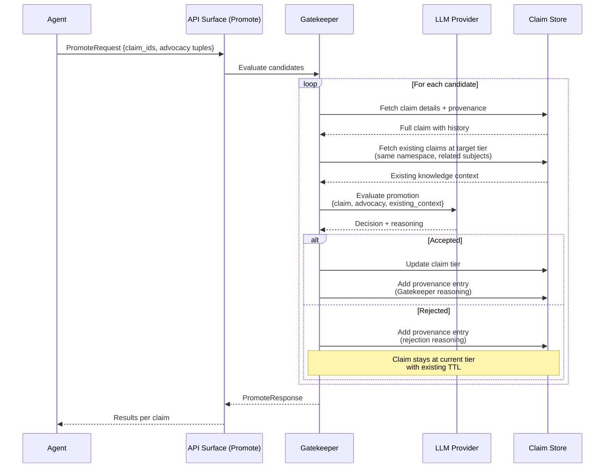

# Boswell — Gatekeeper

The Gatekeeper evaluates claims submitted for tier promotion. It ensures that no agent has unilateral authority to decide what knowledge persists long-term.

## Responsibility

- Evaluate claims for promotion to a higher tier.
- Accept, modify, or reject promotion requests based on independent assessment.
- Record evaluation reasoning as provenance for future reference.
- Guard against confidence bubbles where swarm hallucinations reinforce each other.

## Design



### Advocacy Tuples

Agents submit promotion requests with an advocacy tuple per claim:

- **perceived_importance** (0.0-1.0): How important the agent believes this claim is for long-term retention.
- **advocacy_confidence** (0.0-1.0): How confident the agent is in that assessment.

The Gatekeeper considers advocacy as a signal but is **not bound by it**. High advocacy from the agent does not guarantee promotion. The Gatekeeper evaluates independently.

### Tier-Specific Gatekeepers

Different tier boundaries have different Gatekeepers with increasing skepticism:

| Boundary | Skepticism | LLM Config | Rationale |
|---|---|---|---|
| Ephemeral → Task | Permissive | Fast local model | Low stakes. Task claims have short TTL. Easy cleanup if wrong. |
| Task → Project | Moderate | Capable local model | Medium stakes. Project claims persist for weeks to months. |
| Project → Persistent | Stringent | Frontier model | High stakes. Persistent claims are indefinite. Errors compound over time. |

Each Gatekeeper can use a different LLM provider configuration. The ephemeral→task Gatekeeper might use a fast local Mistral instance. The project→persistent Gatekeeper might use Claude for nuanced evaluation.

### Evaluation Criteria

The Gatekeeper evaluates each claim against:

1. **Novelty.** Does this claim add new knowledge to the target tier, or is it redundant with existing claims?
2. **Consistency.** Does this claim contradict established knowledge at the target tier? If so, is the contradiction supported by strong evidence?
3. **Quality.** Is the claim well-formed? Is the provenance credible? Is the confidence interval reasonable given the evidence?
4. **Agent advocacy.** What does the submitting agent think, and why? Considered but not determinative.
5. **Source diversity.** Claims with multiple independent sources (provenance entries) are stronger candidates than single-source claims.

### Rejection Behavior

Rejected claims are **not deleted**. They remain at their current tier with their existing TTL:

- If the TTL expires without further advocacy or corroboration, the Janitor sweeps them normally.
- If new evidence surfaces and another agent independently submits the same knowledge, the Gatekeeper has context from the prior evaluation.
- The rejection reasoning is recorded as a provenance entry, providing context for future evaluations.

There is no `"rejected"` status in the claim lifecycle. Rejection is simply non-promotion — the claim stays where it is.

### Defense Against Confidence Bubbles

If a swarm of agents all hallucinate the same incorrect claim and submit it with high advocacy scores, the Gatekeeper evaluates it against established knowledge at the target tier:

- Multiple agents saying the same wrong thing does not make it right.
- The Gatekeeper checks whether the claim is consistent with the broader knowledge context, not just whether advocates believe it.
- Corroboration from independent sources (different documents, different contexts) is weighted more heavily than corroboration from agents that may share the same context or training biases.

### Deferral

If the Gatekeeper's LLM provider is slow or temporarily unavailable, the promotion request returns a `"deferred"` status. The client can retry. The claim remains at its current tier during deferral.

## Trait Interface

```rust
pub trait Gatekeeper {
    fn evaluate(
        &self,
        candidates: Vec<PromotionCandidate>,
        tier_boundary: TierBoundary,
    ) -> Result<Vec<PromotionResult>, GatekeeperError>;
}

pub struct PromotionCandidate {
    pub claim: Claim,
    pub target_tier: Tier,
    pub perceived_importance: f32,
    pub advocacy_confidence: f32,
    pub justification: Option<String>,
}

pub enum TierBoundary {
    EphemeralToTask,
    TaskToProject,
    ProjectToPersistent,
}

pub struct PromotionResult {
    pub claim_id: Uuid,
    pub status: PromotionStatus, // Accepted, Rejected, Deferred
    pub previous_tier: Tier,
    pub current_tier: Tier,
    pub reasoning: String,
}
```

## Configuration

| Setting | Default | Description |
|---|---|---|
| `ephemeral_to_task_provider` | (local model) | LLM provider for ephemeral→task evaluation |
| `task_to_project_provider` | (local model) | LLM provider for task→project evaluation |
| `project_to_persistent_provider` | (required) | LLM provider for project→persistent evaluation |
| `evaluation_timeout` | `30s` | Maximum time per claim evaluation |
| `batch_size` | `10` | Maximum claims evaluated per LLM call (batched for efficiency) |
