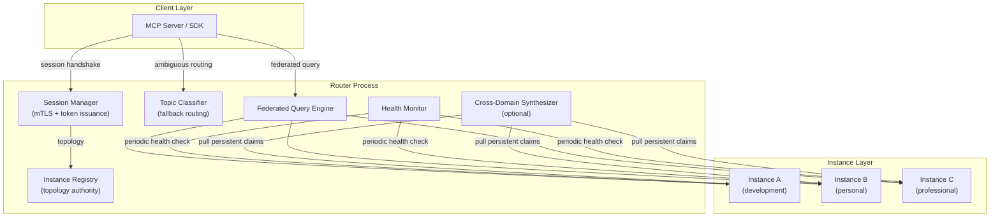
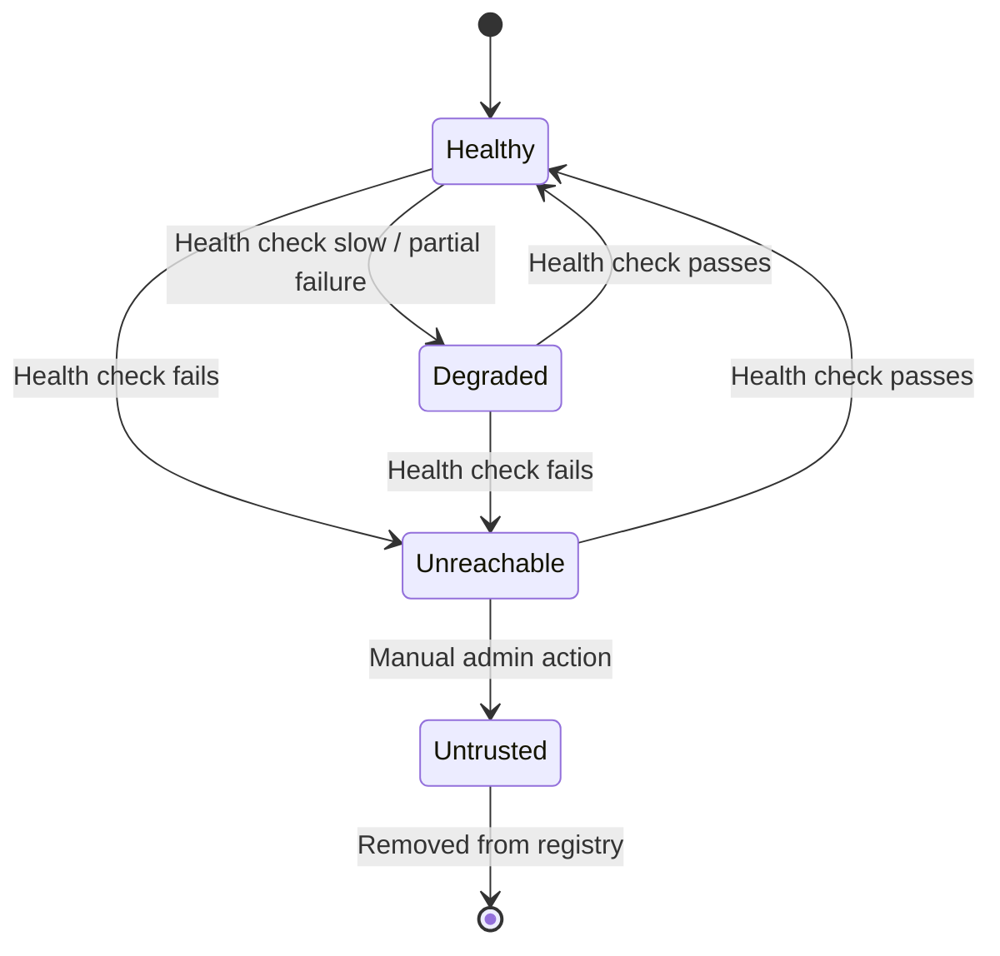
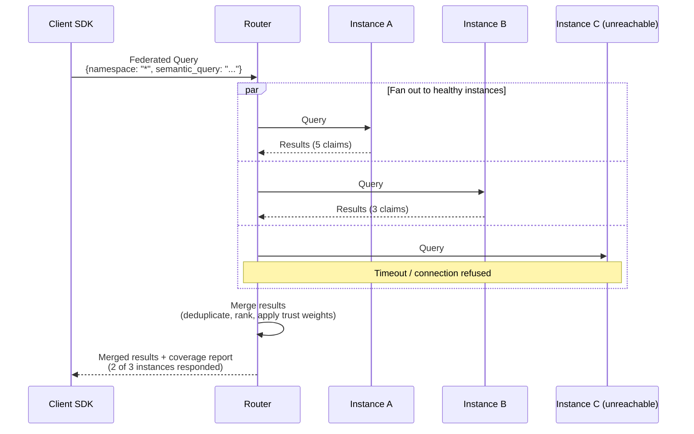

# Boswell — Router

The Router manages multi-instance deployments. It is the topology authority, session issuer, and fallback classifier. It is not required for single-instance deployments.

## Responsibility

- Maintain the instance registry (endpoints, expertise profiles, health states, trust scores).
- Issue session tokens and deliver topology to clients.
- Serve as fallback for operations the client SDK cannot route.
- Execute federated queries across instances.
- Host the cross-domain Synthesizer (optional).
- Manage the portable encrypted configuration.

## Architecture



## Not in the Hot Path

The Router is **not a proxy for routine operations**. After the session handshake, clients route operations directly to instances using the topology they received. The Router is only involved in:

1. **Session initiation and token refresh.** Authenticate the client, issue a token, return the topology.
2. **Ambiguous routing fallback.** When the client SDK cannot determine which instance should receive an operation.
3. **Federated queries.** Queries that span multiple instances.
4. **Cross-domain synthesis.** Optional background process discovering connections between instances.

Everything else — Assert, Learn, Extract, Challenge, Promote, Forget — goes directly from client to instance.

## Instance Registry

The registry is the Router's core data structure. It tracks all registered instances.

```rust
pub struct InstanceEntry {
    pub instance_id: String,
    pub endpoint: String,               // gRPC endpoint (host:port)
    pub fingerprint: Vec<u8>,           // Public key fingerprint for mTLS verification
    pub expertise: Vec<String>,         // Topic descriptors for routing
    pub health: InstanceHealth,         // Current health state
    pub trust: f32,                     // Trust score (0.0-1.0, default 1.0)
    pub permissions: InstancePermissions,
    pub last_health_check: DateTime,
}

pub struct InstancePermissions {
    pub federated_query: bool,          // Participates in cross-instance queries
    pub cross_domain_synthesis: bool,   // Contributes to cross-domain Synthesizer
    pub direct_access: bool,            // Clients can connect directly (always true currently)
}
```

### Expertise Profiles

Each instance declares a set of topic descriptors that describe what kinds of knowledge it holds. These are configured during manual instance registration and returned to clients in the session response.

Examples: `["programming", "devops", "databases"]`, `["cooking", "family", "important-dates"]`, `["clients", "contracts", "meetings"]`.

The client SDK matches routing hints against these profiles for local routing. The Router's Topic Classifier uses them for fallback classification.

### Health States



| State | Meaning | Client Behavior |
|---|---|---|
| Healthy | Responding normally | Route operations normally |
| Degraded | Responding slowly or with partial errors | Route with caution; expect higher latency |
| Unreachable | Not responding to health checks | Client should retry; may succeed if transiently down |
| Untrusted | Manually flagged by admin | Instance removed from topology; clients cannot route to it |

Health state transitions are automatic (based on health check results) except for `Untrusted`, which requires explicit admin action.

### Trust Scores

Each instance carries a trust score (default 1.0). This is a forward-looking design — v1 does not modify trust automatically. Future uses:

- Claims from lower-trust instances have their confidence scaled proportionally in federated query results.
- The cross-domain Synthesizer weights claims from higher-trust instances more heavily.
- An instance that repeatedly produces claims that get challenged and overturned could have its trust automatically degraded.

## Health Monitor

The Health Monitor periodically pings each registered instance:

- **Check interval:** Configurable (default: 60 seconds).
- **Check method:** Lightweight gRPC health check (standard `grpc.health.v1.Health` service).
- **Transition logic:** Two consecutive failures → `Unreachable`. Recovery requires two consecutive successes → back to `Healthy`. This prevents flapping on transient network issues.

Health states are reflected in the topology returned to clients. When a client re-fetches topology (new session request), it gets current health information.

## Topic Classifier (Fallback)

When the client SDK cannot determine which instance should receive an operation, it forwards the operation to the Router. The Router's Topic Classifier resolves the ambiguity.

**Classification methods:**

1. **Keyword matching.** Compare the claim's subject, predicate, and routing hint against instance expertise profiles. Fast, no LLM.
2. **Embedding similarity.** Embed the claim's raw_expression and compare against pre-computed expertise profile signatures. Requires a local embedding model at the Router level.
3. **LLM-assisted.** Send the claim content and available expertise profiles to an LLM for classification. Most nuanced, most expensive.

The Router tries methods in order: keyword first, embedding if inconclusive, LLM as last resort.

## Federated Queries

When a client issues a Query with a namespace pattern that spans instances (e.g., `"*"` or a pattern matching multiple instances), the client SDK sends the query to the Router for federated execution.



**Merging rules:**

- Results are deduplicated by semantic similarity (same claim in multiple instances via cross-domain Learn).
- Confidence intervals are scaled by instance trust score.
- Results are ranked by effective confidence after trust scaling.
- The coverage report tells the client which instances participated and which were unreachable, so the agent knows the results may be incomplete.

## Portable Encrypted Configuration

The Router's configuration — the instance registry, credentials, and settings — is stored in a single encrypted file.

**Format:**
- Inner layer: TOML (human-readable when decrypted, easy to inspect and hand-edit).
- Outer layer: Encrypted with `age` (modern, Rust-native, passphrase-based).

**Workflow:**

1. Download the Boswell Router binary (single static binary).
2. Pull the encrypted config from wherever it's stored (iCloud, USB, cloud storage).
3. `boswell-router --config ./router.enc`
4. Router prompts for passphrase, decrypts in memory, never writes plaintext to disk.
5. Begins health-checking all known instances from wherever you are.

**Properties:**

- Config never exists decrypted on disk. Decryption happens in memory at startup. Modifications are re-encrypted before writing.
- Config includes a version/sequence number for detecting stale copies across multiple storage locations.
- Config sync is manual and deliberate. No automatic sync — that would be a vector for propagating a compromised config.

**Disaster recovery:** As long as you remember your passphrase and can access your config file, you can reconstruct your entire memory network connection topology from any machine. The actual knowledge is durable on the instances themselves. The Router is stateless except for this one config file.

## Trait Interface

```rust
pub trait Router {
    fn create_session(&self, identity: &ClientIdentity) -> Result<SessionResponse, RouterError>;
    fn classify(&self, claim: &ClaimInput) -> Result<InstanceId, RouterError>;
    fn federated_query(&self, request: QueryRequest) -> Result<FederatedQueryResponse, RouterError>;
    fn get_topology(&self) -> Result<Vec<InstanceInfo>, RouterError>;
    fn register_instance(&self, entry: InstanceEntry) -> Result<(), RouterError>;
    fn remove_instance(&self, instance_id: &str) -> Result<(), RouterError>;
}
```

## Configuration

| Setting | Default | Description |
|---|---|---|
| `config_path` | `./router.enc` | Path to encrypted configuration file |
| `listen_address` | `0.0.0.0:9000` | gRPC listen address |
| `health_check_interval` | `60s` | Interval between instance health checks |
| `health_check_timeout` | `5s` | Timeout for individual health check |
| `failure_threshold` | `2` | Consecutive failures before marking unreachable |
| `recovery_threshold` | `2` | Consecutive successes before marking healthy |
| `classification_method` | `keyword,embedding,llm` | Ordered list of classification methods to try |
| `classification_llm_provider` | (optional) | LLM provider for fallback classification |
| `cross_domain_synthesis` | `false` | Enable cross-domain Synthesizer at Router level |

## Deployment

The Router is a single static binary with no runtime dependencies (other than the encrypted config file). It can run on any machine that has network access to at least one registered instance.

**Recommended deployment:** Run on your primary machine (not a remote server) since the Router holds the topology and token-issuing authority. Its config file is the highest-value target in the system.

**Resource requirements:** Minimal. The Router holds no claim data — only the registry and in-flight federated query state. Memory usage scales with the number of registered instances, not the number of claims.
