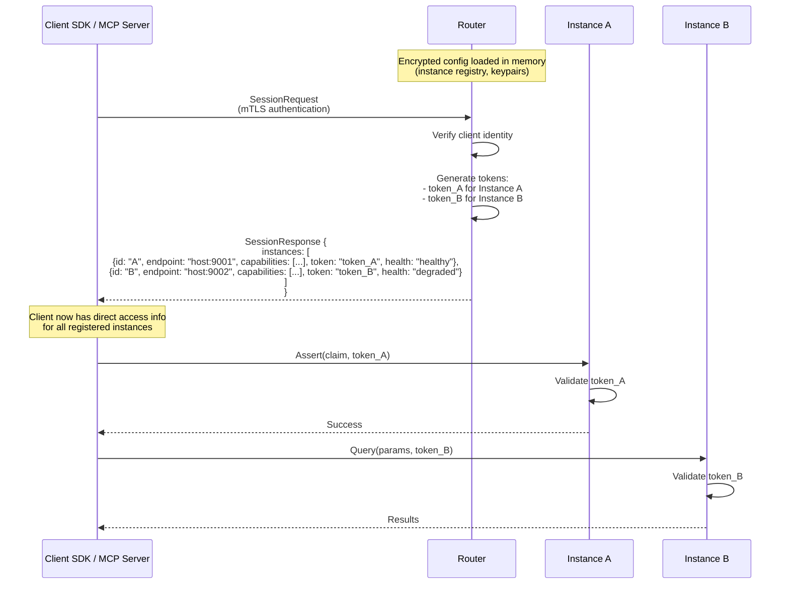
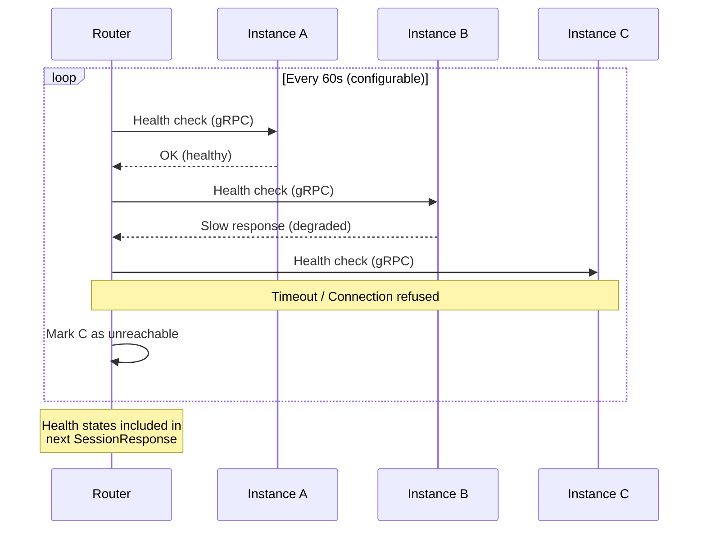
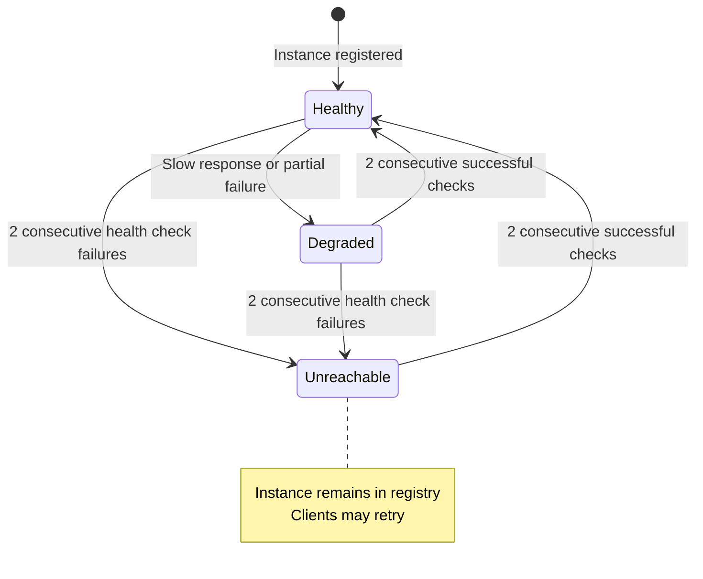
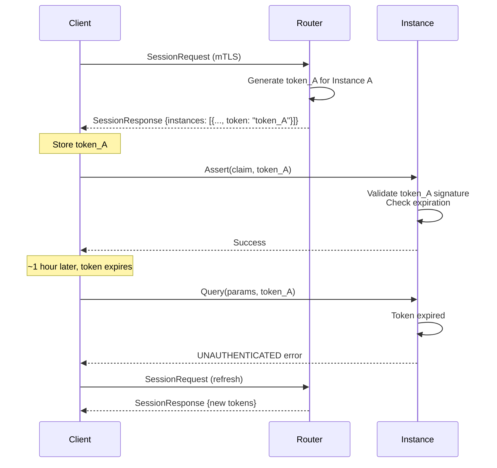
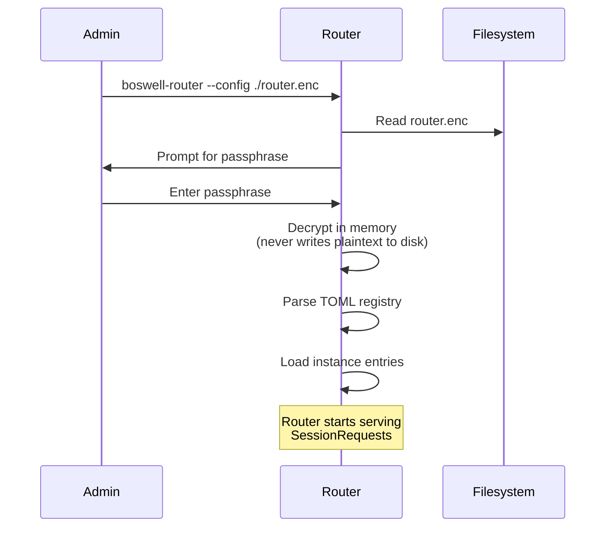

# Boswell — Router

The Router is the session management and instance registry authority for all Boswell deployments. It is **always present**, even in single-instance configurations, where it adds minimal overhead (<1MB memory, near-zero CPU). The Router responds to session requests from authorized clients with a list of registered instances, their endpoints, capabilities, health status, and instance-specific tokens.

## Responsibility

The Router is the single source of truth for:

- **Instance registry:** Maintains the list of registered instances with their cryptographic fingerprints, endpoints, capabilities, and health states.
- **Session token issuance:** Issues one token per instance in response to authenticated session requests. Each token is scoped to a specific instance.
- **Health tracking:** Periodically checks instance health and reports current health status in session responses.
- **Configuration management:** Stores the encrypted, portable configuration file containing all registry data.

**What the Router is NOT:**

- **Not a proxy.** After session establishment, clients route all operations directly to instances. The Router is not in the hot path.
- **Not automatic discovery.** Instance registration is manual and deliberate. Adding a new instance requires explicit administrative action.
- **Not a centralized data store.** The Router holds no claim data — only metadata about instances.

## Architecture

### Session Establishment Flow



### Health Monitoring Flow



## Not in the Hot Path

The Router is **not a proxy for routine operations**. After the session handshake, clients route operations directly to instances using the instance-specific tokens and endpoint information they received. The Router is only contacted for:

1. **Session establishment:** Initial authentication and token issuance for all registered instances.
2. **Token refresh:** When tokens expire (default: 1 hour), clients request a new SessionResponse to get fresh tokens.
3. **Registry updates:** When the client needs to check for new instances or updated health states.

Everything else — Assert, Query, Learn, Extract, Challenge, Promote, Forget — goes directly from client to instance with no Router involvement.

## Instance Registry

The registry is the Router's core data structure. It tracks all registered instances.

```rust
pub struct InstanceEntry {
    pub instance_id: String,
    pub endpoint: String,               // gRPC endpoint (host:port)
    pub fingerprint: Vec<u8>,           // Public key fingerprint for mTLS verification
    pub capabilities: Vec<String>,      // Supported operations (e.g., ["assert", "query", "learn"])
    pub health: InstanceHealth,         // Current health state
    pub last_health_check: DateTime,
}

pub enum InstanceHealth {
    Healthy,      // Responding normally
    Degraded,     // Responding slowly or with partial errors
    Unreachable,  // Not responding to health checks
}
```

### Manual Registration

**Instance registration is manual and deliberate.** There is no automatic discovery mechanism. Adding a new instance requires:

1. **Administrative action:** Editing the Router's encrypted configuration file.
2. **Cryptographic identity:** The instance's public key fingerprint must be added to the registry.
3. **Endpoint configuration:** One or more network endpoints (LAN IP, VPN address, etc.).
4. **Capability declaration:** The set of operations this instance supports.

This deliberate process ensures that only trusted instances join the network. Automatic discovery would create security and trust management challenges.

### Multiple Endpoints

An instance may have multiple endpoints registered to support different network contexts:
- **LAN address** for when the client is on the same local network
- **VPN address** for remote access
- **Public endpoint** (if appropriate for the deployment)

The client SDK can try endpoints in order based on reachability and network context.

### Health States and Transitions



| State | Meaning | Included in SessionResponse | Client Behavior |
|---|---|---|---|
| Healthy | Responding normally within timeout | Yes | Route operations normally |
| Degraded | Responding slowly or with partial errors | Yes | Route with caution; expect higher latency |
| Unreachable | Not responding to health checks | Yes | Client should handle gracefully (retry, skip, notify user) |

**Transition rules:**

- **Consecutive check requirement:** Two consecutive failures before marking `Unreachable`, two consecutive successes before marking `Healthy`. This prevents flapping on transient network issues.
- **Degraded detection:** Single slow response (>80% of timeout) or partial gRPC error triggers `Degraded` state.
- **All states are reported:** Even `Unreachable` instances remain in the registry and are included in SessionResponse. Clients decide how to handle unreachable instances.

Health state transitions are fully automatic based on health check results. No manual intervention is required unless an administrator wants to remove an instance from the registry entirely.

## Health Monitor

The Health Monitor periodically pings each registered instance:

- **Check interval:** Configurable (default: 60 seconds).
- **Check method:** Lightweight gRPC health check (standard `grpc.health.v1.Health` service).
- **Transition logic:** Two consecutive failures → `Unreachable`. Recovery requires two consecutive successes → back to `Healthy`. This prevents flapping on transient network issues.

Health states are reflected in the topology returned to clients. When a client re-fetches topology (new session request), it gets current health information.

## Token Issuance and Validation

The Router issues **one token per instance** in response to each SessionRequest.

### Token Structure

Each token is:
- **Instance-specific:** Scoped to a single instance_id and cannot be used with other instances
- **Short-lived:** Default expiration is 1 hour (configurable)
- **Signed by Router:** Instances validate tokens against the Router's signing key

### Token Lifecycle Flow



### Security Properties

- **Token compromise is instance-scoped:** If one token leaks, only that single instance is affected. The client must re-authenticate to get fresh tokens.
- **No shared secrets between instances:** Each instance validates tokens independently using the Router's public key.
- **Instances never communicate with each other:** All trust relationships are mediated through the Router's registry and mTLS verification.

## Portable Encrypted Configuration

The Router's configuration — the instance registry, keypairs, and settings — is stored in a single encrypted file.

**Format:**
- **Inner layer:** TOML (human-readable when decrypted, easy to inspect and hand-edit).
- **Outer layer:** Encrypted with `age` (modern, Rust-native, passphrase-based encryption).

**Startup Flow:**



**Properties:**

- **Never decrypted on disk:** Decryption happens in memory at startup. The plaintext never touches the filesystem.
- **Modifications are re-encrypted:** If the admin modifies the registry (adds/removes instances), the Router re-encrypts before writing.
- **Versioned config:** Contains a sequence number to detect which copy is most recent when copies exist in multiple locations.
- **Manual sync:** No automatic synchronization. The admin deliberately copies the config between storage locations (iCloud, USB drive, etc.) to prevent propagation of a compromised config.

**Disaster recovery:** With the passphrase and the encrypted config file, you can reconstruct your entire instance network from any machine running the Router binary. The actual knowledge lives on the instances; the Router config just contains the registry metadata.

## Trait Interface

```rust
pub trait Router {
    /// Authenticate a client and issue instance-specific session tokens
    fn create_session(&self, identity: &ClientIdentity) -> Result<SessionResponse, RouterError>;
    
    /// Return current instance registry with health states and endpoints
    fn get_registry(&self) -> Result<Vec<InstanceInfo>, RouterError>;
    
    /// Manually register a new instance (admin operation)
    fn register_instance(&self, entry: InstanceEntry) -> Result<(), RouterError>;
    
    /// Remove an instance from the registry (admin operation)
    fn remove_instance(&self, instance_id: &str) -> Result<(), RouterError>;
    
    /// Update an instance's endpoints or capabilities (admin operation)
    fn update_instance(&self, instance_id: &str, updates: InstanceUpdates) -> Result<(), RouterError>;
}

pub struct SessionResponse {
    pub instances: Vec<InstanceInfo>,
}

pub struct InstanceInfo {
    pub instance_id: String,
    pub endpoint: String,
    pub capabilities: Vec<String>,
    pub token: String,            // Instance-specific session token
    pub health: InstanceHealth,
}
```

Note that the Router trait does not include routing, classification, or query operations. Those are handled by the client SDK and instances directly.

## Configuration

| Setting | Default | Description |
|---|---|---|
| `config_path` | `./router.enc` | Path to encrypted configuration file |
| `listen_address` | `0.0.0.0:9000` | gRPC listen address |
| `health_check_interval` | `60s` | Interval between instance health checks |
| `health_check_timeout` | `5s` | Timeout for individual health check |
| `failure_threshold` | `2` | Consecutive failures before marking unreachable |
| `recovery_threshold` | `2` | Consecutive successes before marking healthy |
| `degraded_threshold` | `80%` | Percentage of timeout that triggers degraded state (e.g., 4s response on 5s timeout) |
| `token_ttl` | `1h` | Time-to-live for issued session tokens |
| `signing_key_path` | (in encrypted config) | Private key for signing session tokens |

## Deployment

The Router is a single static binary with no runtime dependencies (other than the encrypted config file). It runs on any machine that has network access to at least one registered instance.

### Single-Instance Mode

**The Router is present even in single-instance deployments.** This ensures consistent session management and security patterns across all deployment models.

- **Minimal overhead:** <1MB memory footprint, near-zero CPU usage
- **Simple registry:** Contains only one instance entry
- **Consistent API:** Clients use the same SessionRequest/SessionResponse flow regardless of deployment size

### Multi-Instance Mode

The Router scales efficiently to multiple instances:

- **Memory usage:** Approximately 100KB per registered instance (mostly for health state and endpoint tracking)
- **CPU usage:** Health checks every 60 seconds per instance (lightweight gRPC ping)
- **Network usage:** Minimal — only health checks and session establishment

### Recommended Deployment

**Run the Router on your primary trusted machine** (not a remote server). The Router holds:
- The instance registry and cryptographic identities
- The token-issuing signing key
- The encrypted configuration (highest-value target in the system)

Running it on your own machine (desktop, laptop) gives you direct control over the most security-sensitive component.

### Resource Requirements

- **Memory:** <1MB for single instance, ~1MB + (100KB × number of instances)
- **CPU:** Near-zero except during session establishment and health checks
- **Disk:** Only the encrypted config file (~10-50KB depending on registry size)
- **Network:** Outbound connections to instances for health checks; inbound gRPC listener for session requests

The Router holds **no claim data** — only metadata about instances. Memory and CPU usage are independent of the number of claims in your system.
