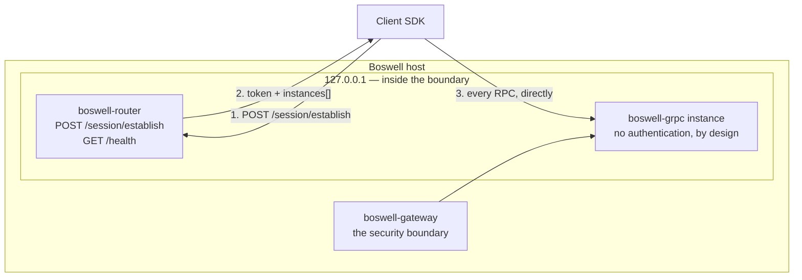

# Boswell — Router

`boswell-router` answers one question: *where are the instances?* A client asks once, receives
a list of endpoints and a signed token, and thereafter talks to an instance directly. The
router is not a proxy, holds no claim data, and is not in the hot path. This is
[ADR-019](../ADRs/019-stateless-sessions.md) — the session is a topology-discovery handshake,
not a connection.

It is also **not a security boundary**. It used to be specified as one: mTLS on the way in,
one signed token per instance on the way out, cryptographic fingerprints in the registry.
[ADR-021](../ADRs/021-gateway-is-the-security-boundary.md) moved all of that to the HTTP
gateway and put the router on loopback behind it. What survives is topology discovery, which
is what the router is for. See [`10-security.md`](10-security.md), which is normative for the
security model.

This document separates four things:

| | |
|---|---|
| **Built** | In the code today, with tests. Trust it. |
| **Decided** | Settled in an ADR, not implemented. Do not deploy as if it exists. |
| **Superseded** | Specified here once, then deliberately abandoned. Not coming. |
| **Open** | Genuinely undecided, or unbuilt with nobody having decided to build it. |

[`docs/development/roadmap.md`](../development/roadmap.md) is the source of truth for status;
where this document and the roadmap disagree, the roadmap wins.

## Where the router sits


```mermaid
graph LR
    subgraph Host["Boswell host"]
        GW["boswell-gateway<br/>the security boundary"]
        subgraph Loop["127.0.0.1 — inside the boundary"]
            R["boswell-router<br/>POST /session/establish<br/>GET /health"]
            I["boswell-grpc instance<br/>no authentication, by design"]
        end
    end

    SDK["Client SDK"]
    SDK -->|"1. POST /session/establish"| R
    R -->|"2. token + instances[]"| SDK
    SDK -->|"3. every RPC, directly"| I
    GW --> I
```

Step 3 is the point. Assert, Query, Learn, Extract, Challenge, Promote, Forget — all of it goes
straight from client to instance with no router involvement. The router is contacted again only
when the client re-fetches topology.

Note what the diagram does not show: the gateway does not call the router, and the router does
not call the instance. They are three processes that share a host and a config convention, not
a call graph.

## Built today

### Two HTTP routes, no authentication on either

`boswell-router` is an axum HTTP service. `create_router` in
[`handlers.rs`](../../crates/boswell-router/src/handlers.rs) registers exactly two routes:

| Route | Body | Response |
|---|---|---|
| `POST /session/establish` | `{"user_id": "..."}`, optional, defaults to `"default-user"` | `{token, mode, instances[]}` |
| `GET /health` | — | `{status, instance_count, healthy_instances}` |

Neither requires a credential. `POST /session/establish` mints a token for whatever `user_id`
the caller sends, or for `"default-user"` if the caller sends none. That is consistent with
ADR-021 — the router lives inside the boundary, and anything that can reach its port is already
inside — but it means the router must not be exposed. See
[The bind is not enforced](#the-bind-is-not-enforced).

`start_server` in [`lib.rs`](../../crates/boswell-router/src/lib.rs) binds `config.bind_addr()`
and calls `axum::serve`. It takes a config and does not return; there is no shutdown handle, so
nothing can start a router in-process and stop it again. That is why the SDK's full-stack
end-to-end tests are `#[ignore]`d and need servers started by hand.

### Session establishment is a topology handshake

`establish_session` does three things: mint a token, read the whole registry, and return both.

```json
{
  "token": "eyJ...",
  "mode": "instance",
  "instances": [
    {"id": "default", "endpoint": "http://localhost:50051", "expertise": ["*"], "health": "healthy"}
  ]
}
```

`mode` is `"instance"` when exactly one instance is registered and `"router"` otherwise
(`create_session_response` in [`session.rs`](../../crates/boswell-router/src/session.rs)). It
reads backwards on first encounter — a *router* deployment is the multi-instance one — but it
is ADR-019's naming and the SDK does not read the field.

An empty registry parses at load and then fails at request time: `establish_session` returns
HTTP 500 `{"error": "No instances registered"}`.

### One session token, HS256, read by nobody

`SessionManager::new` builds an encoding and a decoding key from the same `jwt_secret` string,
so the token is symmetric. `generate_token` signs `{user_id, exp, iat}` with the default HS256
header. There is **one token per session**, not one per instance, and it carries no instance
scope.

No instance validates it. `validate_token` exists on `SessionManager` and is exercised only by
the router's own tests. Per ADR-021 the gRPC instance authenticates nothing at all, so the
token is topology-discovery bookkeeping. Holding one grants nothing.

Rotate `jwt_secret` anyway and never ship the placeholder. The risk is not that a forged token
opens a door; it is that a forged *session response* points a client at an endpoint of the
forger's choosing.

There is no refresh path. The token carries an expiry and the SDK reconnects when it needs a
new one. This is on [`10-security.md`](10-security.md)'s open list, and it is smaller than it
looks now that the token is topology only.

### The registry is the config file, read once

`InstanceRegistry::from_config` turns the `[[instances]]` tables into `RegisteredInstance`
values and stamps every one of them `Healthy`. That is the entire registration path.

`register`, `update_health` and `has_healthy_instances` exist on `InstanceRegistry` and are
correct. No route calls them and nothing outside the crate's tests calls them either. There is
no admin API: adding an instance means editing the TOML and restarting.

A registered instance is `id`, `endpoint`, `expertise`, and a health state. There is no
fingerprint field and no capability list — see [Superseded](#superseded).

### Health is reported, not measured

`GET /health` aggregates registry state:

| Condition | `status` |
|---|---|
| No instance is `Healthy` | `unhealthy` |
| Some but not all instances are `Healthy` | `degraded` |
| Every instance is `Healthy` | `healthy` |

Since `from_config` stamps everything `Healthy` and nothing ever calls `update_health`, the
answer is always `healthy` — whether or not a single instance is running. **`GET /health` is a
liveness check for the router and nothing more.** Treating it as a check on the instances
behind it will mislead you. `HealthStatus` has three variants, `Healthy`, `Degraded` and
`Unhealthy`; only the first is ever constructed outside tests.

The same value flows into each `instances[]` entry of the session response, so a client sees
`"health": "healthy"` for a dead instance and connects to it. The SDK handles this the only way
it can — it picks the first instance reported healthy, connects lazily, and lets the first RPC
fail with `Unavailable` into its retry path.

### Configuration

The Router reads a plaintext TOML file named by `--config`. `--config` and `--help` are the
only flags. With neither, it warns on stderr and runs `RouterConfig::default_test_config()`
— loopback, port 8080, a hard-coded secret, one instance at `http://localhost:50051`. That
fallback exists for tests; it is not a deployment default.

#### The keys `RouterConfig` parses

| Key | Type | Default | Description |
|---|---|---|---|
| `bind_address` | string | *required* | Interface to bind, e.g. `127.0.0.1`. Unvalidated — unlike the gRPC instance, the Router does not refuse a routable address. |
| `bind_port` | integer | *required* | Port to bind, e.g. `8080`. |
| `jwt_secret` | string | *required* | Symmetric HS256 secret for session tokens. Rejected at load if empty. |
| `token_expiry_secs` | integer | `3600` | Lifetime of an issued session token, in seconds. |
| `instances` | array of tables | `[]` | Registered instances. An empty array parses; `POST /session/establish` then returns 500. |
| `instances[].id` | string | *required* | Instance identifier, e.g. `default`. |
| `instances[].endpoint` | string | *required* | The instance's gRPC endpoint. Exactly one — see [Multiple endpoints per instance](#multiple-endpoints-per-instance). |
| `instances[].expertise` | array of strings | `[]` | Namespaces this instance handles. Passed through to the session response; the Router never reads it. |

```toml
bind_address = "127.0.0.1"
bind_port = 8080
jwt_secret = "..."
token_expiry_secs = 3600

[[instances]]
id = "default"
endpoint = "http://localhost:50051"
expertise = ["*"]
```

The file is read once at startup. There is no reload, no write-back, and no environment-variable
override.

#### What this table used to promise

These settings were specified here before the Router was written. None appears in
`RouterConfig`, and with one exception the behavior each would configure does not exist.

| Old setting | What it configured | Where it stands |
|---|---|---|
| `config_path` (`./router.enc`) | The `age`-encrypted portable config | Unbuilt; the file is plaintext TOML. Whether encryption survives ADR-021 is undecided — see [`10-security.md`](10-security.md). |
| `listen_address` (`0.0.0.0:9000`) | A gRPC listener on every interface | Wrong twice: the Router speaks HTTP, and ADR-021 puts it on loopback behind the gateway. `bind_address` and `bind_port` replace it. |
| `health_check_interval`, `health_check_timeout`, `failure_threshold`, `recovery_threshold`, `degraded_threshold` | The Health Monitor | Unbuilt. Nothing polls instances, so nothing consumes an interval or a threshold. |
| `token_ttl` (`1h`) | Session token lifetime | Built, under the name `token_expiry_secs`, same default. |
| `signing_key_path` | A private key for signing per-instance tokens | Unbuilt. Signing is HS256 over the shared `jwt_secret`, and no instance verifies the result. |

## Decided, not built

### Client-side routing by expertise

ADR-019 puts routing in the SDK: match a routing hint or namespace prefix against each
instance's expertise profile, and fall back to the router only for ambiguous cases and
federated queries. The wire format carries everything this needs — `expertise` on every
instance, `mode` on the response.

The SDK does not use any of it. `BoswellClient::connect` picks the **first instance reported
healthy**, or the first instance if none is, and connects to that one for the life of the
client. `InstanceInfo::id`, `InstanceInfo::expertise` and `SessionResponse::mode` are all
carried and all marked `#[allow(dead_code)]` — deliberately, as wire format the SDK does not
yet read.

With one instance registered, which is every deployment today, first-healthy and
route-by-expertise are the same behavior. The gap only opens when a second instance exists.

### Federated query fallback

The other half of ADR-019: the router as a fallback path for queries the client cannot route
itself. There is no such route. `POST /session/establish` and `GET /health` are the whole
surface, and neither the router nor the SDK has a notion of a query it could not place.

## Superseded

These were specified in this document, in detail, and then abandoned on purpose. They are not
backlog items. Nothing is waiting on them.

- **mTLS session establishment.** The client was to authenticate to the router with a client
  certificate. ADR-021 made the gateway the only authenticating component and put the router
  on loopback behind it. `POST /session/establish` requires no credential of any kind, and the
  reason it does not is a decision, not an omission. ADR-022's rejection of manual per-client
  certificate registration applies with equal force here: an agent cannot issue a certificate
  to a subagent without the operator becoming a certificate authority.
- **One token per instance, validated by the instance.** The router was to mint a separately
  scoped token per registered instance, signed with a private key the instances verified. The
  gRPC instance now authenticates nothing — the `auth_token` field is gone from all fourteen
  request messages that carried it (#58), and its numbers are `reserved` so they cannot be
  reused. One symmetric session token remains, and no instance reads it.
- **Cryptographic fingerprints in the registry.** `InstanceEntry` was to carry a public-key
  fingerprint for mTLS verification. With no mTLS there is nothing to verify against, so
  `[[instances]]` has no fingerprint field. Instance trust is filesystem trust: whoever can
  edit the router's config decides what the router points at.
- **Capability declaration per instance.** Registration was to include the set of operations an
  instance supports. Every instance implements the whole fifteen-RPC service, so the field
  would encode nothing. `expertise` — which namespaces, not which operations — is what the
  config actually carries.

## Open

### Health monitoring

There is no polling task, no health-check client, and no configuration for either. Building it
means a periodic sweep calling each instance's `grpc.health.v1.Health` service and driving
`InstanceRegistry::update_health` from the result, which is the one piece already in place.

The transition rules this document used to state — two consecutive failures to `Unhealthy`, two
consecutive successes back to `Healthy`, a slow response to `Degraded` — are a reasonable
design and were never implemented, so nothing constrains them. They are recorded here as a
starting point, not as behavior.

`Unhealthy` is deliberately not removal: an instance that stops answering stays in the registry
and stays in the session response, and the client decides what to do about it. That part of the
design survives, because it is what the SDK already assumes.

### Multiple endpoints per instance

`InstanceConfig::endpoint` is one string. The design called for several per instance — LAN
address, VPN address, public endpoint — with the client trying them in order by reachability.
Nothing about the current shape blocks it; nobody has needed it.

### Portable encrypted configuration

`RouterConfig::from_file` reads plaintext TOML. The design called for a single `age`-encrypted
file, decrypted in memory at startup, never written to disk in the clear, carrying a sequence
number so the newest copy is identifiable — with disaster recovery being "copy the file and
know the passphrase".

Whether that survives ADR-021 is **undecided and is a human's call**, not a slice to pick up.
The registry no longer holds keypairs or fingerprints, so the highest-value thing in the file
is now `jwt_secret`, and the token it signs is not a capability. Against that,
[`16-backup-recovery.md`](16-backup-recovery.md) hangs backup-at-rest encryption off the same
idea. [`10-security.md`](10-security.md) tracks this on its "Still open" list; do not resolve
it by writing a confident sentence here.

### The bind is not enforced

`RouterConfig` accepts `bind_address = "0.0.0.0"` and `start_server` binds it without
complaint. ADR-021 places the router on loopback behind the gateway, and
[`10-security.md`](10-security.md)'s deployment-postures table assumes it is there — but
nothing in the code makes it so.

The gRPC instance refuses exactly this: `ServerConfig` resolves its address through
`to_socket_addrs()` and refuses to start unless every resolved address is loopback. Whether the
router should mirror that refusal is a decision nobody has made. Until it is made, an exposed
router is an unauthenticated endpoint that mints session tokens and reveals every instance
endpoint to anyone who asks.

## Deployment

The router is a single static binary whose only runtime dependency is its config file. Run it
on the same host as the instances it lists, on loopback, alongside the gateway.

**Single-instance mode is the deployment.** The router is present even with one instance, so
the client has one code path regardless — establish a session, receive an array of one, connect
to it. Overhead is a process, a TCP listener, and a `Vec` of instance entries.

The previous version of this section gave memory and CPU figures — "<1MB", "~100KB per
instance", "health checks every 60 seconds per instance". None was measured, and the last one
describes a component that does not exist. No figures are given here in their place. What is
safe to say is structural: the router holds **no claim data**, its memory is a function of the
number of registered instances rather than the number of claims, and between session
establishments it does no work at all.

## Related

- [ADR-019](../ADRs/019-stateless-sessions.md) — sessions are topology discovery; the client
  routes.
- [ADR-021](../ADRs/021-gateway-is-the-security-boundary.md) — why the router authenticates
  nothing; supersedes ADR-017.
- [ADR-022](../ADRs/022-delegated-credentials.md) — where delegated authority comes from
  instead.
- [`10-security.md`](10-security.md) — normative for the security model, including the open
  questions this document defers to.
- [`03-api-surface.md`](03-api-surface.md) — the gRPC service the router points clients at.
- [`docs/development/roadmap.md`](../development/roadmap.md) — what is actually built.
