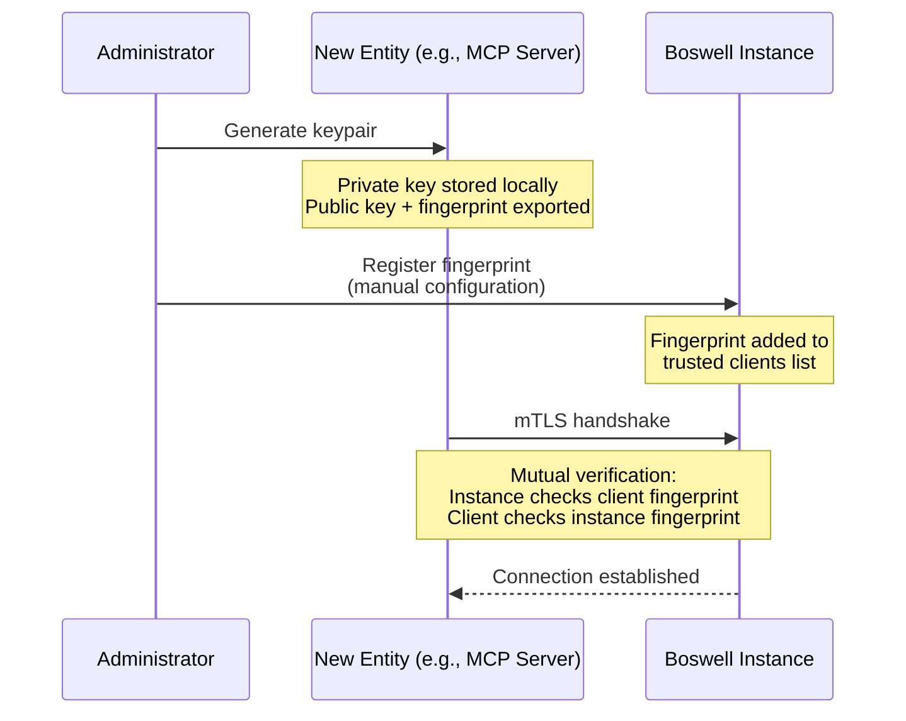
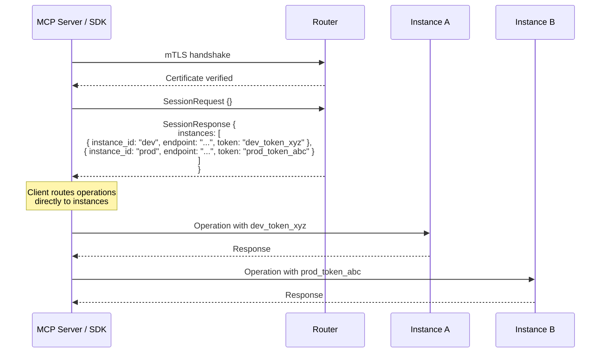

# Boswell — Security Model

Security operates at two levels in Boswell: the **Router** handles all session establishment and token issuance, and each **instance** validates tokens and enforces authorization on operations. This separation ensures consistent authentication logic across all deployments, whether single-instance or multi-instance. Every inbound connection to every instance requires mutual authentication. There are no unauthenticated access modes, no "localhost bypass," and no deployment configuration that weakens this requirement.

## Principles

1. **Every connection is authenticated.** Client-to-Router, Router-to-instance, and any direct connections all use mTLS.
2. **Trust is explicit and manual.** No automatic discovery, no broadcast, no "trust on first use." Every trust relationship is established by a human through manual registration.
3. **Trust is independently revocable.** Compromising one component does not compromise the system. Each trust relationship can be severed independently.
4. **Security is independent of deployment mode.** A single-instance deployment has the same authentication requirements as a multi-instance federation.
5. **Router is always present.** The Router handles session management and token issuance in all deployments, ensuring no duplication of security-critical code.

## Mutual TLS (mTLS)

All gRPC connections use mutual TLS. Both sides present certificates and verify each other's identity.

### Certificate Model

Each entity in the system (instance, Router, MCP server, SDK client) has its own keypair:

- **Private key:** Stays on the entity. Never transmitted.
- **Public key (certificate):** Registered with every entity it needs to communicate with.
- **Fingerprint:** SHA-256 hash of the public key. Used as the human-readable identifier during registration.

Certificates can be self-signed. There is no requirement for a formal CA, though deploying a local CA is a supported option for convenience. The trust model is based on explicit fingerprint registration, not certificate chain validation.

### Registration Workflow

This workflow applies identically to:
- Registering an MCP server with the Router (for session establishment).
- Registering a Router with each instance (allows Router to issue tokens for that instance).
- Registering a direct SDK client with the Router.
- Registering an instance with the Router (for registry coordination).

Each gets its own keypair and explicit registration. No entity inherits another's trust.

## Token Issuance and Validation

The Router is the single source of truth for session management and token issuance in **all** deployment modes. After mTLS authentication with the Router, clients receive a session response containing **per-instance tokens**.

### Session Establishment

All clients connect to the Router for session establishment:

**Single-instance deployment:** Same flow. The Router returns a single-element instance list with one token for that instance. The architectural benefit is significant: no duplication of security-critical session management code.

**Multi-instance deployment:** The Router returns multiple instances, each with its own token. Each token is scoped to its specific instance.

### Instance-Specific Tokens

Each session token is scoped to a specific instance:

- **Granular security:** Token compromise affects only one instance.
- **Per-instance permissions:** The Router can grant different permissions for each instance.
- **Independent revocation:** Individual instance tokens can be revoked without affecting others.

**Token properties:**

| Property | Default | Description |
|---|---|---|
| Lifetime | 1 hour | Time before expiration |
| Scope | Single instance | Each token valid for exactly one instance |
| Signing | Ed25519 | Signed by Router, verifiable by instance using Router's public key |
| Instance ID | Part of token | Binds token to specific instance |

### Token Validation

Instances validate tokens but **never issue them**. The Router's public key is registered with each instance during setup, allowing instances to cryptographically verify tokens:

1. Client sends operation with instance-specific token.
2. Instance validates token signature using Router's public key.
3. Instance verifies token is scoped to itself (instance ID matches).
4. Instance checks token expiration.
5. If valid, instance executes operation.

No callback to the Router is needed for token verification, which means token validation works even if the Router is temporarily unreachable.

## Revocation Scenarios

### Compromised Client (MCP Server, SDK)

1. Remove the client's fingerprint from the Router.
2. The client immediately cannot establish new sessions or obtain tokens.
3. Existing tokens expire when their TTL runs out (at most 1 hour with defaults).
4. If faster revocation is needed, revoke the client's tokens at each instance, but this is a v2 concern given the short default TTL.

### Compromised Instance

1. Remove the instance from the Router's registry.
2. Revoke the instance's certificate at the Router.
3. The Router immediately stops issuing tokens for that instance in new sessions.
4. Clients that already have instance list containing the compromised instance will try to reach it and fail. On session refresh, they receive an updated instance list excluding the compromised instance.

### Compromised Router

1. Revoke the Router's certificate at each instance (each instance has the Router's fingerprint in its trusted list).
2. Instances immediately reject connections from the compromised Router.
3. Existing tokens signed by the compromised Router continue to work until expiration. For immediate revocation, rotate the Router signing key at each instance. This invalidates all tokens for that instance.
4. Stand up a new Router, generate a new keypair, re-register with each instance.

This is the most disruptive scenario but is recoverable. The actual knowledge (claim data) is safe on the instances. Only the instance registry coordination needs to be rebuilt.

## Scoped Permissions

When registering an instance with the Router, the administrator specifies permissions that control what capabilities the Router exposes for that instance:

| Permission | Description |
|---|---|
| `federated_query` | Instance participates in cross-instance queries. Can be excluded for privacy. |
| `cross_domain_synthesis` | Instance contributes claims to the cross-domain Synthesizer. |
| `capabilities` | List of operations the instance supports (e.g., assert, query, promote, learn). |

A highly sensitive instance (e.g., health records) can be registered with `federated_query: false` and `cross_domain_synthesis: false`. It exists in the instance registry for health monitoring and direct access, but no other instance or the Router can query its contents. The Router includes these permission constraints in the capabilities field of the session response.

## Encrypted Configuration at Rest

The Router's configuration file — containing instance fingerprints, endpoints, trust scores, and permissions — is encrypted with `age` (passphrase-based). See `09-router.md` for the portable config workflow.

Instance-level configuration (including trusted client fingerprints) is stored in the instance's own config file. Whether to encrypt instance configs is a deployment decision. For instances on local machines, filesystem permissions may be sufficient. For instances on remote servers, `age` encryption is recommended.

## Network Security

### Local Network Deployment

Even on a trusted home network, all connections use mTLS. Network-level security (firewall rules, VPN) is a complementary layer, not a substitute for application-level authentication.

### Remote Deployment (VPS, Cloud)

Instances on remote servers are accessible over the internet. mTLS ensures that only registered clients and Routers can connect. The gRPC port should additionally be protected by firewall rules allowing only known IP ranges, but this is defense-in-depth — mTLS is the primary security boundary.

### Split Deployment

A common topology: some instances on a local machine (home network), others on remote servers. The Router bridges them. All connections use mTLS regardless of network trust level. The Router's encrypted portable config enables connecting from any location.

## Threat Model Summary

| Threat | Mitigation |
|---|---|
| Rogue instance joins registry | Manual registration only. No automatic discovery. |
| Network eavesdropping | TLS encryption on all connections. |
| Stolen client certificate | Revoke fingerprint at Router. No new sessions issued. |
| Stolen Router config | Config is encrypted with `age`. Passphrase never stored on disk. |
| Router compromise | Revoke Router cert at each instance. Rebuild instance registry. |
| Instance compromise | Remove from Router registry. Stop issuing tokens for it. |
| Token replay | Short-lived tokens. Per-instance scoping limits blast radius. |
| Token compromise for one instance | Only affects that instance. Other instances unaffected. |
| Claim poisoning via untrusted instance | Instance trust scores. Gatekeeper evaluates promotion independently. |

## What Security Does Not Cover (v1)

- **Encryption at rest for claim data.** SQLite databases are not encrypted in v1. Filesystem-level encryption (FileVault, LUKS) is recommended.
- **Fine-grained access control within an instance.** All authenticated clients have full read/write access. Per-namespace or per-tier ACLs are a v2 concern.
- **Audit logging for security events.** The event log captures claim operations but does not currently log authentication events, token issuance, or failed connection attempts. This should be added.
- **Token blocklists.** For immediate revocation of compromised tokens before their TTL expires. Low priority given short default TTL.
