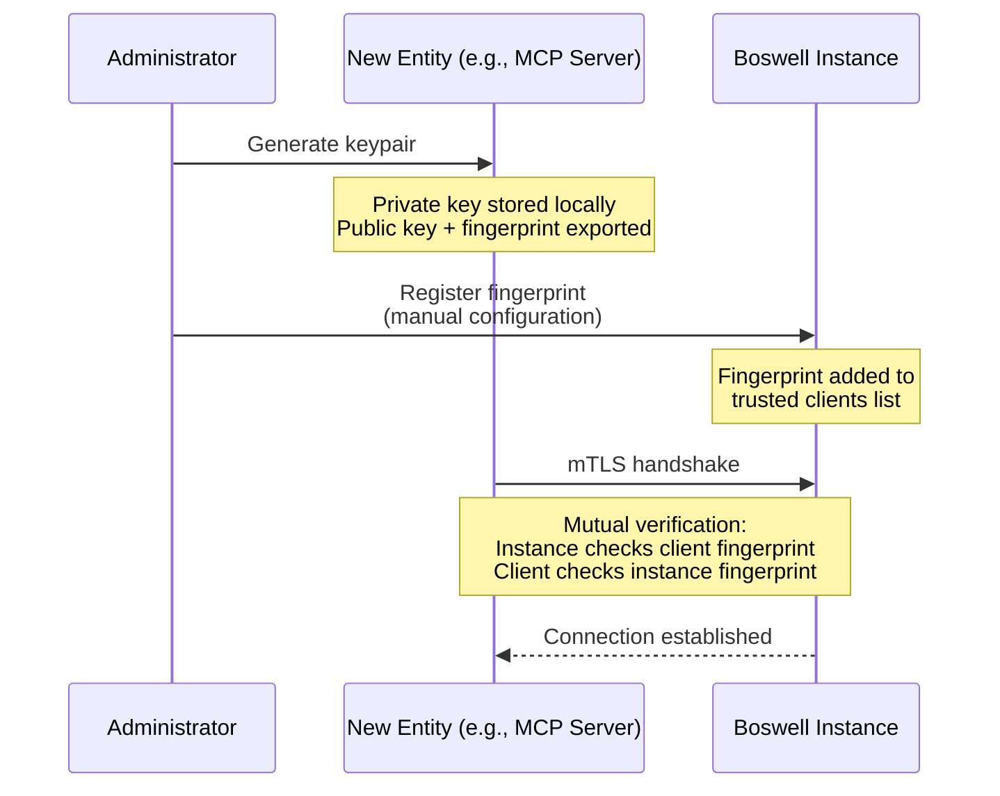

# Boswell — Security Model

Security in Boswell is enforced at the instance level. Every inbound connection to every instance requires mutual authentication. There are no unauthenticated access modes, no "localhost bypass," and no deployment configuration that weakens this requirement.

## Principles

1. **Every connection is authenticated.** Instance-to-instance, client-to-instance, Router-to-instance — all use mTLS.
2. **Trust is explicit and manual.** No automatic discovery, no broadcast, no "trust on first use." Every trust relationship is established by a human.
3. **Trust is independently revocable.** Compromising one component does not compromise the system. Each trust relationship can be severed independently.
4. **Security is independent of deployment mode.** A single-instance deployment has the same authentication requirements as a multi-instance federation.

## Mutual TLS (mTLS)

All gRPC connections use mutual TLS. Both sides present certificates and verify each other's identity.

### Certificate Model

Each entity in the system (instance, Router, MCP server, SDK client) has its own keypair:

- **Private key:** Stays on the entity. Never transmitted.
- **Public key (certificate):** Registered with every entity it needs to communicate with.
- **Fingerprint:** SHA-256 hash of the public key. Used as the human-readable identifier during registration.

Certificates can be self-signed. There is no requirement for a formal CA, though deploying a local CA is a supported option for convenience. The trust model is based on explicit fingerprint registration, not certificate chain validation.

### Registration Workflow



This workflow applies identically to:
- Registering an MCP server with an instance.
- Registering a Router with an instance.
- Registering a direct SDK client with an instance.
- Registering an instance with a Router.

Each gets its own keypair and explicit registration. No entity inherits another's trust.

## Token Issuance

After mTLS authentication, the session handshake issues a short-lived token for subsequent operations.

### Single-Instance Mode

The instance itself issues the token. The client uses this token for all operations on that instance.

```
Client ←→ Instance (mTLS)
Client → Instance: SessionRequest {}
Instance → Client: SessionResponse { token, mode: "instance", instances: [self] }
Client → Instance: Operations with token
```

### Multi-Instance Mode

The Router issues the token. This token is accepted by all registered instances (they trust the Router's signing key).

```
Client ←→ Router (mTLS)
Client → Router: SessionRequest {}
Router → Client: SessionResponse { token, mode: "router", instances: [...] }
Client → Instance A: Operations with Router-issued token (direct connection)
Client → Instance B: Operations with Router-issued token (direct connection)
```

**Token properties:**

| Property | Default | Description |
|---|---|---|
| Lifetime | 1 hour | Time before expiration |
| Scope | All registered instances | Which instances accept this token |
| Signing | HMAC-SHA256 or Ed25519 | Verifiable by instances without calling back to the Router |

Instances validate tokens locally using the Router's public key. No callback to the Router is needed for token verification, which means token validation works even if the Router is temporarily unreachable.

## Revocation Scenarios

### Compromised Client (MCP Server, SDK)

1. Remove the client's fingerprint from each instance it was registered with.
2. The client immediately cannot establish new connections.
3. Existing sessions expire when their token TTL runs out (at most 1 hour with defaults).
4. If faster revocation is needed: instances can maintain a token blocklist, but this is a v2 concern.

### Compromised Instance

1. Remove the instance from the Router's registry.
2. Revoke the instance's certificate at the Router (if the Router authenticated to it directly).
3. The instance is immediately excluded from federated queries and topology delivery.
4. Clients that already have the topology will try to reach the instance and fail. On retry or topology refresh, they learn it's gone.

### Compromised Router

1. Revoke the Router's certificate at each instance (each instance has the Router's fingerprint in its trusted list).
2. Instances immediately reject connections from the compromised Router.
3. Existing tokens signed by the compromised Router continue to work until expiration. For immediate revocation, rotate the Router signing key at each instance.
4. Stand up a new Router, generate a new keypair, re-register with each instance.

This is the most disruptive scenario but is recoverable. The actual knowledge (claim data) is safe on the instances. Only the federation topology needs to be rebuilt.

## Scoped Permissions

When registering an instance with the Router, the administrator specifies permissions:

| Permission | Description |
|---|---|
| `federated_query` | Instance participates in cross-instance queries. Can be excluded for privacy. |
| `cross_domain_synthesis` | Instance contributes claims to the cross-domain Synthesizer. |
| `direct_access` | Clients can connect directly (always true in current design). |

A highly sensitive instance (e.g., health records) can be registered with `federated_query: false` and `cross_domain_synthesis: false`. It exists in the topology for health monitoring and direct access, but no other instance or the Router can query its contents.

## Encrypted Configuration at Rest

The Router's configuration file — containing instance fingerprints, endpoints, trust scores, and permissions — is encrypted with `age` (passphrase-based). See `09-router.md` for the portable config workflow.

Instance-level configuration (including trusted client fingerprints) is stored in the instance's own config file. Whether to encrypt instance configs is a deployment decision. For instances on local machines, filesystem permissions may be sufficient. For instances on remote servers, `age` encryption is recommended.

## Network Security

### Local Network Deployment

Even on a trusted home network, all connections use mTLS. Network-level security (firewall rules, VPN) is a complementary layer, not a substitute for application-level authentication.

### Remote Deployment (VPS, Cloud)

Instances on remote servers are accessible over the internet. mTLS ensures that only registered clients and Routers can connect. The gRPC port should additionally be protected by firewall rules allowing only known IP ranges, but this is defense-in-depth — mTLS is the primary security boundary.

### Split Deployment

A common topology: some instances on a local machine (home network), others on remote servers. The Router bridges them. All connections use mTLS regardless of network trust level. The Router's encrypted portable config enables connecting from any location.

## Threat Model Summary

| Threat | Mitigation |
|---|---|
| Rogue instance joins federation | Manual registration only. No automatic discovery. |
| Network eavesdropping | TLS encryption on all connections. |
| Stolen client certificate | Revoke fingerprint at each instance. Tokens expire within TTL. |
| Stolen Router config | Config is encrypted with `age`. Passphrase never stored on disk. |
| Router compromise | Revoke Router cert at each instance. Rebuild federation. |
| Instance compromise | Remove from Router registry. Revoke at other instances. |
| Token replay | Short-lived tokens. Instance can maintain blocklist (v2). |
| Claim poisoning via untrusted instance | Instance trust scores. Gatekeeper evaluates promotion independently. |

## What Security Does Not Cover (v1)

- **Encryption at rest for claim data.** SQLite databases are not encrypted in v1. Filesystem-level encryption (FileVault, LUKS) is recommended.
- **Fine-grained access control within an instance.** All authenticated clients have full read/write access. Per-namespace or per-tier ACLs are a v2 concern.
- **Audit logging for security events.** The event log captures claim operations but does not currently log authentication events, token issuance, or failed connection attempts. This should be added.
- **Token blocklists.** For immediate revocation of compromised tokens before their TTL expires. Low priority given short default TTL.
