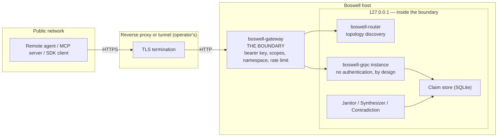

# Boswell — Security Model

Boswell is a memory server that agents reach on one implementer's behalf. It runs either on
that implementer's machine or on a host of theirs reachable from the internet. Public reach is
a requirement, not an edge case, so authentication at the boundary is a control rather than a
preference.

**The HTTP gateway is the boundary.** It is the only component that faces a network and the
only one that authenticates. Everything else — the gRPC instance, the store, the background
workers — sits inside it and binds to loopback. This is
[ADR-021](../ADRs/021-gateway-is-the-security-boundary.md), which supersedes
[ADR-017](../ADRs/017-instance-level-security.md) and the mTLS-everywhere model this document
used to specify.

This document separates three things, and the separation is load-bearing:

| | |
|---|---|
| **Built** | In the code today, with tests. Trust it. |
| **Decided** | Settled in an ADR, not implemented. Do not deploy as if it exists. |
| **Open** | Genuinely undecided. Named here so nobody assumes an answer. |

[`docs/development/roadmap.md`](../development/roadmap.md) is the source of truth for which is
which; where this document and the roadmap disagree about status, the roadmap wins.

## Threat model

Settled in the design session of 2026-09-10 and recorded in ADR-021 and ADR-022.

- **The principal is a person.** Agents are delegates. Access means proving delegation, not
  proving identity. What a delegate may *do* is Boswell's decision and is never handed to the
  identity system — see [`CONTEXT.md`](../../CONTEXT.md) and
  [`08-gatekeeper.md`](08-gatekeeper.md).
- **The grant is long-lived.** The implementer authorizes once; agents run for weeks.
  Re-authenticating daily is a failure, not a hardening.
- **Verification must be local.** Task-tier memories are read and written constantly. A round
  trip to an identity provider per request is not affordable; a signature check is.
- **Delegation is transitive.** An agent spawns subagents and grants them access. A subagent
  must be able to receive *less* authority than its parent and must not be able to widen it.
- **The host may be shared with the operator's own tooling, but not with other tenants.**
  Everything inside the boundary is one trust domain. Boswell does not defend against a
  hostile local process; see [Deployment postures](#deployment-postures).

The fourth constraint is the one that eliminates the obvious answers, and it is why manual
per-client certificate registration was rejected: an agent cannot issue a certificate to a
subagent without the operator becoming a certificate authority.

## Where the boundary is

```mermaid
graph LR
    subgraph Outside["Public network"]
        Agent["Remote agent / MCP server / SDK client"]
    end

    subgraph Proxy["Reverse proxy or tunnel (operator's)"]
        TLS["TLS termination"]
    end

    subgraph Host["Boswell host"]
        GW["boswell-gateway<br/>THE BOUNDARY<br/>bearer key, scopes, namespace, rate limit"]
        subgraph Loop["127.0.0.1 — inside the boundary"]
            Router["boswell-router<br/>topology discovery"]
            Inst["boswell-grpc instance<br/>no authentication, by design"]
            Store["Claim store (SQLite)"]
            Workers["Janitor / Synthesizer / Contradiction"]
        end
    end

    Agent -->|HTTPS| TLS
    TLS -->|HTTP| GW
    GW --> Router
    GW --> Inst
    Inst --> Store
    Workers --> Store
```

Everything in the loopback box is one trust domain. Anything that can open a socket to the
instance's port has full write access to every tier and every namespace. On a single-tenant
host that is the accepted trade; on a shared host it is not, and nothing in this design makes
that deployment safe.

## Built today

### The gateway authenticates

`boswell-gateway` is the only component with real request authentication. It is described in
full in [`docs/integrations/http-api.md`](../integrations/http-api.md); the security-relevant
parts:

| Control | Mechanism |
|---|---|
| Authentication | `Authorization: Bearer <key>`. The gateway stores only the lowercase-hex **SHA-256 hash** of each key; the raw key is never on disk. |
| Authorization | Per-key scopes: `read`, `write`, `delete`. A handler calls `AuthContext::require` before acting. |
| Namespace isolation | Each key is bound to a namespace. A key may act on that namespace or a child of it (`"<ns>:..."`). Empty or `"*"` is unrestricted. A read with no requested namespace falls back to the key's own, so results never leak sideways. |
| Rate limiting | Per-key requests per minute, `rate_limit_per_minute`. `0` disables it. |
| Audit | Every mutation is logged with key id, namespace, operation, and count. |
| Unauthenticated surface | `/v1/health` only. |

The gateway's `/v1` surface is a **superset** of the gRPC service: every gRPC method has a
route in front of it, plus `/v1/recall` and `/v1/hooks/ingest`. Nothing outside the host needs
to reach gRPC to use Boswell.

The gateway defaults to binding `127.0.0.1:8081`. Exposing it is the operator's deliberate act,
and is where TLS enters — see [TLS](#tls-is-somebody-elses-job).

### The instance authenticates nothing, on purpose

The gRPC instance has no credential parameter on any RPC. The `auth_token` field is gone from
all fourteen request messages that carried it, along with its fourteen emptiness checks (#58,
per ADR-021). A check that accepted the string `"x"` was not weak authentication; it was the
appearance of authentication, which is worse.

The loopback bind is **enforced, not advised**. `ServerConfig` resolves its configured address
through `to_socket_addrs()` and refuses to start unless *every* resolved address is loopback.
The refusal happens before the socket opens, in the same spirit as `enable_tls` refusing to
serve plaintext under a TLS banner (#36). A hostname that resolves off-box is a startup error,
not a warning.

Do not add an authentication check to a gRPC handler. If something needs to reach memory from
off the host, it goes through the gateway.

### TLS is somebody else's job

Neither the gateway nor the instance terminates TLS. `enable_tls` on the instance refuses to
start rather than printing a TLS banner over a plaintext socket. Public reach and TLS come from
a reverse proxy or an outbound tunnel that the operator runs — Caddy, nginx, Cloudflare Tunnel,
Tailscale Funnel. For "my own machines only", a private overlay without public exposure is
stricter than any of them.

### The router's JWT is not an authorization credential

`boswell-router` mints a signed session JWT as part of session establishment
([ADR-019](../ADRs/019-stateless-sessions.md)). It carries topology — which instances exist and
where. No instance reads it, and no instance ever did. It is not a capability, and holding one
grants nothing. Rotate `jwt_secret` anyway and never ship the placeholder; a forged session
response can point a client at an endpoint of the forger's choosing.

### Identity grades a reporter's word; it does not gate access

The `IdentityProvider` port ([`crates/boswell-domain/src/identity.rs`](../../crates/boswell-domain/src/identity.rs))
**authenticates** a principal and grades the delegation chain behind it. Boswell **authorizes**
separately, through `AuthorizationPolicy` and the Gatekeeper. The two are deliberately not the
same object.

The grade is an `Assurance` level, and it sets a **tier ceiling**: how far up the tier ladder a
report from that principal may push a procedure. With no provider wired, `NullIdentityProvider`
stamps `Assurance::None` and the ceiling sits at `ephemeral`, which is what makes a negative
self-report against a shared `project`-tier procedure get quarantined rather than tank a
how-to for everyone. Corroboration counts the **authenticated principal**, not the asserted
root, so self-rooted clones collapse onto one witness (#33).

Two honest limits on this today:

- **The principal on a self-report is self-declared.** `issued_to` is a string on the wire, and
  the instance takes the caller's word for it. Inside the boundary that is consistent with
  everything else; it is also exactly what ADR-022's tokens are for.
- **The trust gradient is inert out of the box.** The only shipped adapter is devAuth, which is
  a development fixture. Responses served under it are stamped `X-Boswell-Auth: dev-untrusted`.
  With no adapter configured — the normal case — every report stamps `Assurance::None`, every
  ceiling sits at the floor, and nothing promotes. This is tracked on the roadmap, and ADR-022
  answers it in principle.

`min_distinct_sessions` and `min_distinct_evidence_types` default to `0` for the same reason:
writes are minted in-process with `session_id: None`, so a non-zero default would make
corroboration unreachable rather than stricter (#35). A token-carrying transport is what those
settings are waiting for.

## Decided, not built

[ADR-022](../ADRs/022-delegated-credentials.md) splits the problem at the human boundary. None
of the following exists in code; do not deploy as if it does.

### Above the line — OIDC establishes the person

The implementer authenticates once to an external identity provider using the **device-code
grant**, which needs no browser on the agent's side. The resulting refresh credential is the
go-ahead and lasts months. Boswell never handles a password and never manages human accounts.

Boswell ships **no identity provider**. [Pocket ID](https://pocket-id.org) is a reasonable local
choice; running and governing it stays the operator's job. The gateway verifies against cached
JWKS so no request costs a round trip to the provider.

### Below the line — attenuable tokens carry delegation

The gateway trades a verified OIDC identity for a **root token** scoped to that principal's
namespaces, tiers and operations. The agent holds it. Spawning a subagent means **attenuating
the token locally** — narrowing namespace, operations, tier ceiling, or lifetime — with no
network call and no issuer in the loop. The narrowing is cryptographic: a holder can only ever
remove authority.

The mechanism is [biscuit](https://www.biscuitsec.org/) (`biscuit-auth`), chosen for two
properties that are the requirements restated: offline attenuation, and verification that needs
only a public key. The second is what keeps federation open — an instance can verify a token it
could never have minted. Macaroons were rejected on exactly that point: chained HMACs mean
anything that can verify can also mint.

Authorization policy is written in biscuit's Datalog dialect. That is a real learning curve, and
authorization logic in it is not reviewable by reading Rust.

### Revocation

Offline verification means a revoked grant is invisible until something checks. The gateway
needs a revocation list keyed by token identifier, and every token needs a bounded lifetime so
the list stays small. A long grant and fast revocation are only compatible as separate
mechanisms.

### Corroboration must follow the delegation chain

Once subagents hold their own tokens, the authenticated principal is the *subagent*, so ten
subagents of one agent would read as ten independent witnesses. Corroboration has to resolve
each token to its **delegation root**. `CONTEXT.md` already says the root is the unit of
independence; the code catches up when subagents exist.

## Deployment postures

| Posture | Exposure | What authenticates | Residual risk |
|---|---|---|---|
| Local machine, single tenant | Nothing listens off-box. Gateway, router and instance all on loopback. | Nothing needs to. | Any local process can write to any tier. Accepted. |
| Remote host, gateway exposed | Proxy or tunnel terminates TLS in front of the gateway. Instance and router stay on that host's loopback. | Gateway bearer keys, scopes, namespaces, rate limits. | Key theft grants that key's namespace and scopes until the hash is replaced. No issuance or rotation path exists yet. |
| Shared host | As above, but other tenants share the loopback interface. | Gateway, for remote callers only. | **Not defended.** Any co-tenant process reaches the instance port directly and bypasses every control above. Do not deploy this way. |
| Multi-instance / federation | Not built. | — | Aspirational; ADR-021 and ADR-022 keep it open rather than deliver it. |

## Threat model summary

| Threat | Mitigation | Status |
|---|---|---|
| Unauthenticated remote read or write | Gateway bearer key on every `/v1` route but `/v1/health`. | built |
| Stolen API key | Replace its hash in the gateway config and restart. | built, manual |
| Cross-namespace read or write by a valid key | Namespace binding on the key; reads fall back to the key's own namespace. | built |
| Privilege beyond intent (a read key deleting) | Per-key `read`/`write`/`delete` scopes, checked per handler. | built |
| Brute force / scraping through the gateway | Per-key rate limit. | built |
| Instance reachable from the network | `ServerConfig` refuses a non-loopback bind before the socket opens. | built |
| Plaintext served under a TLS banner | `enable_tls` refuses to start. | built |
| Network eavesdropping | TLS at the operator's proxy or tunnel. | operator's |
| Hostile local process on the host | None. Everything inside the boundary is one trust domain. | accepted |
| Subagent holding its parent's full authority | Attenuated tokens, narrowed locally. | decided (ADR-022) |
| Compromised agent with a long-lived grant | Revocation list plus bounded token lifetimes. | decided (ADR-022) |
| Sybil corroboration by cloned reporters | Corroboration counts the authenticated principal (#33); provenance diversity requires distinct roots (#18). | built |
| Sybil corroboration by sibling subagents | Resolve each token to its delegation root. | decided (ADR-022) |
| Claim poisoning by an over-trusted reporter | Assurance-gated tier ceilings; the Gatekeeper evaluates promotion independently. | built, but inert without an identity adapter |
| Stolen database file | None in Boswell. Use filesystem encryption. | not covered |

## Still open

These are undecided, not merely unbuilt. Nobody should assume an answer.

- **Where TLS terminates.** The standing position — a proxy or tunnel in front, neither
  component terminating — was inherited from when the gateway was one transport among two. With
  the gateway now *the* boundary, it is worth deciding deliberately rather than by inheritance.
- **How gateway API keys are issued and rotated.** Today they are SHA-256 hashes hand-placed in
  a config file with no issuance path. ADR-022 gives the shape of the destination — authority
  descends from a grant — but not the migration from the keys that exist.
- **JWT refresh at the router.** Tokens carry an expiry and there is no refresh path; the SDK
  papers over it by reconnecting once. Smaller than it looks now that the JWT is topology only.
- **Router configuration encryption.** `boswell-router` reads plaintext TOML.
  [`09-router.md`](09-router.md) still calls for a portable `age`-encrypted config, and
  [`16-backup-recovery.md`](16-backup-recovery.md) hangs backup-at-rest encryption off the same
  idea. Whether that survives ADR-021 has not been decided.

## Not covered

Deliberately out of scope today. Each is a real gap, stated so nobody discovers it in
production.

- **Encryption at rest for claim data.** SQLite databases are plaintext. Use FileVault, LUKS, or
  equivalent. Backups inherit the same gap —
  [`16-backup-recovery.md`](16-backup-recovery.md).
- **Access control finer than namespace and scope.** Per-tier and per-claim ACLs do not exist. A
  key with `write` may write anything within its namespace.
- **Authentication event auditing.** Mutations are audit-logged; failed authentications, rate-limit
  rejections and key usage are not separately recorded.
- **Secret management.** Keys and `jwt_secret` live in config files, protected by filesystem
  permissions and nothing else.
- **Defense against a hostile process on the Boswell host.** See the loopback trust domain,
  above.

## Related

- [ADR-021](../ADRs/021-gateway-is-the-security-boundary.md) — the gateway is the boundary;
  supersedes ADR-017.
- [ADR-022](../ADRs/022-delegated-credentials.md) — OIDC above the human line, attenuable
  tokens below.
- [ADR-019](../ADRs/019-stateless-sessions.md) — what the router's session JWT is for.
- [`docs/integrations/http-api.md`](../integrations/http-api.md) — the gateway's surface, keys,
  and exposure guidance.
- [`08-gatekeeper.md`](08-gatekeeper.md) — authorization of what gets written, as distinct from
  authentication of who is asking.
- [`15-procedural-memory.md`](15-procedural-memory.md) §6–§7 — assurance, tier ceilings, and the
  `X-Boswell-Auth` marker.
- [`docs/development/roadmap.md`](../development/roadmap.md) — what is actually built.
