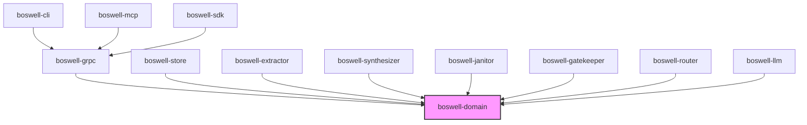

# Boswell — Contributing

Boswell is designed so that contributors — human or AI — can work on one subsystem without understanding the internals of another. This guide covers the development environment, project structure, testing strategy, and contribution workflow.

## Development Environment

### Prerequisites

- **Rust** (stable, latest). Install via [rustup](https://rustup.rs/).
- **Protobuf compiler** (`protoc`). For generating gRPC service code from `.proto` files.
- **An ONNX embedding model.** bge-small-en-v1.5 ships with the repo in `models/`. nomic-embed-text can be downloaded via a provided script.
- **SQLite3** (optional). For inspecting the database directly. The Rust `rusqlite` crate bundles SQLite statically, so no system library is required for building.

### Optional

- **Ollama** (or another local inference server). For running Extractor, Synthesizer, and Janitor tests against a real LLM. Not required — LLM-backed subsystems have mock providers for testing.
- **An Anthropic or OpenAI API key.** For testing frontier model providers. Not required for core development.

### Building

```bash
cargo build              # Debug build
cargo build --release    # Release build (much faster binaries)
```

### Running Tests

```bash
cargo test               # All unit and integration tests
cargo test --lib         # Unit tests only
cargo test --test '*'    # Integration tests only
cargo clippy             # Lint check (must pass CI)
cargo bench              # Performance benchmarks (criterion)
```

## Project Structure

```
boswell/
├── crates/
│   ├── boswell-domain/          # Domain core: claim model, traits, value objects
│   │   ├── src/
│   │   │   ├── model/           # Claim, Provenance, Relationship, ConfidenceInterval
│   │   │   ├── traits/          # ClaimStore, LlmProvider, Extractor, Synthesizer, etc.
│   │   │   ├── confidence/      # Deterministic confidence formula
│   │   │   └── validation/      # Namespace rules, tier rules, claim validation
│   │   └── tests/
│   │
│   ├── boswell-store/           # Claim Store implementation (SQLite + HNSW)
│   │   ├── src/
│   │   │   ├── sqlite/          # SQLite adapter implementing ClaimStore trait
│   │   │   ├── hnsw/            # HNSW vector index adapter
│   │   │   ├── embedding/       # ONNX embedding pipeline
│   │   │   └── migration/       # Database schema migrations
│   │   └── tests/
│   │
│   ├── boswell-extractor/       # Extractor implementation
│   ├── boswell-synthesizer/     # Synthesizer implementation
│   ├── boswell-janitor/         # Janitor implementations
│   ├── boswell-gatekeeper/      # Gatekeeper implementation
│   ├── boswell-router/          # Router implementation
│   │
│   ├── boswell-llm/             # LLM provider adapters
│   │   ├── src/
│   │   │   ├── anthropic/
│   │   │   ├── openai/
│   │   │   ├── ollama/
│   │   │   ├── generic_http/
│   │   │   └── mock/            # Mock provider for testing
│   │   └── tests/
│   │
│   ├── boswell-grpc/            # gRPC service layer
│   │   ├── src/
│   │   │   └── service/         # gRPC handlers that delegate to use cases
│   │   └── proto/               # .proto files
│   │
│   ├── boswell-mcp/             # MCP server implementation
│   ├── boswell-sdk/             # Client SDK (Rust foundation)
│   └── boswell-cli/             # CLI binary (boswell assert, boswell query, etc.)
│
├── models/                      # Shipped ONNX embedding models
├── docs/                        # This documentation set
│   ├── 00-vision.md
│   ├── 01-architecture.md
│   ├── ...
│   └── adr/
├── tests/                       # End-to-end tests
└── benches/                     # criterion benchmarks
```

### Dependency Rules (Clean Architecture)



**The domain crate depends on nothing.** It defines the claim model, value objects, and trait interfaces. Every other crate depends on the domain. No crate depends on another crate at the same level (e.g., `boswell-store` does not depend on `boswell-extractor`).

If you find yourself needing to import from a sibling crate, that's a signal that something belongs in the domain crate instead.

## Testing Strategy

### Unit Tests

Each crate has unit tests alongside the code (`#[cfg(test)]` modules). These test individual functions and structs in isolation.

**Domain crate tests** are the most important. They verify:
- Claim validation (namespace depth, required fields, tier values).
- Confidence computation (the deterministic formula produces correct intervals).
- State machine transitions (active → challenged → deprecated → forgotten).
- Namespace parsing and matching.

### Integration Tests

Integration tests live in each crate's `tests/` directory and test the crate through its public API.

**Claim Store integration tests** verify:
- Assert → Query round-trip through SQLite and HNSW.
- Duplicate detection and corroboration.
- Namespace filtering (exact, recursive, depth-limited).
- Confidence caching and invalidation.

**LLM provider integration tests** use the mock provider to verify:
- Correct prompt construction.
- Response parsing.
- Error handling for malformed responses.

### Property-Based Tests

Use `proptest` for invariants that should hold for all inputs:

- Confidence interval: `0.0 ≤ lower ≤ upper ≤ 1.0` always.
- Asserting the same claim twice never creates duplicates.
- Namespace depth validation rejects exactly those namespaces exceeding max depth.
- Staleness decay is monotonically decreasing over time.

### Benchmark Tests

Use `criterion` for performance-critical paths:

- Point lookup latency (target: < 100 μs).
- Semantic search over 100K claims (target: < 50 ms).
- Embedding computation throughput (sentences/second).
- Confidence computation (target: < 10 μs per claim).

Benchmarks run in CI. Regressions beyond a configured threshold fail the build.

### End-to-End Tests

The `tests/` directory at the repo root contains end-to-end tests that spin up a full Boswell instance and exercise the API:

- Assert claims, query them back, verify confidence.
- Extract from text, verify claims were created.
- Challenge a claim, verify status transition.
- Promote a claim, verify Gatekeeper evaluation.
- Federated query across two instances via Router.

## CI Pipeline

Every PR must pass:

| Gate | Tool | Purpose |
|---|---|---|
| Lint | `cargo clippy` | Idiomatic Rust, no common mistakes |
| Format | `cargo fmt --check` | Consistent code formatting |
| Unit tests | `cargo test --lib` | Correctness |
| Integration tests | `cargo test --test '*'` | API contracts |
| Property tests | `cargo test` (proptest auto-detected) | Invariants |
| Benchmarks | `cargo bench` | Performance regression detection |
| Audit | `cargo audit` | Known vulnerabilities in dependencies |

## Architecture Decision Records (ADRs)

Significant design decisions are recorded in `docs/adr/`. ADRs capture **why** a decision was made, not just what was decided.

### When to Write an ADR

- Choosing between alternatives that have meaningful tradeoffs.
- Making a decision that would be expensive to reverse.
- Settling a question that will likely come up again.

### ADR Format

```markdown
# ADR-NNN: Title

## Status
Accepted | Superseded by ADR-XXX | Deprecated

## Context
What is the problem? What forces are at play?

## Decision
What did we decide? Be specific.

## Consequences
What are the results? Both positive and negative.
```

### Existing ADRs

The current ADR set (001-019) covers foundational decisions from the initial architecture phase. Future ADRs should continue the numbering sequence.

## Contribution Workflow

1. **Read the relevant subsystem doc** (04-09) before starting work. Each doc covers the subsystem's responsibility, trait interface, and configuration.
2. **Check existing ADRs** in `docs/adr/` to understand why things are the way they are.
3. **Write tests first** when possible. Define the behavior you're implementing as tests, then write the implementation.
4. **Keep changes within one crate** unless you're adding something to the domain. Cross-crate changes should be reviewed more carefully.
5. **Run the full CI suite locally** before submitting: `cargo clippy && cargo fmt --check && cargo test && cargo bench`.
6. **Write an ADR** if your change involves a design decision with meaningful tradeoffs.

## For AI Agent Contributors

If you're an AI agent working on Boswell:

- **Read the relevant SKILL.md and subsystem docs first.** They contain the architecture constraints.
- **The compiler is your first reviewer.** `cargo clippy` and `cargo test` catch most issues. Iterate against compiler errors before requesting human review.
- **Property-based tests are your friend.** Write `proptest` tests for invariants. They catch edge cases you won't think to test explicitly.
- **Don't optimize prematurely.** Write correct, readable code first. If benchmarks show a problem, optimize the specific hot path.
- **Follow the dependency rules.** If your code in `boswell-store` needs to import from `boswell-extractor`, stop. Either the shared concept belongs in `boswell-domain` or the design needs rethinking.
